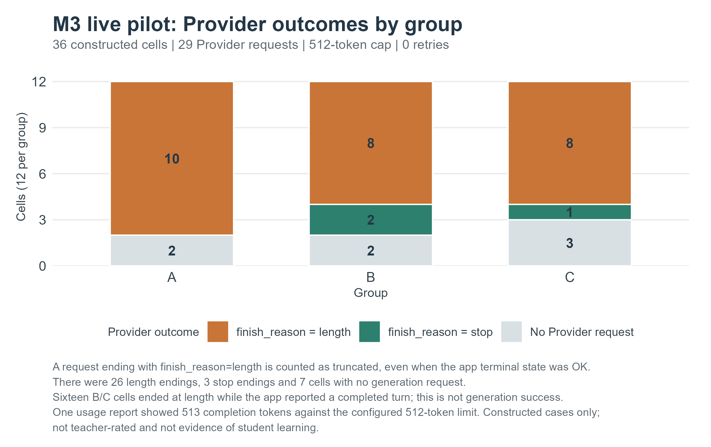
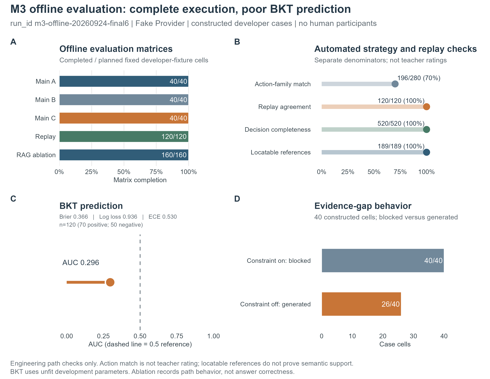
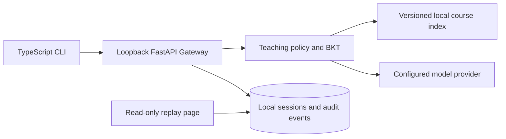

<div align="center">


# DeepProf

### An evidence-grounded, adaptive teaching system you can run locally

[English](README.md) · [简体中文](README.zh-CN.md) · [Architecture](docs/DESIGNv0.6.2.md) · [Experiment report](docs/experiments/M1-M3-实验报告.md) · [Downloads](https://github.com/RockeyRoc/DeepProf/releases)


</div>

> Try a single command. The local Gateway and learner data stay on your machine; API keys remain in local secure storage.

## Get started

Install Node.js 22+ and Python 3.12+, then run:

```sh
npx --yes --package=https://github.com/RockeyRoc/DeepProf/releases/download/v0.6.2/deepprof-cli-0.6.2.tgz deepprof
```

The first run prepares a Python environment under `~/.deepprof`, installs the Runtime dependencies, and starts a Gateway bound to `127.0.0.1`. Configure an OpenAI-compatible provider with `/login` in the CLI. To check the install, run `deepprof doctor`; to install optional OCR support, run `deepprof setup --ocr`.

The package ships its CLI, SDK, Gateway source, course manifest and local replay page. You do not need Git or a repository checkout. PowerShell users can invoke `npx.cmd` with the same package address.

## What it does

- Keeps ordinary chat separate from structured study sessions.
- Runs a versioned teaching policy over locally indexed course materials and keeps locatable evidence with study turns.
- Supports three controlled study groups. Only group C reads and updates the cross-question BKT estimate, and only after a sufficiently reliable answer.
- Stores sessions and audit events locally. The browser page is a read-only replay.
- Records explicit stop conditions for missing evidence, unreliable grades, cancellation and provider failures.

## M1–M3 evidence

The current report brings together nine figures, redacted source data and generation scripts.

| Batch | Observed engineering evidence | Boundary |
|---|---|---|
| M1 A/B | 76 of 80 constructed-case cells completed | Four failed cells remain visible; this is a developer fixture, not a student outcome |
| M2 | 82/82 focused checks; 309/309 Python regression; 5/5 CLI tests | Engineering acceptance does not establish teacher approval or learning gain |
| M3 offline | 120 main cells, 120 replay cells and 160 ablation cells | Explicit local Fake Provider and constructed cases |
| M3 BKT | AUC 0.296, Brier 0.366, log loss 0.936 | Development parameters are not calibrated for prediction |
| M3 live pilot | 36 cells, 29 requests, 3 complete generations, 26 truncations and 7 cells without a request | Application completion is reported separately from complete model generation |
| v0.6.2 release validation | 318/318 Python regression, 82/82 focused M2 checks and 7/7 CLI tests; typecheck passed | The 82 focused checks are included in 318; this run is separate from the frozen M2 record |





Read the [Chinese experiment report](docs/experiments/M1-M3-实验报告.md), [figure catalogue](docs/experiments/图表库.md), [M2 acceptance record](docs/M2-offline-acceptance.md) and [release evidence bundle](docs/experiments/releases/M1-M3-evidence.zip). Teacher review, parameter calibration and real-student learning outcomes remain open research steps.

## Architecture



The policy graph returns a structured teaching decision. The Runtime binds allowed actions, calls the configured provider and records a replayable event trail. Student answer content and provider secrets are not included in the published experiment bundle.

## Requirements

- Node.js 22+
- Python 3.12+
- A local OpenAI-compatible provider for model responses

The core application runs locally. It uses no provider credentials until you configure a profile; setting up the CLI never starts a model request. Scanned-page OCR is optional. See the [CLI guide](apps/cli/README.md) for setup, commands and configuration.

## Development

```powershell
python -m venv .venv
.\.venv\Scripts\Activate.ps1
pip install -r requirements.txt
npm ci --prefix apps/cli
npm run typecheck --prefix apps/cli
npm test --prefix apps/cli
python -m pytest
```

Start the Gateway and CLI in separate terminals with `uvicorn api.app:app --host 127.0.0.1 --port 8000` and `npm run start --prefix apps/cli`. The M2 and M3 offline evaluations run without network access or paid model calls; see the experiment report for the recorded commands, exact run IDs, data definitions and limits.

## Contributing and security

Please read [CONTRIBUTING.md](.github/CONTRIBUTING.md) before submitting a change. Report vulnerabilities through GitHub's private security advisory feature; see [SECURITY.md](.github/SECURITY.md). Avoid committing course answers, raw model replies, API keys, local databases or learner data.
