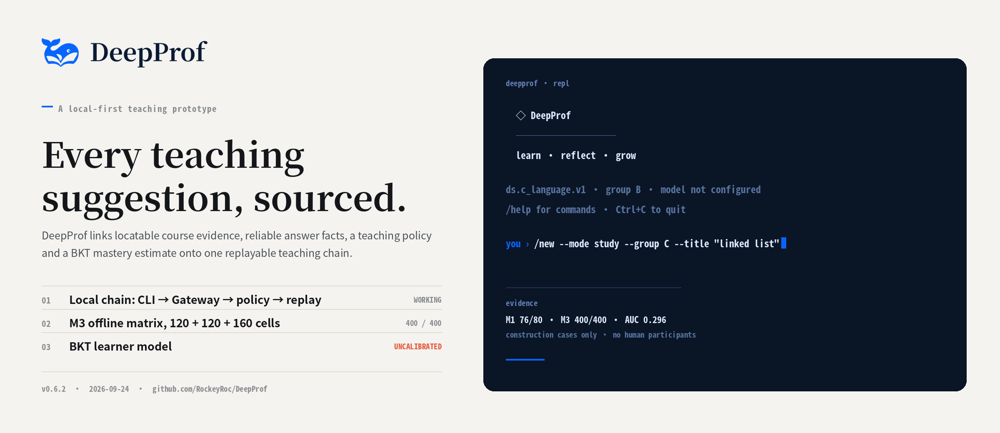
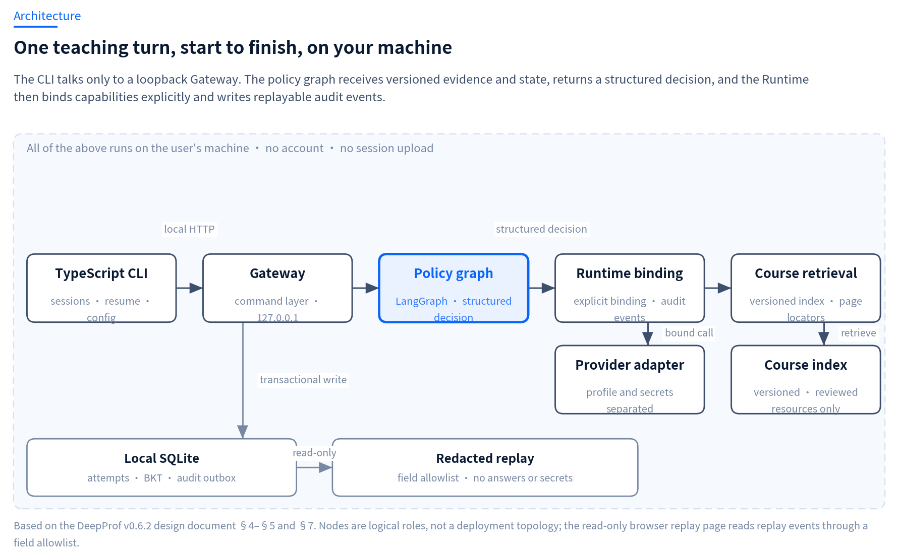
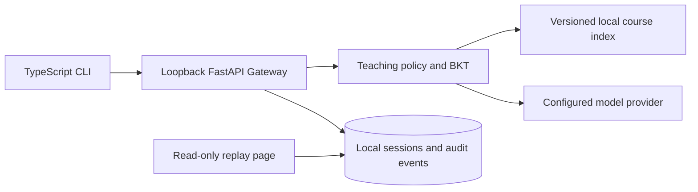
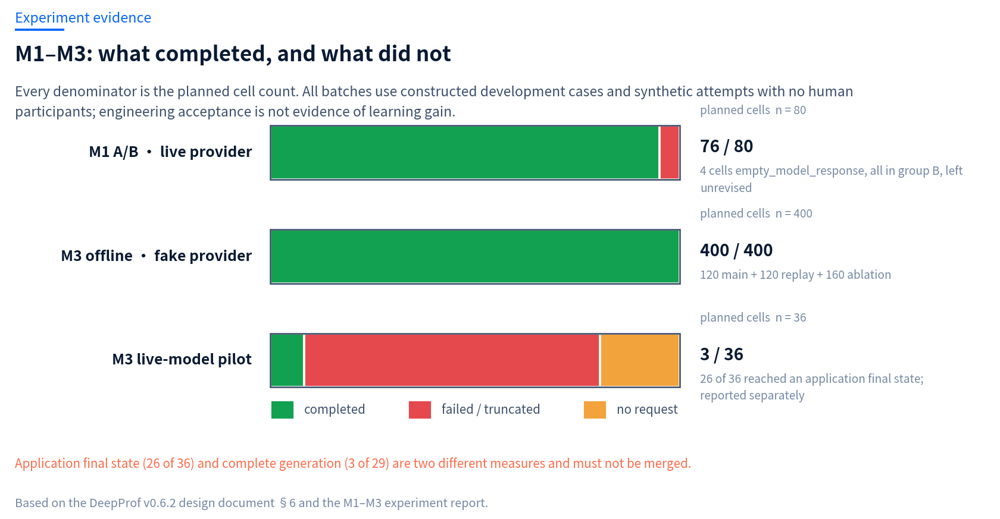
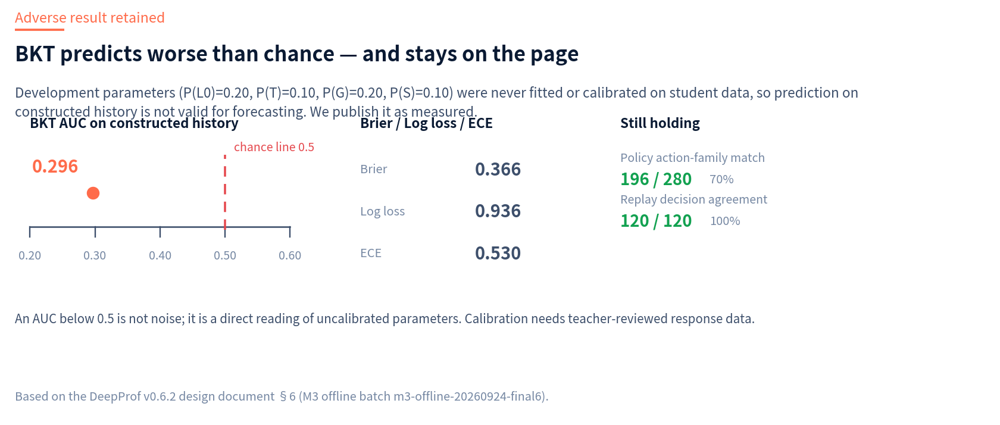

<div align="center">


# DeepProf

### An evidence-grounded, adaptive teaching system you can run locally

[English](README.md) · [简体中文](README.zh-CN.md) · [Website](https://rockeyroc.github.io/DeepProf/) · [Architecture](docs/DESIGNv0.6.2.md) · [Experiment report](docs/experiments/M1-M3-实验报告.md) · [Releases](https://github.com/RockeyRoc/DeepProf/releases)




</div>

> **One command to run it.** Sessions, the course index and audit events stay in `~/.deepprof`. Model calls go only to the provider you configure.

A general assistant can answer a data-structures question correctly and still be useless for teaching: it hands over the conclusion, it points at no page in the textbook, and it leaves nothing behind that a teacher could review. DeepProf is built so those three become checkable properties of the system rather than matters of trust — **evidence is locatable, decisions are auditable, the process is replayable.**

The pilot course is C-language data structures. Current published evidence covers engineering execution, not learning outcomes.

## Contents

- [Why](#why-deepprof)
- [What it does](#what-it-does)
- [Quick start](#quick-start)
- [Architecture](#architecture)
- [Evidence: M1–M3](#evidence-m1m3)
- [Current status](#current-status)
- [Repository layout](#repository-layout)
- [Development](#development)
- [Contributing and security](#contributing-and-security)
- [License](#license)
- [Citation](#citation)

## Why DeepProf

| Failure mode | What goes wrong | What DeepProf does instead |
|---|---|---|
| **Answer leakage** | The reply gives the conclusion and skips the step the student was meant to take. | Every teaching decision carries a declared action family and an explicit stop condition; a failed leakage check returns a deterministic safety result instead of counting as success. |
| **No source** | The advice sounds right but points at no page or knowledge point, so nobody can check it. | Retrieval runs over a versioned local course index and study turns keep `EvidenceRef`s with page locators. When a page cannot be located, the gap is shown rather than filled with a guessed number. |
| **No reproducible trail** | The same question gets different actions on two attempts, and there is no way to see why. | The policy graph reads only versioned state and returns a structured `PedagogicalDecision`; the Runtime records a replayable audit trail that survives restarts. |

## What it does

- **Separates chat from study.** Ordinary conversation and structured study sessions are different paths; only the study path runs the teaching policy.
- **Anchors teaching in locatable evidence.** A versioned policy graph reads a locally indexed course and attaches page-level references to study turns.
- **Gatekeeps what reaches the learner model.** Hinted retries, pending human grades, ambiguous knowledge points and unreliable scores never enter the BKT update. Group C shows mastery only after three reliable answers; groups A and B report the learner model as off.
- **Keeps everything on your machine.** Sessions, events, course index and secrets live in the user data directory. The browser replay page is a read-only field allowlist that returns neither answers nor credentials.
- **Names its own failure states.** Empty model responses, provider truncation, missing evidence, rejected evaluation, cancellation and timeouts are distinct terminal states — none of them folded into "success".

## Quick start

Install **Node.js 22+** and **Python 3.12+**, then:

```sh
npx --yes --package=https://github.com/RockeyRoc/DeepProf/releases/download/v0.6.2/deepprof-cli-0.6.2.tgz deepprof
```

First run needs access to a Python package index: it creates a version-isolated environment under `~/.deepprof`, installs the Runtime dependencies, and starts a Gateway bound to `127.0.0.1`. Setup itself makes no model call. Configure an OpenAI-compatible provider with `/login`, check the install with `deepprof doctor`, add optional scanned-page OCR with `deepprof setup --ocr`.

The package ships its compiled CLI, SDK, Gateway source, course manifest and local replay page — no Git or repository checkout required. PowerShell users can invoke `npx.cmd` with the same package address.

<details>
<summary><b>What the CLI actually prints</b> (transcribed from <code>apps/cli/src/index.ts</code>)</summary>

<br>

`deepprof --help`:

```text
DeepProf CLI v0.6.2

快速开始：deepprof （首次运行时自动准备本机环境）
  deepprof setup [--ocr]    安装 DeepProf Runtime（可选安装扫描件 OCR）
  deepprof doctor            检查 Node.js、Python 与本地安装状态
  deepprof --version         显示 CLI 版本
  deepprof --help            显示本帮助

环境变量：DEEPPROF_HOME、DEEPPROF_PYTHON、DEEPPROF_API_URL
在 CLI 中运行 /help 查看学习、题库和会话命令。
```

On startup, before the `you ›` prompt:

```text
  ◇ DeepProf
  ──────────
  learn · reflect · grow
ds.c_language.v1 · group B · 模型未配置 · 使用 /login 配置 Provider
/help 查看命令 · 空闲时 Ctrl+C 或 /quit 退出 · 执行中 Ctrl+C 取消本轮
```

The command set printed by `/help`:

| Command | Purpose |
|---|---|
| `/login [--show-api-key\|--hidden-api-key]` | Configure a provider profile. Keys never reach history, events, replay or arguments. |
| `/new [--mode chat\|study] [--group A\|B\|C] [--course <id>] [--title <t>]` | Create a session. Defaults to ordinary chat; naming a group opens the teaching path. |
| `/chat <text>` · `/study <text>` | Force the current turn down one path. |
| `/ask` · `/hint` · `/quiz` · `/answer` | Run a teaching turn at a declared action family. |
| `/learner` | Read the local learner estimate (group C only; needs three reliable records). |
| `/ocr <file>` | Convert a scanned PDF or image locally via the bundled MarkItDown skill. |
| `/sources` · `/trace` · `/export` | Inspect the evidence references and decision trace for a turn. |
| `/course list\|use\|import\|bank` | Manage the local course index and question bank. |
| `/resume` · `/tree` · `/fork` · `/compact` | Session history, branching and context management. |
| `/models` · `/doctor` · `/quit` | Provider models, environment probe, exit. |

`/report` and `/acceptance --live` exist only in a developer runtime.

</details>

## Architecture





The policy graph returns a structured teaching decision and never calls the provider, database or filesystem directly. The Runtime binds allowed actions, calls the configured provider and records a replayable event trail. Student answer content and provider secrets are not included in the published experiment bundle.

**Where "local" stops:** the model call itself is not local. Once you configure a remote provider, retrieved textbook fragments and prompts are sent to it. The reproducible offline evaluations instead use a local fake provider, with no network access and no paid calls.

## Evidence: M1–M3

Nine figures, redacted source data and the generation scripts ship with the repository. Every batch uses constructed development cases and synthetic attempts — **there were no human participants**, and engineering acceptance is not evidence of learning gain.

| Batch | Observed engineering evidence | Boundary |
|---|---|---|
| M1 A/B | 76 of 80 constructed-case cells completed | Four failed cells remain visible; this is a developer fixture, not a student outcome |
| M2 | 82/82 focused checks; 309/309 Python regression; 5/5 CLI tests | Engineering acceptance does not establish teacher approval or learning gain |
| M3 offline | 120 main cells, 120 replay cells and 160 ablation cells | Explicit local fake provider and constructed cases |
| M3 BKT | AUC 0.296, Brier 0.366, log loss 0.936 | Development parameters are not calibrated for prediction |
| M3 live pilot | 36 cells, 29 requests, 3 complete generations, 26 truncations and 7 cells without a request | Application completion is reported separately from complete model generation |
| v0.6.2 release validation | 318/318 Python regression, 82/82 focused M2 checks and 7/7 CLI tests; typecheck passed | The 82 focused checks are included in 318; this run is separate from the frozen M2 record |





The BKT parameters (`P(L₀)=0.20`, `P(T)=0.10`, `P(G)=0.20`, `P(S)=0.10`) were never fitted or calibrated on student data, so prediction on constructed history is worse than chance. That result is published as measured rather than tuned away — it is the clearest single reading of how far the learner model still has to go.

Read the [experiment report](docs/experiments/M1-M3-实验报告.md) (Chinese), [figure catalogue](docs/experiments/图表库.md), [M2 acceptance record](docs/M2-offline-acceptance.md) and the [reproducible evidence bundle](docs/experiments/releases/M1-M3-evidence.zip). The offline batches run without network access or paid model calls, so you can re-run them locally and check the figures against the recorded run IDs.

## Current status

Engineering runs end to end; the teaching claims are not yet supported. Stating both is the point of the project.

| | State |
|---|---|
| Local CLI → Gateway → policy graph → provider → replay | Working; M2 offline acceptance passed |
| Versioned course index, page-locatable evidence, audit trail | Working |
| M1 A/B live-provider run | Run recorded; 4 cells failed and were left unrevised |
| M3 offline framework | 400 of 400 cells completed under a local fake provider |
| M3 live-model pilot | 3 of 29 requests generated completely; truncation is the binding constraint |
| BKT learner model | Implemented, **uncalibrated**; prediction worse than chance |
| Teacher review of question bank, page locators and policy | **Not done** |
| Real-student learning outcomes | **Not attempted** — no recruitment, consent or ethics clearance has been sought |

Next gates, in order: teacher review and double-blind case rating → BKT parameter calibration → review of the comparison design and ethics clearance for real students → a pre-registered analysis plan with pre- and post-test data. Until those are cleared, individual scores and product measurements are for local development and teacher-supervised use only.

## Repository layout

```
apps/cli/            TypeScript CLI — keyboard-first entry point, REPL and session handling
api/                 Loopback FastAPI Gateway — command validation, sessions, replay API
graph/education/     Teaching policy graph (LangGraph) returning PedagogicalDecision
runtime/             Runtime: capability binding, provider adapters, memory, error model
models/learner/      BKT estimation and update rules
library/             Course indexing, embeddings and retrieval errors
packages/            Contract schemas and the TypeScript client SDK
data/                Course manifest and the pilot question bank
evaluation/          Offline evaluation entry points and metrics
docs/                Design, experiment reports, figure catalogue and acceptance records
docs/site/           Generators for the figures and brand assets used by index.html
index.html           Project site (open it directly, or serve it from the repository root)
```

## Development

```powershell
python -m venv .venv
.\.venv\Scripts\Activate.ps1
pip install -r requirements.txt
npm ci --prefix apps/cli
npm run typecheck --prefix apps/cli
npm test --prefix apps/cli
python -m pytest
```

Start the Gateway and CLI in separate terminals with `uvicorn api.app:app --host 127.0.0.1 --port 8000` and `npm run start --prefix apps/cli`. The M2 and M3 offline evaluations run without network access or paid model calls; the experiment report records the exact commands, run IDs, data definitions and limits.

## Contributing and security

Read [CONTRIBUTING.md](.github/CONTRIBUTING.md) before submitting a change, and open issues through the provided templates. Report vulnerabilities through GitHub's private security advisory feature — see [SECURITY.md](.github/SECURITY.md).

**Never commit** course answers, raw model replies, API keys, local databases, learner data, or scanned textbook pages.

## License

This repository currently ships **no open-source license**. The code is publicly accessible, which is not the same as permission to redistribute or reuse it. If you want to use DeepProf in another project, please open an issue first.

## Citation

```bibtex
@misc{deepprof,
  title        = {DeepProf: an evidence-grounded, adaptive teaching system},
  author       = {{DeepProf contributors}},
  year         = {2026},
  version      = {v0.6.2},
  howpublished = {\url{https://github.com/RockeyRoc/DeepProf}},
  note         = {Engineering prototype; teacher review, BKT calibration and
                  real-student outcomes remain open.}
}
```

When citing the engineering state, pin the version and date — `v0.6.2`, released 2026-09-24 — rather than pointing at a moving `main`.
