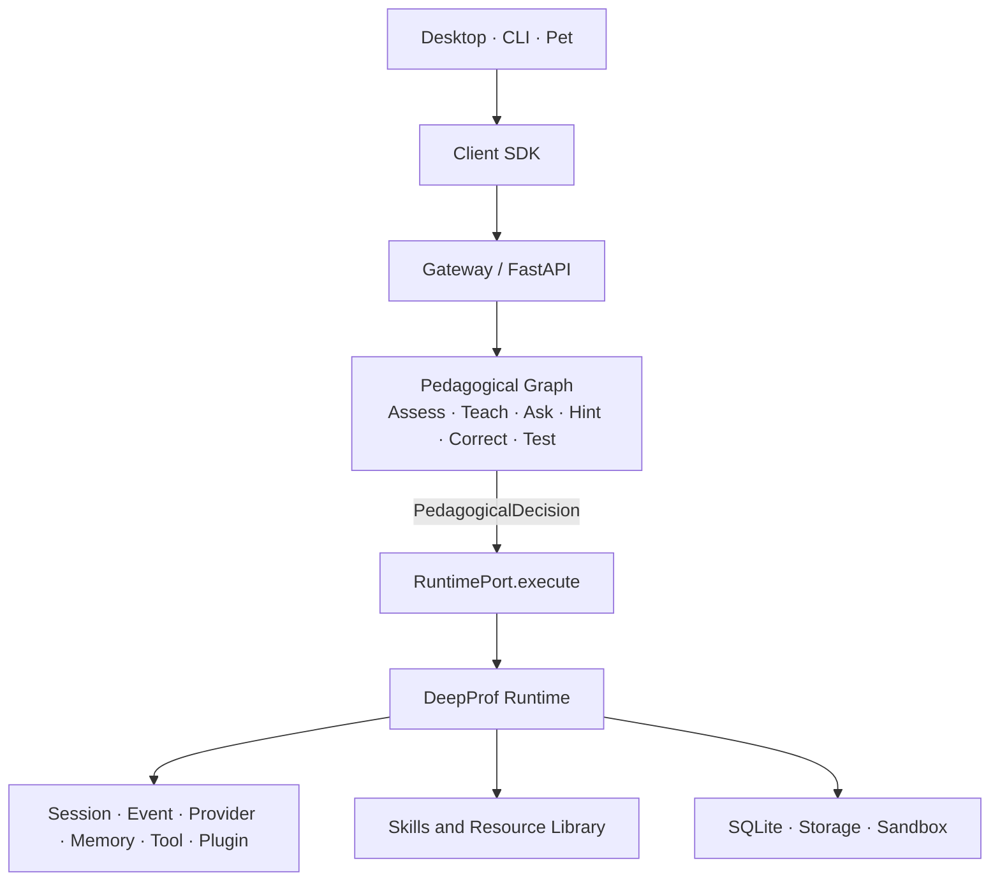

# DeepProf

<p align="center">
  
</p>

<p align="center"><strong>A personal learning companion for higher education</strong></p>

<p align="center">
  <a href="README.zh-CN.md">简体中文</a>
  · MVP-1—MVP-5 engineering preview
</p>

DeepProf combines an education-focused agent runtime, a pedagogical strategy graph, a local resource library, a keyboard-first CLI, and a desktop companion. It is designed to help students learn through questions, evidence, reflection, and durable study context—not to present unverified model output as an authoritative answer.

> **Release status:** `v0.6.1` is a pre-release. MVP-1 through MVP-5 have engineering implementations and acceptance records. Real-provider availability, installer packaging, and several research-oriented capabilities remain environment- or roadmap-dependent.

## What is included

| Surface | Purpose | Current state |
| --- | --- | --- |
| DeepProf Runtime | Sessions, events, providers, memory, tools, plugins, storage, and sandbox boundaries | Delivered and tested |
| Pedagogical Graph | Assess → Teach/Ask/Hint/Correct → Test → Update Profile | Delivered and tested |
| Education capabilities | Socratic dialogue, resource retrieval, quiz, diagnosis, and paper reading contracts | Registered; retrieval and evidence paths are available, while BKT/IRT remain planned |
| Desktop | Electron + React workbench with provider settings, sessions, trace/event projection, and pet window | MVP-3 delivered; loopback-only runtime |
| CLI | Pi-style keyboard workflow: `login`, `new`, `ask`, `resume`, `tree`, `fork`, `compact`, `models`, `doctor` | MVP-5 delivered; shares sessions with Desktop |
| Resource library | Import, preview, activate, search, crawl policy, provenance, and citation locations | MVP-4 delivered |
| Pet package | Codex-compatible event projection and 8×9 sprite-sheet package | Delivered as a companion surface |

## Architecture

DeepProf keeps educational strategy separate from generic agent execution. Graph nodes produce a declaration (`PedagogicalDecision`); a binding table maps it to capabilities; the Runtime performs the work and emits auditable events.



The important boundary is `WHAT → HOW`: `graph/education` owns teaching policy, while `runtime/` remains generic and does not depend on teaching vocabulary. Architecture guard tests enforce this boundary.

## Quick start

### Requirements

- Python 3.12 or newer (the acceptance environment uses Python 3.14).
- Node.js and npm for the Desktop, CLI, and Pet surfaces.
- An OpenAI-compatible provider, a local provider, or the deterministic fake provider for offline tests.

### Python runtime and API

```powershell
python -m pip install -r requirements.txt
Copy-Item .env.example .env

# Start the local Gateway directly
python -m uvicorn api.app:app --host 127.0.0.1 --port 8000
```

The default data root is `~/.deepprof`. The Gateway only binds to loopback by default. Put provider configuration in the supported Provider/Secret path; do not commit API keys or place them in the React renderer.

### Desktop workbench

```powershell
Push-Location apps/desktop
npm.cmd install
npm.cmd run dev
Pop-Location
```

The Electron Main process starts the local Runtime and a loopback workbench. Renderer code has no Node privileges and does not access Provider, Memory, Tool, or Secret internals.

### CLI

```powershell
Push-Location apps/cli
npm.cmd install
npm.cmd run build
node dist/apps/cli/src/index.js --json new --title "Linear algebra"
node dist/apps/cli/src/index.js --json ask <session_id> "What is gradient descent?"
Pop-Location
```

Without a command, the CLI opens its interactive REPL. Use `/login` to configure a provider, or use `--api-key-stdin` / `DEEPPROF_SECRET_*`; plaintext `--api-key` arguments are intentionally rejected.

### API highlights

| Method | Path | Purpose |
| --- | --- | --- |
| `GET` | `/health` | Runtime, provider, capability, binding, and sandbox health |
| `GET` | `/sessions`, `/sessions/{id}/messages` | Inspect sessions and read transcripts |
| `POST` | `/commands` | Send a client command/message |
| `GET` | `/sessions/{id}/events?from_sequence=0` | Replay events for reconnecting clients |
| `GET` / `PUT` | `/providers`, `/providers/{id}` | Manage OpenAI-compatible profiles |
| `GET` / `POST` | `/resources`, `/search`, `/resources/{id}/activate` | Manage and search the resource library |

Errors are structured (`code`, `message`, `details`) so clients do not need to parse prose. See `api/` and `packages/contracts/` for the current wire contracts.

## MVP verification

The release gate covers Python contracts, Runtime behavior, provider switching, education routing, resource provenance, Desktop/CLI cross-surface recovery, and Pet package validation.

```powershell
python -m pytest -q
npm.cmd run typecheck --prefix apps/cli
npm.cmd run build --prefix apps/cli
npm.cmd run test --prefix apps/cli
npm.cmd run typecheck --prefix apps/desktop
npm.cmd run build --prefix apps/desktop
npm.cmd run validate --prefix apps/pet
```

The detailed records are in [`docs/MVP-1_验收记录.md`](docs/MVP-1_验收记录.md), [`docs/MVP-2_验收记录.md`](docs/MVP-2_验收记录.md), [`docs/MVP-3_验收记录.md`](docs/MVP-3_验收记录.md), [`docs/MVP-4_验收记录.md`](docs/MVP-4_验收记录.md), and [`docs/MVP-5-final-verification.md`](docs/MVP-5-final-verification.md).

## Project layout

```text
DeepProf/
├── runtime/              # Generic agent runtime and execution boundaries
├── graph/education/      # Teaching strategy graph and decision contracts
├── skills/               # Socratic, RAG, quiz, diagnosis, paper-reader skills
├── library/              # Resource import, parsing, crawling, indexing, provenance
├── api/                  # FastAPI composition root and Gateway routes
├── packages/             # Client SDK, contracts, and design system
├── apps/                 # Desktop, CLI, and Pet surfaces
├── models/learner/       # Learner model contracts and attempt facts
├── evaluation/           # MVP-5 metrics and cost/latency checks
├── tests/                # Unit, contract, integration, and architecture tests
└── docs/                 # Design document and acceptance records
```

## Known limitations of this pre-release

- BKT/IRT knowledge tracing is represented by contracts and DTOs; the full estimators are not yet shipped.
- Provider fallback is explicit by design, but the streaming main path still needs the remaining fallback wiring.
- The plugin registry and trust model exist; plugin composition-root installation is still being completed.
- A real model account, quota, and model capability determine whether live generation succeeds. Fake/local providers support deterministic offline work.
- `npm run build` produces development/production build output, not a signed Windows installer.

These are tracked in the design document and acceptance records; the release is intentionally marked pre-release.

## Security and privacy

- Runtime, Gateway, and Desktop services bind to loopback by default.
- API keys stay outside Renderer code, session events, graph state, and logs.
- Resource crawling uses allowlists, robots/Terms-of-Service confirmation, size limits, rate limits, and provenance fields.
- Student memory is local-first and should be reviewable, revocable, and removable.
- Third-party content is treated as untrusted data, not as system instructions.

## Documentation

- [`docs/DESIGNv0.6.1.md`](docs/DESIGNv0.6.1.md) — architecture, interfaces, dependency rules, security, and delivery roadmap.
- [`docs/MVP-5-final-verification.md`](docs/MVP-5-final-verification.md) — final cross-surface verification snapshot.
- [`apps/desktop/README.md`](apps/desktop/README.md) — Desktop-specific development notes.
- [`apps/cli/README.md`](apps/cli/README.md) — CLI commands and secret handling.
- [`apps/pet/package/README.md`](apps/pet/package/README.md) — Pet package format and event boundary.

## License and contribution

This repository currently has no `LICENSE` file. Until the team selects and adds a license, all rights are reserved; please do not redistribute or use the code commercially without permission. Issues and design discussions are welcome through GitHub Issues.
