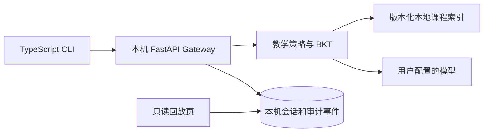

<div align="center">


# DeepProf

### 在本机运行的、以课程证据为基础的自适应教学系统

[简体中文](README.zh-CN.md) · [English](README.md) · [架构设计](docs/DESIGNv0.6.2.md) · [实验报告](docs/experiments/M1-M3-实验报告.md) · [下载](https://github.com/RockeyRoc/DeepProf/releases)


</div>

> 一条命令启动。Gateway 与学习数据留在本机，API Key 使用本机安全存储。

## 快速开始

安装 Node.js 22+ 和 Python 3.12+ 后运行：

```sh
npx --yes --package=https://github.com/RockeyRoc/DeepProf/releases/download/v0.6.2/deepprof-cli-0.6.2.tgz deepprof
```

首次运行会在 `~/.deepprof` 建立 Python 环境、安装 Gateway 依赖，并启动只监听 `127.0.0.1` 的本地服务。在 CLI 中运行 `/login` 配置 OpenAI 兼容 Provider；运行 `deepprof doctor` 检查安装，运行 `deepprof setup --ocr` 安装可选 OCR 支持。

npm 包已包含编译后的 CLI/SDK、Gateway、课程清单与本地回放页面，不用先装 Git 或下载完整仓库。Windows PowerShell 可用 `npx.cmd` 执行相同地址。

## 功能

- 区分普通聊天和结构化学习会话。
- 根据本地审核课程资料与可定位证据生成教学回合。
- 支持三个对照组。只有 C 组读取和更新跨题 BKT 估计，且答案评分可靠、证据数量充分时才更新。
- 在本地保留会话及审计事件；浏览器页面仅提供只读回放。
- 单独标记证据不足、评分不可靠、取消和 Provider 故障等终止原因。

## M1–M3 实验结果

整合报告包括九组图表、脱敏源数据与生成脚本。

| 批次 | 工程运行证据 | 结论边界 |
|---|---|---|
| M1 A/B | 40 个构造案例 × A/B，80 格中完成 76 格 | 保留 4 格失败；属于开发案例，不是真实学生结果 |
| M2 | 定向验收 82/82；Python 回归 309/309；CLI 单测 5/5 | 工程验收不等于教师批准或学习效果 |
| M3 离线 | 主矩阵 120 格、回放 120 格、消融 160 格 | 使用本机 Fake Provider 和构造案例 |
| M3 BKT | AUC 0.296、Brier 0.366、log loss 0.936 | 开发参数尚未校准，不能用于有效性结论 |
| M3 真实模型试跑 | 36 格、29 次请求、3 次完整生成、26 次截断、7 格没有请求 | 分开展示应用终态和完整模型生成结果 |
| v0.6.2 发布验证 | Python 回归 318/318、M2 子集 82/82、CLI 7/7；类型检查通过 | 82 项已包含在 318 项内；本批次与历史 M2 数值分开记录 |


查看[中文实验报告](docs/experiments/M1-M3-实验报告.md)、[图表库](docs/experiments/图表库.md)、[M2 验收记录](docs/M2-offline-acceptance.md)和[实验复现附件](docs/experiments/releases/M1-M3-evidence.zip)。教师审核、BKT 校准和真实学生学习效果仍需后续研究。

## 架构



教学策略图返回结构化决策。Runtime 调用绑定好的能力、已配置 Provider 并记录可回放事件。公开实验包不含学生答案正文或 Provider 密钥。

## 环境要求

- Node.js 22+
- Python 3.12+
- 如需模型回复，配置本地可访问的 OpenAI 兼容 Provider

应用主体在本机运行；用户配置 Profile 前不会访问模型，安装 CLI 不会触发模型请求。扫描页 OCR 是可选依赖。安装和命令用法见 [CLI 指南](apps/cli/README.md)。

## 开发与验证

```powershell
python -m venv .venv
\.venv\Scripts\Activate.ps1
pip install -r requirements.txt
npm ci --prefix apps/cli
npm run typecheck --prefix apps/cli
npm test --prefix apps/cli
python -m pytest
```

可在两个终端分别用 `uvicorn api.app:app --host 127.0.0.1 --port 8000` 和 `npm run start --prefix apps/cli` 启动 Gateway 与 CLI。M2/M3 离线评测不需网络或付费模型调用；准确运行 ID、源数据口径、命令与限制见实验报告。

## 参与贡献与安全问题

提交代码前请阅读[贡献指南](.github/CONTRIBUTING.md)。发现安全问题，请通过 GitHub 私密安全公告联系维护者，详见[安全策略](.github/SECURITY.md)。请勿提交课程答案、模型原始回复、API Key、本地数据库或学习者数据。
