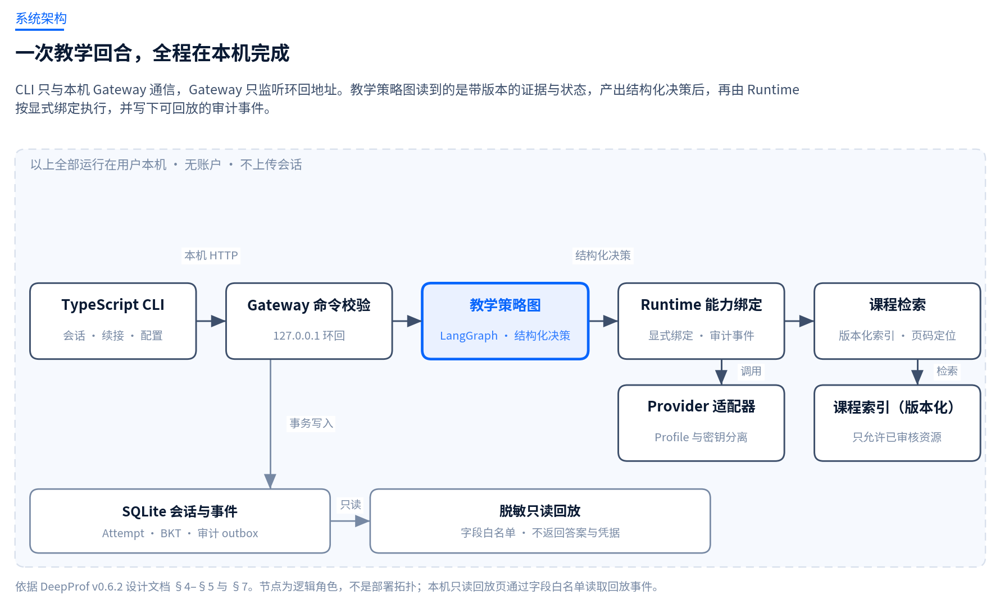
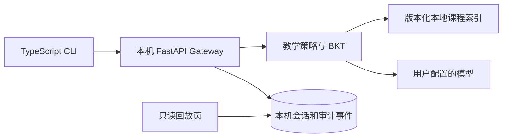
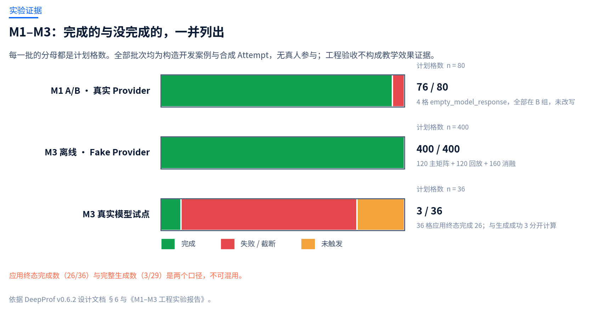
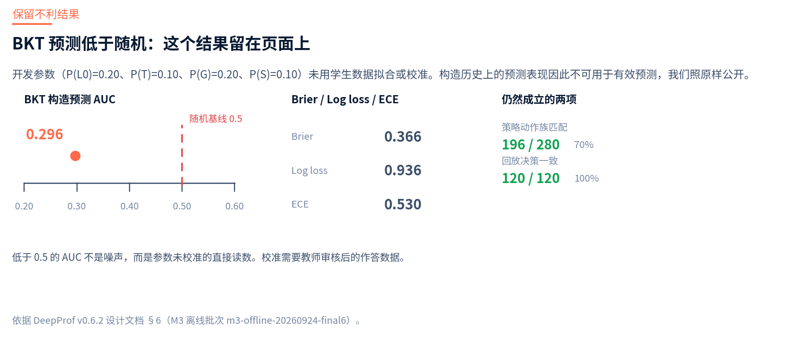

<div align="center">


# DeepProf

### 在本机运行的、以课程证据为基础的自适应教学系统

[简体中文](README.zh-CN.md) · [English](README.md) · [项目网站](https://rockeyroc.github.io/DeepProf/) · [架构设计](docs/DESIGNv0.6.2.md) · [实验报告](docs/experiments/M1-M3-实验报告.md) · [下载](https://github.com/RockeyRoc/DeepProf/releases)


</div>

> **一条命令启动。** 会话、课程索引与审计事件都留在 `~/.deepprof`；模型调用只发往你自己配置的 Provider。

通用助手可以把一道数据结构题答对，却仍然不能拿来教学：它把结论直接交出去，指不到教材的任何一页，也不留下任何教师可以复核的东西。DeepProf 要做的，是让这三件事从"信任问题"变成系统里可检查的属性——**证据可定位、决策可审计、过程可回放。**

试点课程为 C 语言版数据结构。当前公开的证据覆盖工程执行能力，不覆盖学习效果。

## 目录

- [为什么做这个](#为什么做这个)
- [功能](#功能)
- [快速开始](#快速开始)
- [架构](#架构)
- [实验证据](#实验证据)
- [当前状态](#当前状态)
- [仓库结构](#仓库结构)
- [开发与验证](#开发与验证)
- [参与贡献与安全问题](#参与贡献与安全问题)
- [许可](#许可)
- [引用](#引用)

## 为什么做这个

| 失败模式 | 具体会怎样 | DeepProf 的做法 |
|---|---|---|
| **答案泄露** | 回答直接给出结论，跳过了学生本该自己完成的那一步。 | 每个教学决策都带声明的动作族与明确的停止条件；答案泄露检查不通过时返回确定性的安全问题，不把错误生成计作成功。 |
| **建议无出处** | 建议听起来合理，却指不到具体的页码或知识点，学生没法回查、教师没法核对。 | 检索跑在版本化的本地课程索引上，教学回合保留带页码定位的 `EvidenceRef`。页码无法定位时显示缺口，不用推测的页码补足。 |
| **过程不可复现** | 同一道题两次问得到不同的教学动作，事后也回看不出当时为什么这么决定。 | 教学策略图只读取带版本的状态，返回结构化的 `PedagogicalDecision`；Runtime 记录可回放的审计轨迹，重启后仍在。 |

## 功能

- **区分聊天与教学。** 普通对话和结构化学习会话是两条路径，只有教学路径会运行教学策略图。
- **把教学锚在可定位的证据上。** 版本化的策略图读取本地索引的课程，并把页码级引用挂到教学回合上。
- **守住进入学情模型的门槛。** 提示后重试、待人工评分、模糊知识点与不可靠判分都不进入 BKT 更新。C 组至少要有 3 条合格作答证据才显示掌握度；A、B 组明确显示学情模型未启用。
- **所有数据留在本机。** 会话、事件、课程索引与密钥保存在用户数据目录。浏览器回放页是只读的字段白名单，不返回学生答案内容与凭据。
- **给失败状态起名字。** 空模型响应、Provider 截断、证据缺失、评估被拒、取消与超时是各自独立的终态，没有一个被合并进"成功"。

## 快速开始

安装 **Node.js 22+** 与 **Python 3.12+**，然后：

```sh
npx --yes --package=https://github.com/RockeyRoc/DeepProf/releases/download/v0.6.2/deepprof-cli-0.6.2.tgz deepprof
```

首次运行需要能访问 Python 包索引：它会在 `~/.deepprof` 下建立按版本隔离的环境、安装 Runtime 依赖，并启动只监听 `127.0.0.1` 的 Gateway。安装过程本身不会发起任何模型调用。在 CLI 中运行 `/login` 配置 OpenAI 兼容 Provider；运行 `deepprof doctor` 检查安装；运行 `deepprof setup --ocr` 安装可选的扫描件 OCR。

npm 包已包含编译后的 CLI、SDK、Gateway 源码、课程清单与本地回放页面，不用先装 Git 或下载完整仓库。Windows PowerShell 可用 `npx.cmd` 执行相同地址。

<details>
<summary><b>CLI 实际会打印什么</b>（照抄自 <code>apps/cli/src/index.ts</code>）</summary>

<br>

`deepprof --help`：

```text
DeepProf CLI v0.6.2

快速开始：deepprof （首次运行时自动准备本机环境）
  deepprof setup [--ocr]    安装 DeepProf Runtime（可选安装扫描件 OCR）
  deepprof doctor            检查 Node.js、Python 与本地安装状态
  deepprof --version         显示 CLI 版本
  deepprof --help            显示本帮助

环境变量：DEEPPROF_HOME、DEEPPROF_PYTHON、DEEPPROF_API_URL
在 CLI 中运行 /help 查看学习、题库和会话命令。
```

进入 `you ›` 提示符之前：

```text
  ◇ DeepProf
  ──────────
  learn · reflect · grow
ds.c_language.v1 · group B · 模型未配置 · 使用 /login 配置 Provider
/help 查看命令 · 空闲时 Ctrl+C 或 /quit 退出 · 执行中 Ctrl+C 取消本轮
```

`/help` 打印的命令集：

| 命令 | 用途 |
|---|---|
| `/login [--show-api-key\|--hidden-api-key]` | 配置 Provider Profile。密钥不写入历史、事件、回放或命令行参数。 |
| `/new [--mode chat\|study] [--group A\|B\|C] [--course <id>] [--title <t>]` | 新建会话。默认走常规聊天；指定组别才进入教学路径。 |
| `/chat <内容>` · `/study <内容>` | 强制当前回合走某一条路径。 |
| `/ask` · `/hint` · `/quiz` · `/answer` | 按声明的动作族执行一次教学回合。 |
| `/learner` | 读取本地学情估计（仅 C 组；需要 3 条合格作答证据）。 |
| `/ocr <文件>` | 用内置的 MarkItDown Skill 在本机转换扫描 PDF 或图片。 |
| `/sources` · `/trace` · `/export` | 查看某一回合的证据引用与决策轨迹。 |
| `/course list\|use\|import\|bank` | 管理本地课程索引与题库。 |
| `/resume` · `/tree` · `/fork` · `/compact` | 会话历史、分叉与上下文管理。 |
| `/models` · `/doctor` · `/quit` | Provider 模型、环境检查、退出。 |

`/report` 与 `/acceptance --live` 只在开发环境提供。

</details>

## 架构





教学策略图返回结构化决策，且不直接调用 Provider、数据库或文件系统。Runtime 按显式绑定执行能力、调用已配置的 Provider，并记录可回放的事件轨迹。公开实验包不含学生答案正文或 Provider 密钥。

**"本机"到哪儿为止：** 模型调用本身不在本机。一旦配置了远端 Provider，教材检索片段与提示会发送给该 Provider。可复现的离线评测改用本地 Fake Provider，不产生网络调用与费用。

## 实验证据

整合报告连同九组图表、脱敏源数据与生成脚本一并发布。全部批次使用构造开发案例与合成 Attempt——**没有真人参与者**，工程验收不等于学习效果。

| 批次 | 工程运行证据 | 结论边界 |
|---|---|---|
| M1 A/B | 40 个构造案例 × A/B，80 格中完成 76 格 | 保留 4 格失败；属于开发案例，不是真实学生结果 |
| M2 | 定向验收 82/82；Python 回归 309/309；CLI 单测 5/5 | 工程验收不等于教师批准或学习效果 |
| M3 离线 | 主矩阵 120 格、回放 120 格、消融 160 格 | 使用本机 Fake Provider 和构造案例 |
| M3 BKT | AUC 0.296、Brier 0.366、log loss 0.936 | 开发参数尚未校准，不能用于有效性结论 |
| M3 真实模型试跑 | 36 格、29 次请求、3 次完整生成、26 次截断、7 格没有请求 | 分开展示应用终态和完整模型生成结果 |
| v0.6.2 发布验证 | Python 回归 318/318、M2 子集 82/82、CLI 7/7；类型检查通过 | 82 项已包含在 318 项内；本批次与历史 M2 数值分开记录 |





BKT 的开发参数（`P(L₀)=0.20`、`P(T)=0.10`、`P(G)=0.20`、`P(S)=0.10`）从未用学生数据拟合或校准，因此在构造历史上的预测低于随机。这个结果照原样公开，不做调参掩盖——它是学情模型还差多远最清楚的一个读数。

查看[中文实验报告](docs/experiments/M1-M3-实验报告.md)、[图表库](docs/experiments/图表库.md)、[M2 验收记录](docs/M2-offline-acceptance.md)与[可复现的实验附件](docs/experiments/releases/M1-M3-evidence.zip)。离线批次不需要网络或付费模型调用，可以在本机重跑并按记录的 run ID 核对图表。

## 当前状态

工程链路能跑通，教学主张尚不成立。两件事都写出来，正是这个项目的重点。

| | 状态 |
|---|---|
| 本机 CLI → Gateway → 策略图 → Provider → 回放 | 可用；M2 离线验收通过 |
| 版本化课程索引、页码可定位证据、审计轨迹 | 可用 |
| M1 A/B 真实 Provider 运行 | 已有记录；4 格失败，未改写 |
| M3 离线框架 | 本地 Fake Provider 下 400/400 格完成 |
| M3 真实模型试跑 | 29 次请求中 3 次完整生成；截断是硬约束 |
| BKT 学情模型 | 已实现、**未校准**；预测低于随机 |
| 题库、页码与策略的教师审核 | **未完成** |
| 真实学生学习效果 | **未开展**——没有招募、同意或伦理审批 |

下一步门槛，按顺序：教师审核与案例双人盲评 → BKT 参数校准 → 对照方案审查与真实学生伦理准入 → 预注册分析计划与前测/后测数据。在这些门槛完成之前，个体成绩与产品测量只用于本机开发与教师监督下的教学。

## 仓库结构

```
apps/cli/            TypeScript CLI —— 键盘优先入口、REPL 与会话处理
api/                 环回 FastAPI Gateway —— 命令校验、会话、回放 API
graph/education/     教学策略图（LangGraph），返回 PedagogicalDecision
runtime/             Runtime：能力绑定、Provider 适配器、记忆、错误模型
models/learner/      BKT 估计与更新规则
library/             课程索引、嵌入与检索错误
packages/            契约 schema 与 TypeScript 客户端 SDK
data/                课程清单与试点题库
evaluation/          离线评测入口与指标
docs/                设计文档、实验报告、图表库与验收记录
docs/site/           index.html 所用配图与品牌资产的生成脚本
index.html           项目网站（可直接打开，也可从仓库根提供服务）
```

## 开发与验证

```powershell
python -m venv .venv
\.venv\Scripts\Activate.ps1
pip install -r requirements.txt
npm ci --prefix apps/cli
npm run typecheck --prefix apps/cli
npm test --prefix apps/cli
python -m pytest
```

可在两个终端分别用 `uvicorn api.app:app --host 127.0.0.1 --port 8000` 和 `npm run start --prefix apps/cli` 启动 Gateway 与 CLI。M2/M3 离线评测不需网络或付费模型调用；准确命令、run ID、源数据口径与限制见实验报告。

## 参与贡献与安全问题

提交代码前请阅读[贡献指南](.github/CONTRIBUTING.md)，并请使用提供的 issue 模板。发现安全问题，请通过 GitHub 私密安全公告联系维护者，详见[安全策略](.github/SECURITY.md)。

**请勿提交**课程答案、模型原始回复、API Key、本地数据库、学习者数据或教材扫描页。

## 许可

本仓库当前**没有附加开源许可证**。代码是公开可访问的，但这不等于授权再分发或复用。若希望在别的项目中使用 DeepProf，请先开 issue 联系。

## 引用

```bibtex
@misc{deepprof,
  title        = {DeepProf: an evidence-grounded, adaptive teaching system},
  author       = {{DeepProf contributors}},
  year         = {2026},
  version      = {v0.6.2},
  howpublished = {\url{https://github.com/RockeyRoc/DeepProf}},
  note         = {Engineering prototype; teacher review, BKT calibration and
                  real-student outcomes remain open.}
}
```

引用工程的交付状态时，请带上版本与日期——`v0.6.2`、2026-09-24——不要指向一个移动中的 `main`。
