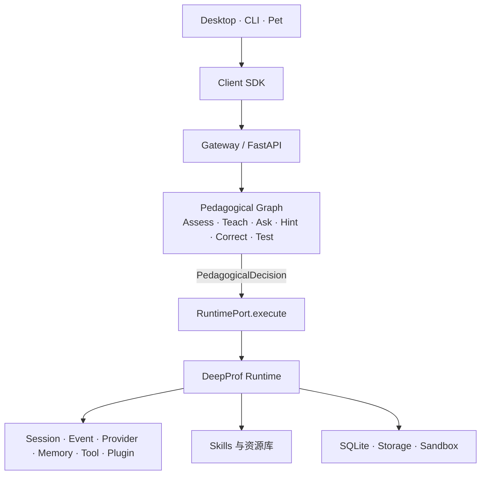

# DeepProf

<p align="center">
  
</p>

<p align="center"><strong>面向高等教育的个性化伴学智能体</strong></p>

<p align="center">
  <a href="README.md">English</a>
  · MVP-1—MVP-5 工程预览版
</p>

DeepProf 将教育智能体 Runtime、教学策略图、本地资源库、键盘优先 CLI 和桌面伴学挂件组合起来。它通过提问、证据、反思和可持续的学习上下文帮助学生学习，而不是把未经验证的模型输出包装成权威答案。

> **发布状态：** `v0.6.1` 为预发布版。MVP-1 至 MVP-5 已完成工程实现并形成验收记录；真实 Provider 的可用性、安装程序封装以及若干研究能力仍取决于运行环境或后续路线。

## 当前包含的能力

| 模块 | 作用 | 当前状态 |
| --- | --- | --- |
| DeepProf Runtime | Session、事件、Provider、Memory、Tool、Plugin、Storage 与 Sandbox 边界 | 已交付并测试 |
| Pedagogical Graph | Assess → Teach/Ask/Hint/Correct → Test → Update Profile | 已交付并测试 |
| 教育能力 | 苏格拉底对话、资源检索、测验、诊断和论文阅读契约 | 已注册；检索与证据链路可用，BKT/IRT 仍在规划 |
| Desktop | Electron + React 工作台、Provider 设置、Session、Trace/事件投影和桌宠窗口 | MVP-3 已交付；仅环回地址 |
| CLI | Pi 风格键盘流程：`login`、`new`、`ask`、`resume`、`tree`、`fork`、`compact`、`models`、`doctor` | MVP-5 已交付；与 Desktop 共享 Session |
| 资源库 | 导入、预览、启用、检索、爬虫策略、来源追踪和引用定位 | MVP-4 已交付 |
| 桌宠包 | Codex 兼容的事件投影和 8×9 动作图集 | 作为伴学挂件交付 |

## 架构

DeepProf 将教育策略与通用 Agent 执行分离。图节点只产生声明式决策（`PedagogicalDecision`），绑定表将决策映射到能力，Runtime 负责执行并发出可审计事件。



核心边界是“策略决定做什么，Runtime 决定如何执行”：`graph/education` 负责教学策略，`runtime/` 保持通用且不依赖教学词汇。架构守卫测试会机械检查这条边界。

## 快速开始

### 环境要求

- Python 3.12 或更高版本（验收环境为 Python 3.14）。
- 使用 Desktop、CLI 和 Pet 时需要 Node.js 与 npm。
- 一个 OpenAI-compatible Provider、本地 Provider，或用于离线测试的确定性 Fake Provider。

### Python Runtime 与 API

```powershell
python -m pip install -r requirements.txt
Copy-Item .env.example .env

# 直接启动本地 Gateway
python -m uvicorn api.app:app --host 127.0.0.1 --port 8000
```

默认数据目录为 `~/.deepprof`。Gateway 默认只监听环回地址。请通过受支持的 Provider/Secret 路径配置模型，不要提交 API Key，也不要让 React Renderer 接触密钥。

### Desktop 工作台

```powershell
Push-Location apps/desktop
npm.cmd install
npm.cmd run dev
Pop-Location
```

Electron Main 进程会启动本地 Runtime 和环回工作台。Renderer 没有 Node 权限，也不直接访问 Provider、Memory、Tool 或 Secret 内部实现。

### CLI

```powershell
Push-Location apps/cli
npm.cmd install
npm.cmd run build
node dist/apps/cli/src/index.js --json new --title "线性代数"
node dist/apps/cli/src/index.js --json ask <session_id> "什么是梯度下降？"
Pop-Location
```

不带命令时 CLI 会打开交互式 REPL。使用 `/login` 配置 Provider；自动化场景使用 `--api-key-stdin` 或 `DEEPPROF_SECRET_*`。系统会拒绝明文 `--api-key` 参数。

### API 主要接口

| 方法 | 路径 | 作用 |
| --- | --- | --- |
| `GET` | `/health` | Runtime、Provider、能力、绑定和 Sandbox 健康检查 |
| `GET` | `/sessions`、`/sessions/{id}/messages` | 查看 Session 与历史消息 |
| `POST` | `/commands` | 发送客户端命令或消息 |
| `GET` | `/sessions/{id}/events?from_sequence=0` | 为断线客户端补发事件 |
| `GET` / `PUT` | `/providers`、`/providers/{id}` | 管理 OpenAI-compatible Profile |
| `GET` / `POST` | `/resources`、`/search`、`/resources/{id}/activate` | 管理与检索资源库 |

错误统一返回 `code`、`message`、`details`，客户端不需要解析自然语言。当前契约见 `api/` 与 `packages/contracts/`。

## MVP 验证

发布门禁覆盖 Python 契约、Runtime 行为、Provider 切换、教育路由、资源来源追踪、Desktop/CLI 跨端恢复以及桌宠包校验。

```powershell
python -m pytest -q
npm.cmd run typecheck --prefix apps/cli
npm.cmd run build --prefix apps/cli
npm.cmd run test --prefix apps/cli
npm.cmd run typecheck --prefix apps/desktop
npm.cmd run build --prefix apps/desktop
npm.cmd run validate --prefix apps/pet
```

详细记录见 [`docs/MVP-1_验收记录.md`](docs/MVP-1_验收记录.md)、[`docs/MVP-2_验收记录.md`](docs/MVP-2_验收记录.md)、[`docs/MVP-3_验收记录.md`](docs/MVP-3_验收记录.md)、[`docs/MVP-4_验收记录.md`](docs/MVP-4_验收记录.md) 和 [`docs/MVP-5-final-verification.md`](docs/MVP-5-final-verification.md)。

## 项目结构

```text
DeepProf/
├── runtime/              # 通用 Agent Runtime 与执行边界
├── graph/education/      # 教学策略图与决策契约
├── skills/               # socratic、RAG、quiz、diagnosis、paper-reader
├── library/              # 资源导入、解析、爬取、索引与来源追踪
├── api/                  # FastAPI 组合根与 Gateway 路由
├── packages/             # Client SDK、契约和设计系统
├── apps/                 # Desktop、CLI 和 Pet 前端
├── models/learner/       # 学情契约与作答事实
├── evaluation/           # MVP-5 指标、成本与延迟检查
├── tests/                # 单元、契约、集成和架构测试
└── docs/                 # 设计文档与验收记录
```

## 预发布已知限制

- BKT/IRT 学情追踪目前提供契约与 DTO，完整估计器尚未交付。
- Provider fallback 必须显式启用，流式主链路仍需补齐剩余 fallback 接线。
- Plugin 注册表和信任模型已实现，插件进入组合根的安装流程仍在完善。
- 实时生成是否成功取决于模型账户、配额和能力；Fake/本地 Provider 可用于确定性离线运行。
- `npm run build` 生成开发/生产构建产物，但尚未生成签名 Windows 安装程序。

这些限制已记录在设计文档和验收记录中，因此本版本明确标记为预发布版。

## 安全与隐私

- Runtime、Gateway 和 Desktop 默认只监听环回地址。
- API Key 不进入 Renderer、Session Event、Graph State 或日志。
- 资源爬取使用域名白名单、robots/ToS 确认、大小限制、限速和来源字段。
- 学生记忆默认本地保存，并应支持查看、撤回和删除。
- 第三方内容被视为不可信数据，不得当作系统指令执行。

## 文档

- [`docs/DESIGNv0.6.1.md`](docs/DESIGNv0.6.1.md)：架构、接口、依赖规则、安全与交付路线。
- [`docs/MVP-5-final-verification.md`](docs/MVP-5-final-verification.md)：跨端最终验证快照。
- [`apps/desktop/README.md`](apps/desktop/README.md)：Desktop 开发说明。
- [`apps/cli/README.md`](apps/cli/README.md)：CLI 命令与密钥处理。
- [`apps/pet/package/README.md`](apps/pet/package/README.md)：桌宠包格式与事件边界。

## 许可证与贡献

仓库当前没有 `LICENSE` 文件。在团队选定并加入许可证之前，代码默认为保留所有权利；未经许可请勿再分发或用于商业用途。欢迎通过 GitHub Issues 提交问题和架构讨论。
