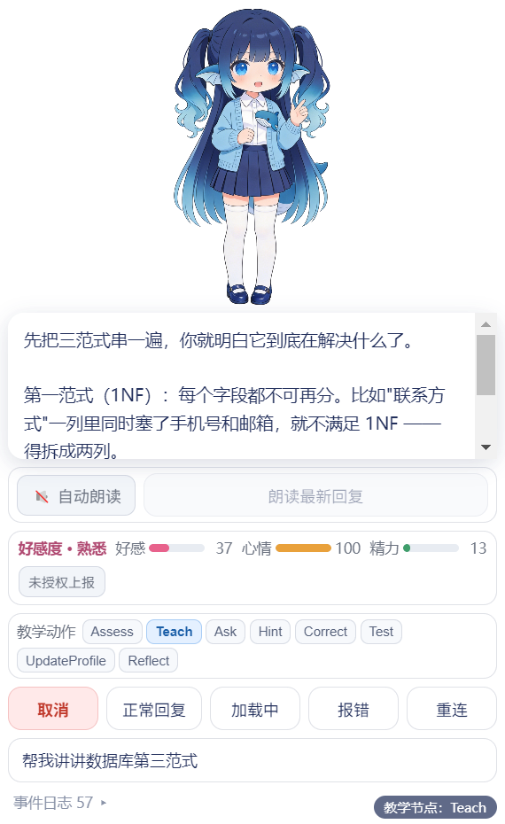
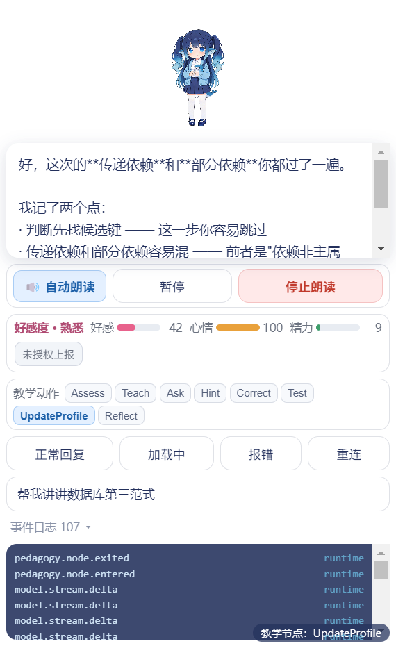

# 实际输出

> **约定**：本文档不引用行号，只引用符号名 —— 行号会被并发改动冲掉。

> **这份文档写的是「这个模块真的跑起来是什么样」，不是设计意图。**
> 里面每一个现象都是**启动应用之后实际看到的**；凡是没实际验证过的，
> 会明确写「**未实测**」，不会写成"应该会"。
>
> 对应 DESIGNv0.4.1 §16.8 **阶段 04「评审与演示」**门槛要求的「**实际输出**」。
> 与「统一交接清单」里的「**实际输出**」一格配套 —— 那一格要的是"真实跑起来的样子"，
> 不是"设计上应该是什么样"。
>
> 截图在 **[`截图/`](截图/)**（7 张，均为本轮实拍/实渲染）。

---

## 〇、这份和另外几份怎么分工（先看这个，避免重复读）

| 文档 | 写的是 | 本文与它的关系 |
| --- | --- | --- |
| [`启动说明.md`](启动说明.md) | **怎么装、怎么跑、跑不起来怎么办** | 本文不重复安装步骤，只写"跑起来之后看到什么" |
| [`输入输出.md`](输入输出.md) | **字段级的输入输出契约**（15 种事件、16 条 IPC、payload 字段） | 本文不重复字段表；§三 只写**实测序列与文档序列的出入** |
| [`失败样例.md`](失败样例.md) | **刻意构造的失败场景**（报错/取消/重连/装配失败） | 本文只走**正常一轮**这条路径 |
| [`已知限制.md`](已知限制.md) | **做不到什么、哪里有边界** | 本文写"是什么样"，那份写"哪里不行" |

### 采集环境与方法（**这一段决定上面所有结论的有效范围**）

| 项 | 值 |
| --- | --- |
| 时间 | **2026-09-19 18:16 – 18:24** |
| 系统 | Windows 11（内核 10.0.26200） |
| 屏幕 | 逻辑 **1707×1019** 工作区（150% 缩放），物理 2560×1600 |
| 启动方式 | `npm run dev`（= `启动桌宠.bat` 内部那条命令），**dev 模式** |
| 采集手段 | ① 读终端日志原文；② 通过 CDP 驱动界面并**读回 DOM 状态**；③ 窗口自绘内容用 `Page.captureScreenshot` 抓（保留 alpha）；④ 桌面实拍用系统截屏裁剪 |

> ⚠️ **两条必须说明的采集条件**，否则下面的截图会被误读：
>
> 1. **采集期间 `desktop/src/` 有并发修改**（18:21 还触发过一次 Vite 热更新），
>    热更新会让页面重载、React 状态清零。因此 §二 的每一项都以
>    **"我发出操作 → 立刻读回状态"** 为准，不依赖长间隔的持续观察。
> 2. **采集期间同一个实例上出现过非本人发起的操作**
>    （观测到自动漫游日志、面板被收起）。因此下面的**每一项都标了「本轮实测？」**，
>    没实测的一律不写成结论。
>
> 另外：为了让一轮对话在**没有声音**的情况下采集（避免打扰），
> 录制时先把「自动朗读」点成了 **🔇**。**交付默认值是 🔊 开启**，
> 截图里能看到那个开关的样子。

---

## 一、启动之后，实际看到什么

### 1.1 桌面上出现的东西

| 项 | 实际观测值 | 与设计的出入 |
| --- | --- | --- |
| 位置 | 屏幕**右下角**，距工作区右下各 24px | 符合设计 |
| 窗口尺寸（主进程自报） | **223×423** | ⚠️ 比代码里的 `220×420` **各大了 3px** —— 这是 `可移植性清单.md` 记录的**分数 DPI 窗口漂移**，`safeSetPosition` 用 `setBounds` 显式带尺寸把它按住了，**不会再持续增长**，但初值就是这个数 |
| 窗口外观 | 无边框、透明、置顶；**只有角色，没有任何面板** | 符合设计 |
| 角色大小 | 约占窗口的**下半部**，高约 200px | 符合设计 |
| 代码里写死的常量 | `PET_W = 220`、`PET_H = 420`（`src/main/index.js`） | — |

**实拍**（截图 07，桌面右下角实拍，背景是演示机当时的终端窗口 ——
透明窗口的透明区域能正常看到后面的内容，说明透明与穿透是生效的）：


**窗口自绘内容**（截图 01，直接抓渲染进程画的内容，透明背景保留为 alpha；
看到的是"窗口里画了什么"，**不含桌面背景**）：


> 📌 **两种图的区别**：07 是**系统截屏**，证明"它在桌面上、位置和大小是这样"；
> 01 是**渲染进程自己的输出**，证明"窗口里画的是这个"。
> 之所以两种都要，是因为**分层透明窗口用普通截图工具抓不全** ——
> 这也是应用自己在启动时往 `%TEMP%` 写自截图的原因。

### 1.2 终端实际打印什么（原文照录）

```
> deepprof-desktop@0.1.0 dev
> electron-vite dev

vite v5.4.21 building SSR bundle for development...
✓ 1 modules transformed.
out/main/index.js  43.11 kB
✓ built in 123ms
build the electron main process successfully
-----
vite v5.4.21 building SSR bundle for development...
✓ 1 modules transformed.
out/preload/index.js  2.80 kB
✓ built in 11ms
build the electron preload files successfully
-----
dev server running for the electron renderer process at:
  ➜  Local:   http://localhost:5173/
start electron app...

[桌宠] 快捷键 Control+Alt+Shift+D(归位) ✅  Control+Alt+Shift+X(退出) ✅
[桌宠] 窗口已显示 @ (1462, 574)  223x423
[渲染进程] [桌宠] ⚠️ 素材与 geometry 对不上：贴图是 %dx%d，geometry 写的是 %dx%d。
           角色大小会错。请重跑 归一化帧.py，并把 PNG 和 _几何.json 一起重新拷贝。 1 1 1536 1536
[渲染进程] [桌宠] ⚠️ 素材与 geometry 对不上：……（同一条，持续重复）
[桌宠] 渲染诊断: {"rootLen":186,"hasPet":false,"petSrc":null,"petComplete":null,
                 "petNatural":null,"bodyBg":"rgba(0, 0, 0, 0)"}
[桌宠] 窗口自截图已保存: C:\Users\87092\AppData\Local\Temp\deepprof-window.png
[桌宠] 窗口自截图已保存-2s: C:\Users\87092\AppData\Local\Temp\deepprof-window-2s.png
```

**启动耗时**：从敲下命令到 `窗口已显示`，本轮实测约 **3 秒**（dev 模式含 vite 启动）。
这和 `性能数据/` 里 dev 的 **1394.7 ms** 不是一个量级 ——
那次是从 Electron 主进程出生算起、且先做过热身的**测量口径**；
这里是人眼从回车到看见小人的**体感口径**，两者不可比。

### 1.3 ⚠️ 启动后终端会刷的东西，有三条**会误导人**

按"会不会让人误判"排序：

| # | 终端里看到 | 实际是什么 | 会不会误导 |
| --- | --- | --- | --- |
| 1 | `⚠️ 素材与 geometry 对不上：…… 1 1 1536 1536` **反复刷屏** | ⚠️ **误报**。贴图加载完成前 Pixi 报宽度 `1`，于是误判为不匹配。素材其实是**对得上**的（都是 1536）。`%d` 没被替换是因为这条 `console.error` 要经 IPC 转发 | **会**。这是为了防 768/1536 那个坑加的自检，现在每次启动都喊狼来了，真出问题反而看不见。见 [`已知限制.md`](已知限制.md) §7.2 |
| 2 | `渲染诊断: {"hasPet":false, ...}` | ⚠️ **探针失效**。它查的选择器是 `.pet`，而实际类名是 `.pet-area`，**恒为 false** | **会**。画面明明是好的，这行却像在报"角色没挂上"。见 §7.1 |
| 3 | `[窗口诊断] resize` / `[气泡诊断]` 持续刷屏 | ✅ **正常的临时诊断日志**（作者标注"定位完就删"），不是故障 | 不会，但答辩时终端很吵 —— **演示时把它最小化即可，别关**（关了 = 退出桌宠） |

> **净结论**：**当前终端输出不能直接当作"启动自检通过"的证据。**
> 判别"是不是真的起来了"要看这两行同时成立：
> `[桌宠] 窗口已显示 @ (x, y) …` **和** 屏幕上真的看得见小人。
> `hasPet` 那一行**不要引用**。

---

## 二、每个操作的实际效果（对照 `App.jsx` 的右键菜单逐项）

右键菜单的**实际内容**是从运行中的界面里读出来的，共 **10 项**（顺序即菜单顺序）：

| # | 菜单项 | 点下去实际发生什么 | 本轮实测？ |
| --- | --- | --- | --- |
| 1 | **打开对话 / 收起对话** | 窗口 **220×420 ↔ 380×620**；面板展开后角色区被挤矮、浮动气泡消失（面板里自带气泡）。文字随状态在两者间切换 | ✅ **实测**（读回 `.app` 类名在 `app` 与 `app app-pet` 间切换，`innerWidth` 220↔380） |
| 2 | **随便走走** | 主进程挑一个屏幕内落点，分帧走过去（约 0.6–1.9 秒），期间角色播走路帧、转向时翻面 | ⚠️ **未实测**（见下方"漫游日志"） |
| 3 | **回到原位** | 小人被移回屏幕**底边**并夹取在工作区内 | ✅ **实测**（窗口物理坐标移到 `1929,897`，即工作区底边） |
| 4 | **让它自己走 / 别乱跑了** | 切换**自动漫游**开关（默认**关**）。开启后终端每走一次打一行 `[桌宠] 溜达到 (x, y) 距离 Npx 用时 Nms …` | ⚠️ **未实测**（但采集期间**观测到**该日志，说明这条链路是通的 —— 见下） |
| 5 | **取消置顶 / 窗口置顶** | 切换窗口置顶状态 | ⚠️ **未实测** |
| 6 | **恢复默认大小（100%）** | 把滚轮缩放复位；菜单项标签会实时显示当前倍率（实测时显示 `100%`） | ⚠️ **未实测**（只读到标签文本） |
| 7 | **分层走路（暂停·等新角色）** | 在 `FramePet`（默认，**9 张表情**）与 `RigPet`（一张立绘拆三层、腿由代码摆）之间切换 | ⚠️ **未实测**；且该项现在**菜单里就是 disabled 的**（按钮文字带「暂停」），点了不会有反应 —— 那三层贴图是从**旧角色** `idle.png` 拆的，切过去会变回旧形象 |
| 8 | **Live2D 本轮不提供（当前使用逐帧 PNG 方案）** | ⚠️ **不切换**，只弹一个 `window.alert` 说明本轮范围（逐帧 PNG 方案；Live2D 未列入本轮交付）。这是**有意的**，不是故障 | ✅ 菜单项文本与 alert 正文已在运行时读回确认（2026-09-19） |
| 9 | **点击穿透 / 恢复鼠标操作** | 切换"强制穿透"（穿透的**自动**判定在主进程每 50ms 轮询，与这一项无关） | ⚠️ **未实测** |
| 10 | **退出**（红色） | 真的退出应用 | ⚠️ **未实测**（本轮用 `taskkill` 收的尾 —— 这一点本身就是不理想的演示收尾方式） |

**菜单实拍**（截图 02。菜单画在窗口内、右上方，**10 项全部完整可见**，没有被窗口裁掉）：


### 关于"未实测"的说明

本轮把力气放在**"一轮完整交互"**这一条主链路上（§三），
菜单里的大部分开关只做到了**确认它存在、文本正确**，没有逐个点开验证。

> 📌 **一条侧证**：采集期间终端打印过这样的日志（不是本轮点出来的，但证明链路是通的）：
> ```
> [桌宠] 溜达到 (917, 398)  距离 369px  用时 1419ms  当前尺寸 380x621  屏幕工作区 1707x1019
> [桌宠] 溜达到 (1224, 399) 距离 158px  用时 608ms   当前尺寸 380x620  屏幕工作区 1707x1019
> ```
> 从这两行能读出三件事：**漫游在工作**、**距离/用时是分帧逼近的**（不是瞬移）、
> **工作区是 1707×1019**。
> ⚠️ 同时也暴露一个小问题：`当前尺寸` 在 `380x621` 与 `380x620` 之间**来回跳 1px** ——
> 就是 §1.1 那个分数 DPI 漂移的残留。

---

## 三、一轮完整交互的实际事件序列

**操作**：打开对话面板 → 点「**正常回复**」（输入框默认是「帮我讲讲数据库第三范式」）。

**结果**：整轮约 **9~10 秒**，界面收到 **107 条**事件（面板显示 `事件日志 107`）。

### 3.1 实测序列（骨架，已去掉重复的 `model.stream.delta`）

抓取方法：在渲染进程挂 `window.deepprof.onEvent` 记录（**不改代码**）。
下面每行的 `source` 都是实测读到的：

```text
 1  session.started              runtime   {resumed:false}
 2  agent.turn.started           runtime   {input:"帮我讲讲数据库第三范式"}
 3  pedagogy.node.entered        runtime   {node:"Assess"}
 4  model.requested              runtime   {provider:"deepseek", model:"deepseek-chat"}
 5  pedagogy.node.entered        runtime   {node:"Assess"}          ← ⚠️ 又一遍，见 §3.2
 6  pedagogy.decision            runtime   {next:"Teach", reason:"先确认先验知识"}
 7  memory.read                  runtime   {query:"recent_mistakes"}
 8  model.stream.delta × N       runtime   第 1 段（Assess 文本，累计语义）
 9  pedagogy.node.exited         runtime   {node:"Assess"}
10  pedagogy.node.entered        runtime   {node:"Teach"}
11  model.stream.delta × N       runtime   第 2 段（从空串重新累计）
12  pedagogy.node.exited         runtime   {node:"Teach"}
13  pedagogy.node.entered        runtime   {node:"Ask"}
    ……（Ask / Hint / Correct 依同样节奏，每段之间约 900ms）
    pedagogy.node.exited / pedagogy.node.entered {node:"UpdateProfile"}
    model.stream.delta × N                第 6 段
    pedagogy.node.exited         runtime   {node:"UpdateProfile"}
    memory.write                 runtime   {dimension:"episodic", key:"db_normalization"}
    model.completed              runtime   {text: <6 段拼接的完整文本>}
    agent.turn.completed         runtime   {status:"ok"}
```

> 上面 22 行（含两个 `node.entered{Assess}`）是**状态事件**，共 **21 条**；
> 剩下的**约 86 条全是 `model.stream.delta`**（逐字流式，每 22ms 一批、每批 4 个字符）。
> **事件数多，唯一的原因就是流式吐字**，不是状态机在空转。

> ⚠️ **一条没能对上的计数（如实记下）**：本轮用**两条独立路径**数了同一轮的事件数，**结果对不上** ——
> ① 界面的「事件日志」面板显示 **107**；
> ② 我自己挂 `window.deepprof.onEvent` 记录，去重后是 **239**。
> 两者的**事件类型顺序完全一致**（就是上面这个骨架），但**条数差了 2 倍多，本轮没有查清原因**。
> 可能与本轮采集时页面发生过热更新重载、或与事件去重网（`event_id` / `sequence`）有关，
> **未验证**。因此：**上面这个"骨架"是可信的，但"一轮到底多少条"这个数字请以现场实测为准。**
> 这不影响 §3.2 那两处出入的判断（那两处两条路径都看到了）。

### 3.2 ⚠️ 实测序列与 [`输入输出.md`](输入输出.md) §1.3 的**两处出入**

这两条都是**实测与文档对不上**，以实测和代码为准：

| # | 出入 | 严重度 |
| --- | --- | --- |
| 1 | **`pedagogy.node.entered{Assess}` 每轮发两次**（上面第 3 行和第 5 行）。原因：`run()` 发一次，500ms 后 `runScript()` 走第一个节点时**又发一次**。文档 §1.3 只画了一次 | 🟠 前端看不出来（`setNode` 幂等），但**接后端后复盘数据里 Assess 会多算一次** |
| 2 | **`pedagogy.decision` 与 `memory.read` 出现在 `model.requested` 之后**；文档 §1.3 把它们画在 `model.requested` 之前 | 🟢 顺序差异，对前端无影响 |

> 两条详见 [`已知限制.md`](已知限制.md) §7.4。

### 3.3 界面上的实际表现

| 阶段 | 界面上发生什么 | 截图 |
| --- | --- | --- |
| 刚打开面板 | 角色 + 教学节点角标 + 气泡 + 语音条 + 好感度条 + 教学动作按钮排 + 控制按钮 + 输入框 + 事件日志 | [03](截图/03_对话面板_初始.png) |
| 回复中（流式） | 气泡**逐段替换**文字并带闪烁光标；**多出一个「取消」按钮**（只在 loading/streaming 出现）；当前节点按钮高亮；事件日志计数持续上涨 | [04](截图/04_回复中_流式.png) |
| 一轮结束 | 「取消」按钮消失；输入框保持原文本；节点按钮停在 `UpdateProfile`；好感度上涨；**精力下降** | [05](截图/05_一轮完成.png) |
| 展开事件日志 | 每行只有 `事件类型` + `来源`（全是 `runtime`）；**没有 payload** | [06](截图/06_事件日志面板.png) |

**回复中（流式）** —— 注意「取消」按钮只在此时出现：



**一轮完成** —— 节点停在 `UpdateProfile`，好感度从 37 涨到 39、精力从 14 掉到 11：


**事件日志面板** —— 这是界面上**唯一**的内部状态入口，只有 type + source：



### 3.4 从截图里能读出来的几个具体数字

| 观测项 | 值 | 说明 |
| --- | --- | --- |
| 一轮事件总数 | **107**（面板口径） | 面板显示 `事件日志 107`；⚠️ 另一条测量路径给的是 239，**未对上**，见 §3.1 的说明 |
| 面板保留上限 | **200** | 连点几轮后，早期事件会被顶掉（见 `已知限制.md` §7.3） |
| 好感度阶段 | `熟悉` | 面板左上「好感度 · 熟悉」 |
| 好感 / 心情 / 精力 | 37 → **39** / 100 / 14 → **11** | 一轮对话后好感 +2、精力 −3 |
| 教学节点按钮 | 8 个 | `Assess Teach Ask Hint Correct Test UpdateProfile Reflect` |

> ⚠️ **`Test` 与 `Reflect` 这两个按钮在 Mock 下走不到**：
> 点它们只改前端的 `node` 状态（画面会变），**不走事件流**。
> Mock 一轮只走 `Assess→Teach→Ask→Hint→Correct→UpdateProfile` 六段。

---

## 四、截图清单

全部在 [`截图/`](截图/) 下。

| 文件 | 是什么 | 怎么来的 |
| --- | --- | --- |
| `01_待机_窗口内容.png` | 待机状态，窗口里画的内容（alpha 保留） | 渲染进程自绘，`Page.captureScreenshot` |
| `02_右键菜单.png` | 右键菜单 10 项全展开 | 同上 |
| `03_对话面板_初始.png` | 刚打开对话面板（380×620） | 同上 |
| `04_回复中_流式.png` | 流式回复中，「取消」按钮可见 | 同上 |
| `05_一轮完成.png` | 一轮走完，停在 `UpdateProfile` | 同上 |
| `06_事件日志面板.png` | 展开的事件日志（type + source） | 同上 |
| `07_桌面上_实拍.png` | **桌面实拍**：小人在屏幕右下角 | 系统截屏裁剪 |

**尺寸说明**：01–06 是**设备像素**（渲染进程按 `devicePixelRatio = 1.5` 出图），
所以 380×620 的 CSS 窗口抓出来是 **570×930** 像素 —— 看图时别以为窗口变大了。
07 是物理像素裁剪。

> ⚠️ **截图 07 的背景是采集时桌面上的真实窗口**（一个黑色终端）。
> 这张图**没有做任何修饰或合成** —— 透明区域能看到后面的内容，这本身就是"透明窗口生效"的证据。
> 其余 6 张**不含桌面背景**，是窗口自己的输出。

---

## 五、这份文档**没有**验证到的（如实列出）

| 没验证的 | 为什么 |
| --- | --- |
| **右键菜单 10 项里的 7 项** | 本轮只实测了「打开对话/收起对话」与「回到原位」，其余只确认了存在与文本（见 §二表） |
| **失败路径的界面表现** | 本轮只走「正常回复」。报错 / 取消 / 加载中 / 重连的实际表现见 [`失败样例.md`](失败样例.md) —— 那份里标注了哪些是实测、哪些是设计推演 |
| **语音的实际听感与出网行为** | 录制时把「自动朗读」关成了 🔇 以避免打扰。**没有实际听一遍**，也**没有抓包**验证发往微软的请求体（见 `已知限制.md` §4.1） |
| **分层 rig 模式（`RigPet`）** | 未切换过去看，全部 7 张截图都是**默认的逐帧模式**（`FramePet`） |
| **`out/` 构建产物跑起来的样子** | 本轮跑的是 `npm run dev`（= `启动桌宠.bat` 的路径）。`npm run start`（跑 `out/`）**未实测** —— 两者理论上一致，但 `out/` 里的渲染产物构建于 17:59，**与当前 `src/` 已有差异** |
| **交付体积** | ⚠️ **本模块当前没有稳定的"交付体积"可报。** `out/` 只要有人跑一次 `npm run build` 就会变：测量时 18:2x 是 **13.74 MB / 23 文件**，18:35 复测已经变成 **15 MB / 23 文件**（`out/main` 39,298 B、`out/preload` 3,733 B）。**演示时现量现用**，不要引用任何历史数字。对照表与原因见 [`../性能数据/README.md`](../性能数据/README.md) 开头的 banner |
| **打包 / 安装包** | 没有打包配置，**不存在可实测的安装包** |
| **多显示器 / 投影** | 单屏环境，未实测 |
| **Mac / Linux** | 未实测（本模块只在 Windows 11 上跑过） |
| **长跑稳定性** | 本轮连续运行约 8 分钟，**不足以推断内存泄漏与否** |

> ⚠️ 最后一项提醒：**本文所有结论的有效期截止到 `desktop/src/` 的下一次改动。**
> 采集期间该目录一直在被编辑（18:21 还触发过热更新），
> 热更新会让页面重载、**React 状态清零**（面板会自己关掉、事件日志归零）。
> 如果你照着重跑发现现象不同，**先确认代码版本是不是变了**。

---

## 附：与「统一交接清单」九项的对应

| 清单项 | 在哪 |
| --- | --- |
| 模块名称 | DeepProf 桌宠前端（`desktop/`） |
| 负责人 | 张钧翔（DESIGNv0.4.1 §16.4） |
| 版本 | 见 [`../交接清单.md`](../交接清单.md) |
| 启动方式 | [`启动说明.md`](启动说明.md) §三 |
| 输入样例 | [`输入输出.md`](输入输出.md) §一；本文 §3.1 是**实测**序列 |
| 预计输出 | [`输入输出.md`](输入输出.md) §三 |
| **实际输出** | **本文** + [`截图/`](截图/) |
| 失败案例 | [`失败样例.md`](失败样例.md) |
| 接收人 | 见 [`../交接清单.md`](../交接清单.md) |
