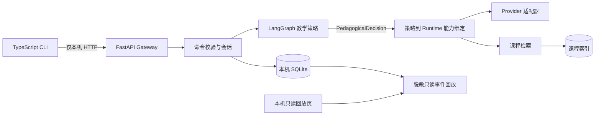

# DeepProf v0.6.2 项目设计

> 更新：2026-09-24 · 状态：工程版本基线；研究效能尚未验证
> 完整历史设计：[DESIGN v0.6.2 原文](archive/DESIGNv0.6.2-full.md)；旧版：[DESIGN v0.6.1](archive/DESIGNv0.6.1.md)

## 1. 项目目标与研究问题

DeepProf 是一套本机优先的自适应教学原型，当前试点范围为 C 语言版数据结构。系统将课程材料中的可定位证据、学习者的合格作答事实、明确教学策略和 BKT 掌握估计连到同一条可回放的教学链路。目标是让学习建议有出处、教学决策可审查、失败过程可追溯。

研究问题分为三层：教学策略图是否稳定地产生符合预期的动作；加入课程检索后能否在证据不足时安全停止；加入学习状态后 BKT 和个性化干预是否经受教师审查并带来可测量的学习收益。当前证据回答的是前两层的工程执行能力。第三层仍需教师标注、模型校准和真实学生的预注册研究。

系统闭环：学生输入或答题 → 检索课程证据 → 合格答案写入 Attempt → C 组按门槛读取 BKT → 策略图产生 PedagogicalDecision → Runtime 执行和记录事件 → 学生反馈用于下一轮教学。

## 2. 课程、材料与准入

唯一试点课程为 `ds.c_language.v1`，覆盖线性表、树、排序、图等知识模块。题库 30 题，来源已复核 30 题，16 题有可靠的确定性评分规则；题库、教材页码和策略仍需教师完成独立审核。

原始教材、答案页、OCR 页面和 Provider 回答不进入仓库、报告或 npm 包。资源导入记录来源、授权状态、内容哈希、页序、印刷页、章节、切块和抽取质量。只允许审核后的本地课程资源进入检索；证据必须保留资源版本与页码定位。页面或引用不可定位时要显示缺口，不用推测页码补足。

## 3. A/B/C 条件与 BKT

| 条件 | 教学策略图 | 跨题 BKT 状态 | 作用 |
|---|---|---|---|
| A | 关闭 | 不读取、不更新 | 教材检索加普通教学提示 |
| B | 开启 | 不读取、不更新 | 检验显式教学策略的工程差异 |
| C | 开启 | 对合格证据读取和更新 | 检验个性化闭环工程链路 |

各组固定课程、题目、证据检索、模型版本、采样参数、停止规则和会话时长；只改变声明的教学策略状态。每个会话保存组别、课程、Provider、模型、语料版本、策略版本、题库版本、检索配置和 BKT 配置快照。真实模型试跑不得视为公平的效果比较：现有批次中 A 组截断比例明显更高。

BKT 使用四参数二元知识状态模型，按“观测后验，再学习转移”顺序计算。当前开发初值为 `P(L0)=0.20`、`P(T)=0.10`、`P(G)=0.20`、`P(S)=0.10`，配置 SHA-256 为 `51340c493ab91337ea65b92535dc82237a6e1209ad23a985506e5090f4e8126f`。参数未用学生数据拟合或校准。

Attempt 绑定学习者、会话、题目、知识点、正确性、提示次数、评分来源、题库版本和幂等命令 ID。提示后重试、待人工评分、模糊知识点和不可靠判分不进入 BKT。前三条合格观察之前显示 `insufficient_data`。BKT 估计、二元熵和证据数量分别标示；熵不是置信区间。A/B 不读取跨题学习估计。C 使用学习者、课程和知识点范围的估计，并按事务约束与 Attempt 一致更新。

## 4. 系统结构与数据流



CLI 负责会话、会话续接、Provider 配置和使用反馈。Gateway 在 `127.0.0.1` 动态端口启动，只允许环回地址，健康检查通过后才接受命令；进程退出时按所有者令牌清理 Gateway 注册记录。会话、事件、模型密钥和课程索引保存在用户数据目录 `~/.deepprof`；Windows 使用 `%USERPROFILE%\.deepprof`。密钥不写入会话、事件、回放、报告或命令行参数。浏览器回放是只读字段白名单，不返回学生答案或凭据。

## 5. 核心接口与失败行为

教学图只读取带版本的状态和 EvidenceRef，返回结构化 `PedagogicalDecision`：动作族、目标知识点、消息、停止状态、来源证据和不确定性。教学图不直接调用 Provider、数据库或文件系统。Runtime 按显式绑定执行能力并产生审计事件。

所有写操作由命令包封装，校验主体、会话、会话组别、参数结构和幂等 ID；重复命令只返回原结果。工作进程失败时记录安全错误码并保留最后一个完整事件边界。空模型响应、Provider 截断、证据缺失、评估被拒、取消、超时与人工评分待处理均为不同终态。答案泄露检查不通过时返回确定性安全问题，不把错误生成计作成功。

能力注册表遵循窄接口：Gateway 仅向教学图注入声明式端口；命令处理层执行鉴权与持久化；Provider Profile 与密钥存储分开；回放 API 使用显式字段白名单。SQLite 写 Attempt、BKT 更新和审计 outbox 的事务失败时整体回滚。

## 6. M1–M3 验收证据

| 批次 | 样本及最新读数 | 结论边界 |
|---|---|---|
| M1 A/B | 构造开发案例 40 例 × A/B；76/80 格完成，4 格失败；首次自动审计 76/80 | DeepSeek 真实 Provider 的开发运行；不是学生学习效果 |
| M2 | 固定离线集 82/82；Python 回归 309/309；CLI 5/5，类型检查通过 | 本机工程验收；教师审查和 BKT 校准待完成 |
| M3 离线 | Fake Provider：主矩阵 120/120、只读回放 120/120、检索/约束消融 160/160 | 固定构造用例，不是人工标注或真实学生数据 |
| M3 BKT 与动作 | 动作族匹配 196/280（70%）；回放决策一致 120/120；BKT AUC 0.296、Brier 0.366、log loss 0.936、ECE 0.530 | 较低的 AUC 暴露当前开发参数与构造历史不可用于有效预测；保留不利结果 |
| M3 真实模型试跑 | 12 案例 × A/B/C，共 36 格；DeepSeek 请求 29 次，完整 3 次，长度截断失败 26 次，未调用 7 格 | 应用终态完成 26/36 与生成成功 3/29 分开计算；不作组间效果结论 |

M1 运行标识 `run_20260923T235151Z_ed03930c`。4 个失败格原因为 `empty_model_response`。M2 的较早记录分别为 77 项定向、300 项 Python、3 项 CLI，已被上述新批次读数更新，不能与新批次相加。M3 离线运行 `m3-offline-20260924-final6`；主矩阵 A/B/C 各 40 格，另含回放与二因素消融。无检索且约束开启时 40 格阻止生成；约束关闭时 26 格触发生成，此项验证安全开关行为，不评价回答质量。

真实模型试点 `m3-live-20260924-071515-indexed-8e41c6d2` 每格最多一次请求、零重试、512 输出 token 上限。29 次请求中 26 次返回 `finish_reason=length`，其中若干应用仍报告终态完成；另有一次 Provider 用量回报 513 token。仓库只含按字段白名单导出的分组汇总；原始请求、文本、答案及会话标识留在获准的本机数据目录。图 F07 是真实调用前的零调用预检，不能代表后续实际试跑。

图表 F01–F09、源数据、图注、边界与再生成步骤汇总见[中文实验报告](experiments/M1-M3-实验报告.md)、[图表库](experiments/图表库.md)及[可下载附件](experiments/releases/M1-M3-evidence.zip)。批次级指纹和 SHA-256 见报告证据清单。

## 7. 安全、隐私与合规

Provider 调用需用户明确配置；安装和普通启动不访问 Provider、不收集账户、不上传会话。实验记录区分开发构造数据、合成 Attempt、真实模型运行和真人参与者；本仓库没有真人学习效果数据。没有招募、同意、教师批准或机构审批证据时，不对学生开展研究。外部发布之前核对教材题目和答案的分发授权。

Release 附件包含可公开的统计量、图表、经筛选的数据、生成脚本和来源字段说明。不打包答案、扫描教材页、原始模型回答、SQLite、密钥、OCR 全量文本、用户路径或会话记录。文件完整性由 SHA-256 清单核对。

## 8. 安装、运行与部署

开发环境需 Node.js 22+、Python 3.12+ 与 npm。公开 Release 提供不依赖 registry 发布的 `@deepprof/cli` npm 压缩包：

```sh
npx --yes --package=https://github.com/RockeyRoc/DeepProf/releases/download/v0.6.2/deepprof-cli-0.6.2.tgz deepprof
```

首次运行或 `deepprof setup` 在用户数据目录创建按版本隔离的 Python 环境并安装运行依赖；`setup --ocr` 再安装扫描件 OCR。npm 包直接包括所需的编译 SDK、Gateway Python 代码、课程元数据、契约和回放静态页，不依赖 Git 或调用目录。用户使用 `deepprof doctor` 检查 Python 和本机 Gateway。默认接口只监听环回地址；Provider 密钥由 CLI 安全保存。

仓库 GitHub Actions 校验 Python 和 TypeScript，并在 Windows、macOS、Linux 上打包、安装与启动 CLI。发布时 Git tag `v0.6.2` 创建 Release，附 CLI 包、实验报告、聚合复现附件和校验值。用户可离线按 Release 附件中的步骤复核图表；模型试验需要另行配置有效 Provider，并独立设置调用预算。

## 9. 测试、验收与后续研究

本机工程测试需覆盖命令幂等和会话隔离、Attempt 与 BKT 一致性、可靠评分准入、并发事务回滚、EvidenceRef 定位、答案和密钥字段隔离、Gateway 限定环回监听、服务退出清理、图表分母校验、脱敏包内容和 CLI 依赖自足。发布冒烟还需覆盖首次和重复运行、任意工作目录、空格/中文路径、无密钥提示以及首次安装中断重试。

当前工程门槛：M2 固定测试和运行恢复通过；M3 评测逐格可追溯；截断计为失败；报告、图表和聚合附件之间的运行 ID、分子/分母与哈希一致；DESIGN 主文件少于 10,000 非空白字符。研究门槛仍包括题库与策略教师审核、案例双人盲评、BKT 参数校准、对照方案审查、真实学生伦理准入、预注册分析计划及充分的前测/后测数据。在这些门槛完成之前，产品测量与个体成绩仅用于本机开发和教师监督教学。
