# BKT 与 RAG 改进实验报告
**批次：** `bkt-rag-improvement-20261001`　**更新日期：** 2026-10-05　**用途：** 研究评测；不改变课程默认参数。

## 本轮结论
BKT 的主要优化证据来自 ASSISTments 开发集按学生分组的嵌套 OOF。题目相关猜测/失误参数是当前表现最好的探索性候选；它提高 AUC、降低 Log loss 与 Brier，但 ECE 点估计恶化且区间跨零，尚不应冻结为课程模型。构造集的退化现象得到分层解释，但该集没有足够序列长度或概念覆盖变化来估计边界。

全文 OCR 为347/347页；新批次正式矩阵已完成，有效／观察／计划格为480/480/480。AI标注已保存检索13710条、引用1595条、可答性120题。真实人员复核待实际评审提交。

NoMIRACL中文固定候选全量评测已完成：37,599配对；测试门限FAR=4.51%、FRR=70.11%、AUC=0.8007。这是候选排序与证据接受判断，人员复核保持待提交。

## 数据与边界
| 用途 | 数据 | 状态与解释 |
|---|---|---|
| BKT 退化诊断 | 40 条构造序列、120 次作答、21 个知识点 | 全部长度为 3，只有 FFF/TFT/TTF 三类历史；留概念折所有测试概念训练覆盖均为 0。仅作故障诊断。 |
| BKT 新开发比较 | ASSISTments 2009–2010；开发集 3,202 名学生、184,631 次作答 | 按学生分组的外层 5 折×内层 4 折；这是本轮可用的开发证据。 |
| BKT 历史回归 | ASSISTments 锁定测试集 801 名学生、51,429 次作答 | 测试集已被历史实验查看；本轮只作回归检查，不称为独立验证。 |
| 计划的新课程 BKT 测试 | Algebra I 2005–06/2006–07 完整 KDD `_master.txt` | 官方数据页要求注册下载；完整文件未取得，不使用截断样例替代。 |
| 课程 RAG | 冻结教材索引、旧 40 题、新80题（可答性按全文复核） | AI可答性按全文独立复核，人员复核待实际提交；近重复家族不跨开发/封存集。 |
| 公开 RAG 验证 | NoMIRACL 中文固定候选；MIRACL 中文全库 | NoMIRACL 全部3,770题固定候选评测已完成；MIRACL 全库未建490万级语料向量索引。 |

## BKT 分层退化诊断
构造集复核采用 `correct=1`、当前作答前预测、并列分数平均秩 AUC，以及五折知识点留出。原始 BKT AUC=0.2964；留概念拟合 AUC=0.2931；折内训练常数汇总 AUC=0.4177。该折内常数跨折汇总后 AUC 不必等于 0.5。构造集按知识点聚类的探索性区间跨零。不能从此推出长度 1/4+ 或有训练覆盖概念的性能。
公共锁定测试总体历史参考为 AUC 0.7143、Log loss 0.5760、ECE 0.00735。以下分层用于定位已见测试集中的回归边界；不是选型证据。所有覆盖计数由对应训练折产生；在当前学生分组折中，测试覆盖为 0 的层为空。
| 分层轴 | 分层 | 测试作答 (正/负) | 收缩 BKT AUC | ΔAUC vs 全局常数 | 配对 95% CI | Log loss | 判读 |
|---|---|---|---|---|---|---|---|
| 完整序列长度 | 1-3 | 4972 (3907/1065) | 0.768 | 0.268 | [0.252, 0.285] | 0.490 | 区间高于 0 |
| 完整序列长度 | 11-20 | 12766 (8036/4730) | 0.710 | 0.210 | [0.192, 0.227] | 0.594 | 区间高于 0 |
| 完整序列长度 | 21+ | 17670 (10641/7029) | 0.687 | 0.187 | [0.167, 0.206] | 0.619 | 区间高于 0 |
| 完整序列长度 | 4-10 | 16021 (11017/5004) | 0.742 | 0.242 | [0.226, 0.257] | 0.541 | 区间高于 0 |
| 预测时已有作答 | 0-2 | 16729 (10740/5989) | 0.697 | 0.197 | [0.188, 0.207] | 0.596 | 区间高于 0 |
| 预测时已有作答 | 10+ | 16716 (10704/6012) | 0.708 | 0.208 | [0.187, 0.227] | 0.587 | 区间高于 0 |
| 预测时已有作答 | 3-5 | 10107 (6821/3286) | 0.734 | 0.234 | [0.218, 0.252] | 0.546 | 区间高于 0 |
| 预测时已有作答 | 6-9 | 7877 (5336/2541) | 0.730 | 0.230 | [0.212, 0.248] | 0.548 | 区间高于 0 |
| 折内知识点训练覆盖 | 1-39 | 28 (13/15) | 0.600 | 0.100 | [0.000, 0.183] | 0.739 | 证据不足：区间跨 0 |
| 折内知识点训练覆盖 | 200+ | 51024 (33380/17644) | 0.714 | 0.214 | [0.202, 0.225] | 0.576 | 区间高于 0 |
| 折内知识点训练覆盖 | 40-199 | 377 (208/169) | 0.761 | 0.261 | [0.130, 0.335] | 0.584 | 区间高于 0 |
更完整的六种方法指标（AUC、相对全局/概念常数 ΔAUC、Log loss、Brier、ECE、正负样本、概念与训练学生覆盖）见 [`public-bkt-strata.csv`](data/public-bkt-strata.csv)。学生配对 bootstrap 区间针对收缩 BKT 与常数基线；其余方法只列分层点估计。区间跨零的层标为证据不足；1–39 次训练覆盖层只有 28 个测试作答，需要谨慎解释。

## BKT 优化实验
开发集 184,631 次 OOF 预测、3,202 名学生。原始 BKT AUC=0.6741、Log loss=0.6476；概念 EM Log loss=0.5681。嵌套选型后单调逻辑校准模型 AUC=0.7214、Log loss=0.5659、Brier=0.1913、ECE=0.0060。相对概念 EM 的 Log loss 降低 0.0022，学生聚类配对 95% CI [0.0017, 0.0027]；ECE 区间跨零。
题目难度研究变体（稀疏题目回退概念参数）AUC=0.7324、Log loss=0.5593、Brier=0.1885、ECE=0.0091。相对概念 EM，AUC 增加 0.0154（95% CI [0.0143, 0.0167]），Log loss 降低 0.0088（95% CI [0.0082, 0.0094]）；ECE 恶化点估计为 0.0031，其区间跨零。此实现是本项目研究适配器，不宣称等同于完整 KT-IDEM 或 pyBKT `multigs` 复现。
题目 EM 上限 100 轮、最大参数变化 `<1e-5` 连续三轮收敛；5 个外层折均在 13–19 轮内收敛。嵌套选择主要落在收缩强度 50、逐机会遗忘 0.01 附近。参数边界用于提示失配或数据不足，不作为代码错误的直接证据。
历史测试集本轮回归运行包含 51,429 次作答和 801 名学生；由于它此前已查看，不用于声明新验证或模型选型。

## 全文教材与120题新批次
当前批次 `m3-fulltext-rag-20261004-v4`，状态 `completed`。全文 OCR 为347/347页；新批次正式矩阵已完成，有效／观察／计划格为480/480/480。AI标注已保存检索13710条、引用1595条、可答性120题。真实人员复核待实际评审提交。 旧40题保留会话历史，新开发和封存各40题采用单轮冷启动；BKT训练结果沿用原版本。
教材以2倍缩放强制RapidOCR，按不超过50页分成七批，347页无遗漏、重复或乱序。已保存逐页原始／校正文本、行框、置信度、图像哈希及AI复核记录。重点补核覆盖347页，补充校正4页；印刷页码逐页确认319页，其余为空。重点核对不等于全部字符、二维图连接或人员复核认证。
仍有明确未确认重点内容的PDF页：79, 101, 102, 147, 200, 214, 220, 313。这类内容保留原始图像和具体原因，不补造图中关系。旧OCR及索引保留，独立新索引按800字分块、120字重叠得到629片段，其中575个属于313个可作为可靠证据的正文页。
语义复核阶段另在PDF 34、40、171、180页发现代码字符OCR错误，并放大核对原页图形成独立AI勘误。勘误不回写已冻结的实验文本或索引；本轮结果仍使用上述固定版本，其算法文字与代码字符准确性须分别判断。未宣称教材程序整体可编译，人员复核仍待提交。
检索固定采用字符哈希向量与BM25，两路各取50，RRF常数60，最终证据5条；沿用证据不足判断，未接入BGE在线检索。检索关／约束开按规则零生成。
生成配置：`deepseek-flash`，温度0.3，`thinking.type=disabled`，8192 tokens，自动重试0；每格最多一次生成，未使用种子重复或推断性置信区间。AI评估请求温度为0。预算由本批次冻结授权读取：本轮369/399次，累计857/887次，未决0次。分阶段实际请求：预检4／正式331／AI标注34，上限分别为4／360／35；失败和未决计入账本。
每格发送前检查冻结配置、代码、教材、索引、题集、BKT参数及预算。配置SHA-256 `4ac6128abca8473ba7111a2e44575f8d209182e3dcdaeb83e426bc3693b1480c`；教材校正版SHA-256 `21d8ca58901be9b68eeddba793d505fe19309e6b8b260c9969568090cd9166b3`；索引内容SHA-256 `549119cf5efae4deb29e565de3b76a6d0435393ee9b14ead80a85d53ae039c17`；提示模板指纹 `c078711439c16f3f4318430d2f1df4039ab405457c20bfaefa5fcc19442fdb35`。原始prompt、模板源码及实际消息均独立归档，不写入正文或附录；参考答案、标签和标注理由仅进入评估。
停止原因：无；清理状态：`gateway_tree_and_port_verified_closed`。之前的停止批次及旧指纹不匹配批次保留原状态，仅作历史诊断，不进入当前正式比较。
本批次曾因独立引用诊断文件占用账本保留文件名而安全暂停；更名后核清未决请求并验证服务清理，沿原冻结批次断点续跑。已完成格逐项核对哈希不变，未重发；报告工具等非运行文件的工作区指纹变化单独记为历史，冻结运行文件仍严格逐项比对。

### 分区消融结果
合并三个分区的描述性结果：检索开启时，证据不足题进入生成由约束关闭的23/23 (100.0%)降为约束开启的15/23 (65.2%)；可答题未生成均为7/97 (7.2%)。证据约束仍允许部分证据不足题生成，尚不能当作可靠拒答保障。检索关／约束开的零生成来自固定规则，可答题也全部未生成，不构成性能提升证据。分区结果和动作口径见下表；这里评价进入生成的决策，不评价答案正确率。
| 条件 | 分区 | 有效／观察／计划 | 请求 | 不足时生成 | 可答时未生成 | 旧题动作匹配 |
|---|---|---|---|---|---|---|
| 检索开／约束开 | 旧40题 | 40/40/40 | 28 | 1/6 (16.7%) | 7/34 (20.6%) | 32/40 (80.0%) |
| 检索开／约束开 | 新开发40题 | 40/40/40 | 38 | 6/8 (75.0%) | 0/32 (0.0%) | 不适用 |
| 检索开／约束开 | 封存40题 | 40/40/40 | 39 | 8/9 (88.9%) | 0/31 (0.0%) | 不适用 |
| 检索开／约束关 | 旧40题 | 40/40/40 | 33 | 6/6 (100.0%) | 7/34 (20.6%) | 32/40 (80.0%) |
| 检索开／约束关 | 新开发40题 | 40/40/40 | 40 | 8/8 (100.0%) | 0/32 (0.0%) | 不适用 |
| 检索开／约束关 | 封存40题 | 40/40/40 | 40 | 9/9 (100.0%) | 0/31 (0.0%) | 不适用 |
| 检索关／约束开 | 旧40题 | 40/40/40 | 0 | 0/6 (0.0%) | 34/34 (100.0%) | 5/40 (12.5%) |
| 检索关／约束开 | 新开发40题 | 40/40/40 | 0 | 0/8 (0.0%) | 32/32 (100.0%) | 不适用 |
| 检索关／约束开 | 封存40题 | 40/40/40 | 0 | 0/9 (0.0%) | 31/31 (100.0%) | 不适用 |
| 检索关／约束关 | 旧40题 | 40/40/40 | 33 | 6/6 (100.0%) | 7/34 (20.6%) | 32/40 (80.0%) |
| 检索关／约束关 | 新开发40题 | 40/40/40 | 40 | 8/8 (100.0%) | 0/32 (0.0%) | 不适用 |
| 检索关／约束关 | 封存40题 | 40/40/40 | 40 | 9/9 (100.0%) | 0/31 (0.0%) | 不适用 |
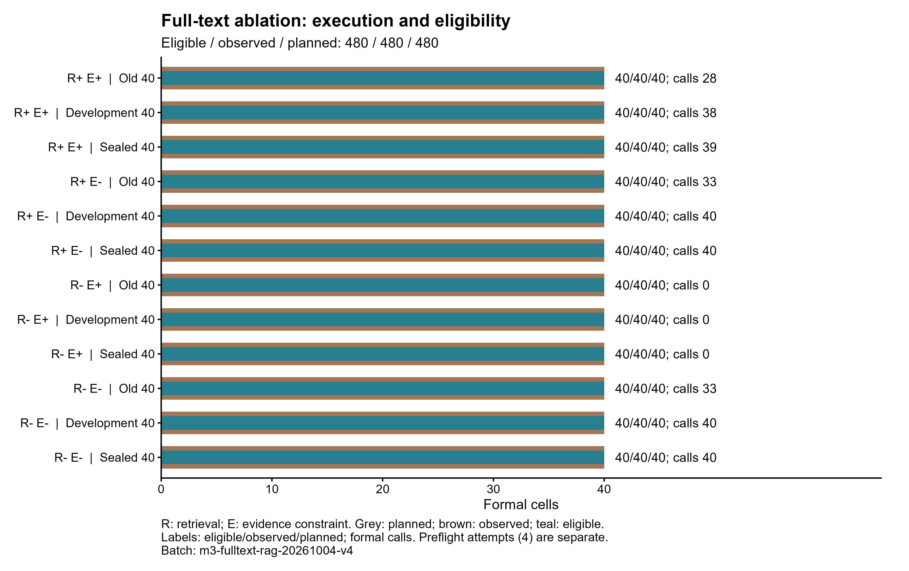
错误接受以证据不足题进入生成为分子，错误拒答以可答题未进入生成为分子；两者以已完成AI可答性判断的对应题数为分母，不等于答案正确率。缺失标签和无分母指标为N/A。动作匹配只用于原有预期动作的旧40题。停止批次不产生正式比较分数。
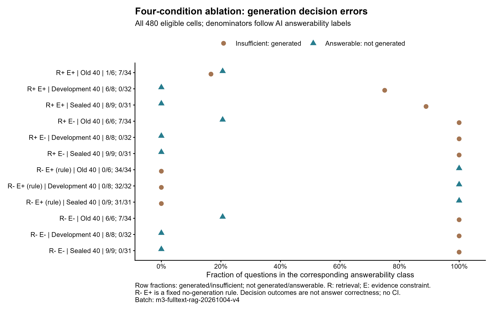
图2显示全部四条件、三个40题分区，行末依次列出证据不足题生成的分子／分母和可答题未生成的分子／分母。检索关／约束开按固定规则零生成，因此其不足时生成率为0、可答时未生成率为100%；这项取舍来自规则，不能作为拒答能力提升。所有比例均使用AI可答性标签，无种子重复或推断性置信区间。
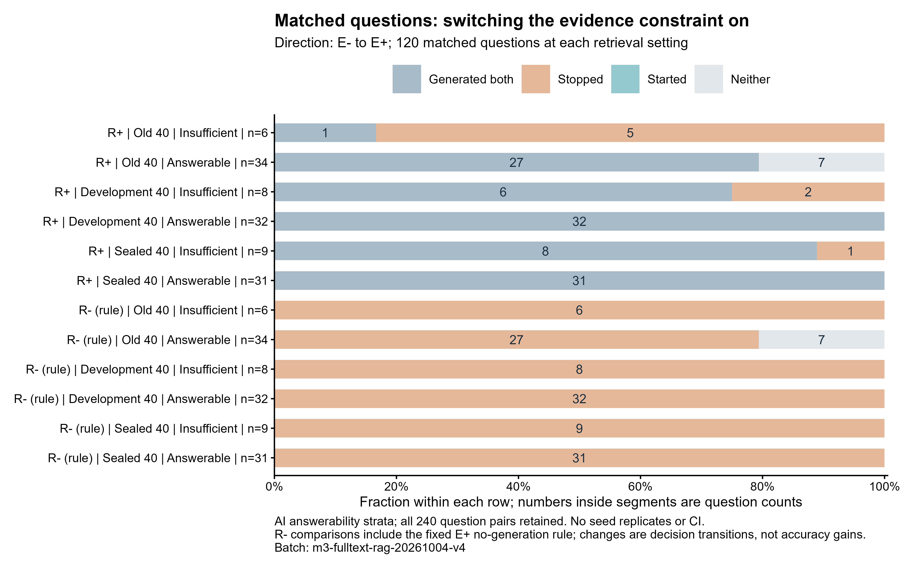
图3以同一题从约束关闭到约束开启的决策作配对，分别在检索开、关时保留120题，共240个配对；按分区和AI可答性分层。检索开启时，证据不足题中5道旧题、2道开发题、1道封存题停止生成，另15道仍生成；97道可答题的决策均未改变，其中90道两条件都生成、7道两条件都未生成。检索关闭时，约束开启的规则使23道不足题和90道原本生成的可答题均停止生成，另7道可答题两条件都未生成。上述是有限构造题集的一次运行决策变化，不评价答案正确率或因果性性能增益；逐格哈希和配对计数已另存来源数据。
### AI标注与检索质量
保存AI语义标注：检索13710条，引用1595条，可答性120题。原人员评审表独立保留。候选按问题与证据去重判断，再映射到方法排名；记录具体理由、证据位置、来源、版本和请求哈希。本地Codex结构审查的哈希明确记为本地复核凭据，不冒充供应商请求。AI标签仅用于探索性指标，未生成双人一致率或人员κ。
首次检索标注响应虽正常结束，但把问题编号和PDF页码混入标签字段，未通过语义标注格式校验，整次响应不进入指标且仍计入请求账本。随后独立冻结评估器版本 `fulltext-ai-review-20261004-v4-evaluator2`，每次528项，使用明确命名的输入字段和逐项来源行号校验；不更改已完成正式生成的冻结配置。评估器源码、输入和规则指纹及实际请求单独归档。最终检索标注协议异常9项；异常保留为无法判定，不补造标签。
格式通过不代表语义正确。另以Codex逐条读源核对17条历史候选，修正8条：包括把否定错误复杂度的直接证据误记为不相关，以及将仅覆盖算法步骤而缺少适用条件的片段记为直接覆盖。该抽查按已读正例、部分支持和负例对照选取，不是随机样本，不能据此估计总体误标率。供应商原标签表和本地复核凭据均独立保留。其余AI判断尚无真实人员复核，检索及题目评估与生成使用同一模型也可能存在共同偏差，引用另由Codex独立评估，指标仅作探索性比较。
15道原定义包含三轮的旧题，按正式实验实际发送的首轮另做Codex语义复核，并逐段核对教材行号和必要条件；原多轮判断独立保留。最终120题可答性表与实际首轮输入逐项匹配，复核没有增加供应商请求。
26题的供应商证据范围超过每段8行约束，但页码与起止行均在来源内；将原范围拆为每段至多8行，逐字核验后恢复供应商原可答性判断。未增加请求、未推断新语义标签，原响应及规范化凭据分别保留；来源越界范围不按此规则恢复。

| 候选池 | 分区 | 方法 | 计分题数 | 条件Recall@20 | nDCG@5 | 无法判定条数 |
|---|---|---|---|---|---|---|
| 旧索引 | 旧40题 | hash_dense | 8 | 0.5625 | 0.2778 | 0 |
| 旧索引 | 旧40题 | bm25 | 8 | 0.6250 | 0.2684 | 0 |
| 旧索引 | 旧40题 | rrf | 8 | 0.6250 | 0.2800 | 0 |
| 全文索引 | 旧40题 | hash_dense | 18 | 0.7963 | 0.4675 | 2 |
| 全文索引 | 旧40题 | bm25 | 18 | 0.9167 | 0.6921 | 2 |
| 全文索引 | 旧40题 | rrf | 18 | 0.9259 | 0.6438 | 2 |
| 全文索引 | 新开发40题 | hash_dense | 24 | 0.8174 | 0.4296 | 3 |
| 全文索引 | 新开发40题 | bm25 | 24 | 0.9542 | 0.7367 | 3 |
| 全文索引 | 新开发40题 | rrf | 24 | 0.9396 | 0.7438 | 3 |
| 全文索引 | 封存40题 | hash_dense | 17 | 0.7941 | 0.4477 | 4 |
| 全文索引 | 封存40题 | bm25 | 17 | 0.8137 | 0.5301 | 4 |
| 全文索引 | 封存40题 | rrf | 17 | 0.9706 | 0.5612 | 4 |
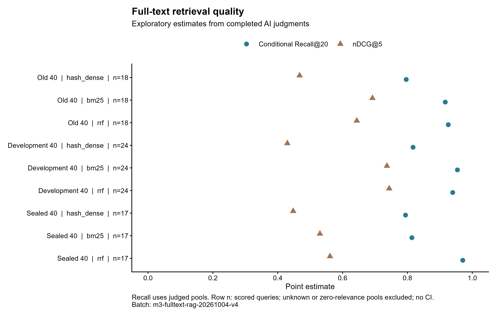
Recall@20以每题已标注候选池中等级1或2的片段为分母，不是全教材召回。全文候选池来自两路Top-50并集；含无法判定条目的题目单独记录覆盖，不进入完整候选池指标。候选池全为等级0时相关分母为0，该题同样不进入均值；各方法在同一候选池内共用计分题集，旧索引与全文索引的计分题集可能不同，不能将跨索引均值差当作配对增益。
### 引用与答案证据覆盖
234个主张—来源配对由本地Codex逐条阅读64段实际引用原文，完成单条支持、211条不同主张的联合支持及来源定位评估，新增外部接口请求0次。配对单条标签为完整支持175、部分支持44、无支持10、矛盾1、无法判定4。另1359条无显式引用主张按引用结构记录无支持，2条未提取到主张的引用保留无法判定，总计1595条独立AI标注。此前DeepSeek引用请求HTTP 402作为失败历史保留，未重试；本地评估是用户明确授权的独立标注方式。原文、逐条理由、联合引用清单与哈希凭证单独归档，真实人员复核仍待提交。

| 来源／条件 | 分区 | 配对 | 单条完整支持 | 主张联合覆盖 | 来源定位 | 无法判定 |
|---|---|---|---|---|---|---|
| 旧引用 | 旧40题 | 119 | 94/119 (79.0%) | 97/261 (37.2%) | 119/119 (100.0%) | 0 |
| 检索开／约束开 | 旧40题 | 21 | 15/21 (71.4%) | 16/100 (16.0%) | 21/21 (100.0%) | 0 |
| 检索开／约束开 | 新开发40题 | 32 | 20/32 (62.5%) | 23/149 (15.4%) | 32/32 (100.0%) | 0 |
| 检索开／约束开 | 封存40题 | 28 | 22/28 (78.6%) | 22/74 (29.7%) | 28/28 (100.0%) | 1 |
| 检索开／约束关 | 旧40题 | 19 | 17/19 (89.5%) | 17/188 (9.0%) | 19/19 (100.0%) | 1 |
| 检索开／约束关 | 新开发40题 | 5 | 2/5 (40.0%) | 2/220 (0.9%) | 5/5 (100.0%) | 0 |
| 检索开／约束关 | 封存40题 | 10 | 5/10 (50.0%) | 5/117 (4.3%) | 10/10 (100.0%) | 2 |
| 检索关／约束关 | 旧40题 | 0 | N/A | 0/165 (0.0%) | N/A | 0 |
| 检索关／约束关 | 新开发40题 | 0 | N/A | 0/187 (0.0%) | N/A | 0 |
| 检索关／约束关 | 封存40题 | 0 | N/A | 0/109 (0.0%) | N/A | 0 |
全文批次合并分区：检索开／约束开单条完整支持为57/81 (70.4%)，主张联合证据覆盖为61/323 (18.9%)；检索开／约束关分别为24/34 (70.6%)和24/525 (4.6%)。所有已配对来源均可定位，但定位正确不保证语义支持，且大量主张没有显式引用。两个条件提取的主张与引用分母不同，这些为描述性份额，不作为同一主张的配对因果效应或答案正确率。
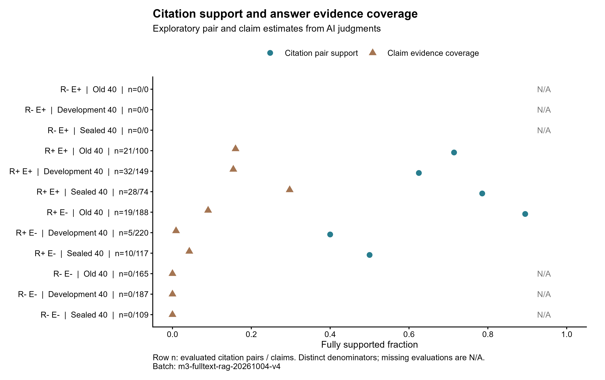
单条支持、实际引用的联合支持与来源定位分别判断，使用完整支持／部分支持／无支持／矛盾／无法判定五分类。只计回答实际引用；无显式引用主张记为引用支持缺失，不据此判断事实错误。未被回答引用的全文内容不能补充支持率。无法判定保留在引用审计分母并单列数量，完整支持比例表示已确认的支持份额，不把未知标签判成事实错误。

## 原版本引用审计
### 原版本审计口径：旧120格
| 指标 | 结果 | 含义 |
|---|---:|---|
| 字段可解析率 | 540/540 (100.0%) | 定位字段 |
| 来源实际可定位率 | 92/92 (100.0%) | 回答可见引用 |
| 语义完整支持率 | 82/119 (68.9%) | 主张—引用配对 |
| 事实主张证据覆盖率 | 86/261 (33.0%) | 需证据事实主张 |
AI 辅助审计将 119 个主张—回答实际引用配对标为完整支持 82、部分支持 22、无支持 15；261 个事实性主张中 86 个完整获得证据支持、13 个部分支持、162 个无支持，156 个事实主张没有回答可见引用。检索候选、决策附带引用和回答实际引用分开保存；只有最后一类进入主张—引用语义分母。未生成、无主张、无引用及孤立引用分开记录。
两份旧人工盲评仍未返回。当前所有语义判断都是未校准 AI 辅助结果；本报告借鉴 ARES 的上下文相关性/忠实度/答案相关性维度，没有声称完成人工校准。次级旧汇总与源表冲突（67 对/252 主张 vs 主源表 119 对/261 主张），按源级明细保留 119/261 主口径，并另存差异核对。

### 旧课程索引的离线耗时

| 课程检索阶段 | 中位数 ms/题 | P95 ms/题 |
|---|---|---|
| hash_dense_ms | 91.2 | 96.4 |
| bm25_ms | 112.9 | 115.8 |
| hash_rrf_ms | 0.1 | 0.2 |
| bge_dense_query_ms | 201.9 | 228.4 |
| bge_rrf_merge_ms | 0.1 | 0.2 |
| bge_reranker_50_ms | 14247.6 | 15251.6 |

该旧BGE检索的人员盲评质量为N/A；全文检索AI指标见前文。排序分数不作为Recall或回答质量。

## NoMIRACL 中文完整固定候选评测

已完成全部3,770题：开发集1,475题（相关393、非相关1082），测试集2,295题（相关920、非相关1375）。评分覆盖31,826个不同文档、37,599个配对，保存150,396条四方法排名记录。

数据revision `ecd08778d0426a5ca28ac99763b0c9ddc2c78e68`。按固定版本的[官方加载逻辑](https://huggingface.co/datasets/miracl/nomiracl/resolve/ecd08778d0426a5ca28ac99763b0c9ddc2c78e68/nomiracl.py)过滤语料不存在的95条qrel，其中35条正例（开发32条／13正例；测试63条／22正例）。不排除任何题目，不补造缺失文本；语料中5,773条内容完全相同的重复行合并，冲突ID拒绝运行。

固定候选内比较BGE-M3 dense、BM25、两路RRF-60和BGE reranker v2-m3；BM25 k1=1.2、b=0.75，沿用中文二字切分与小写字母数字分词。文本为标题加正文，文档与配对最多512 tokens，查询256 tokens；分数并列按docid升序。此处RRF使用每题完整固定候选的两路排名，与教材在线Top-50检索范围不同。

专用本地环境FP32、关闭TF32，编码批大小2，重排4；实际阶段设备：documents=cuda, queries=cuda, reranker=cuda。每256项原子保存，输入、模型、代码、评分配置和设备指纹绑定缓存；CUDA阶段失败时完整改用CPU FP32、16线程，隔离设备缓存。有限输出检查和数量校验通过，新增外部模型请求0次，累计账本857/887保持不变。

### 固定候选排序

| 方法 | dev相关题平均 nDCG@5 (n=393) | test相关题平均 nDCG@5 (n=920) |
|---|---|---|
| BGE-M3 dense | 0.7508 | 0.7618 |
| BM25 | 0.4248 | 0.4296 |
| BGE-M3 + BM25 RRF-60 | 0.6402 | 0.6563 |
| BGE reranker v2-m3 | 0.7863 | 0.7969 |

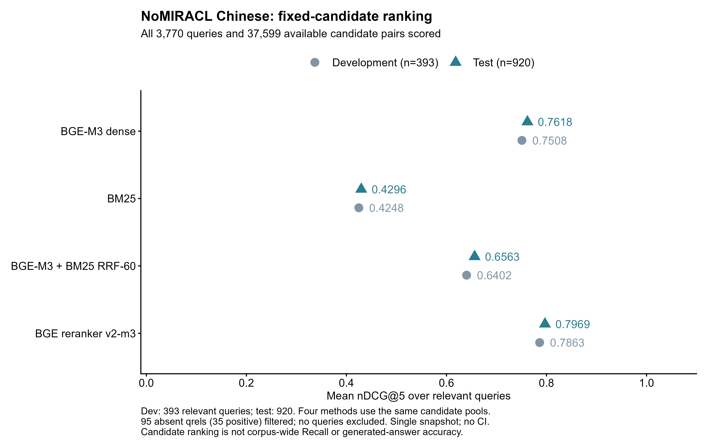

nDCG@5在保留的候选与qrel内计算，只对相关题取均值。没有全库Recall，没有生成答案评测；本轮单次固定快照不报告重复实验置信区间。

两个分区的重排平均nDCG@5均最高；测试集0.7969，高于BGE-M3 dense的0.7618。两路RRF为0.6563，低于稠密单路，说明本固定候选与分词配置下，融合不保证排序收益。这里只比较本快照，不据此推广到全库或其他配置。

### 冻结门限的测试集结果

仅用开发集最大重排分数选门限θ=6.42378902，接受规则为最大分数≥θ。在非相关题FAR≤5%条件下最大化相关题接受率，并列选较低门限。开发FAR=4.99%，相关题接受率=29.01%。门限在测试指标计算前独立冻结；测试标签未用于选型或调参。

| 测试指标 | 分子／分母或AUC比较单位 | 结果 |
|---|---|---|
| 错误接受 FAR | 62/1375 | 4.51% |
| 错误拒绝 FRR | 645/920 | 70.11% |
| 最大重排分数 AUC | 920相关 × 1375非相关 | 0.8007 |

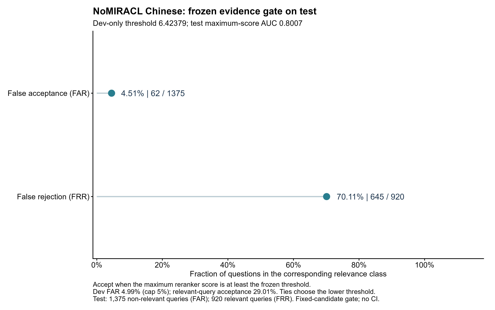

FAR以非相关题接受数为分子、1,375题为分母；FRR以相关题拒绝数为分子、920题为分母。AUC使用最大重排分数和题级相关标签，分数并列取平均秩。这些是固定候选排序及门限指标，不能当作教材实验的回答正确率或全库召回能力。预训练模型与公开基准的潜在数据重叠仍是解释限制。

开发集5%错误接受上限对应的门限在测试集拒绝了645/920道相关题（70.11%）。因此较低FAR伴随较高FRR，不能仅凭错误接受率宣称门限可靠或适合课程直接部署。未利用测试结果调整门限。

### 耗时与冻结证据

| 阶段 | 耗时 | 单位 |
|---|---|---|
| 文档编码 | 589.94 | 秒／完整阶段 |
| 查询编码 | 25.15 | 秒／完整阶段 |
| 四方法排序与指标 | 2.41 | 秒／完整阶段 |
| 配对重排 | 648.90 | 秒／完整阶段 |
| 本次运行总墙钟 | 1338.70 | 秒／含加载与编排 |
| 重排平均每配对 | 17.259 | 毫秒／配对；不是中位数 |

评分配置SHA-256 `dcedb895a8ea629bacb94b48903db5a344d34d7eb96094649179ef5cf54fd0f9`；门限文件SHA-256 `c73a29199a924ae4fd1b39fc1fc46ffed2acc43d34faff1b98107c045fc024a2`。总墙钟包含加载、数值预检及编排，阶段计时来自保存批次；平均每配对明确以毫秒给出，不冒充P95或中位数。完整逐题数据和四方法分数排名见[`nomiracl-zh-per-query.csv`](data/nomiracl-zh-per-query.csv)及[`nomiracl-zh-candidate-ranks.csv`](data/nomiracl-zh-candidate-ranks.csv)。配置、缓存、日志、清理证明和归档哈希由交付清单追踪。

| 模型 | 固定 revision | 许可 | 权重文件 SHA-256 |
|---|---|---|---|
| BAAI/bge-m3 | 5617a9f61b028005a4858fdac845db406aefb181 | mit | 2,271,145,830 bytes; SHA-256 b5e0ce3470abf5ef3831aa1bd5553b486803e83251590ab7ff35a117cf6aad38 |
| BAAI/bge-reranker-v2-m3 | 953dc6f6f85a1b2dbfca4c34a2796e7dde08d41e | apache-2.0 | 2,271,071,852 bytes; SHA-256 d9e3e081faff1eefb84019509b2f5558fd74c1a05a2c7db22f74174fcedb5286 |

## 人工标注包与复核流程
私有标注包状态：`ready_for_human_review; all new question gold labels pending`。包含 119 个引用配对、3920 个检索标注行（旧候选池 3141 对，新增课程检索去重候选 779 对）、开发/封存各 40 题、两份独立盲评 CSV/XLSX、裁决表、codebook 与导入校验器。所有人工字段保持空白。
指导流程：先各自完成 20 个引用配对和 30 个检索候选试标；确认规则后分批独立标注；引用使用五分类 Cohen’s κ，检索 0/1/2 使用二次加权 κ；报告缺失、原始一致率、κ、分歧理由，再由第三人裁决。未收到的人工作业不估填分数。
评审文件仅保存在项目授权的本地私有目录；报告、CSV 指标和图表不携带学生回答、教材原文摘录或模型权重。

## 复现文件与图表
当前图表均由R 4.6.1生成，提供SVG、PDF、600-dpi PNG、R源码和来源数据。历史占位图及停止证据已独立归档；不纳入当前比较。

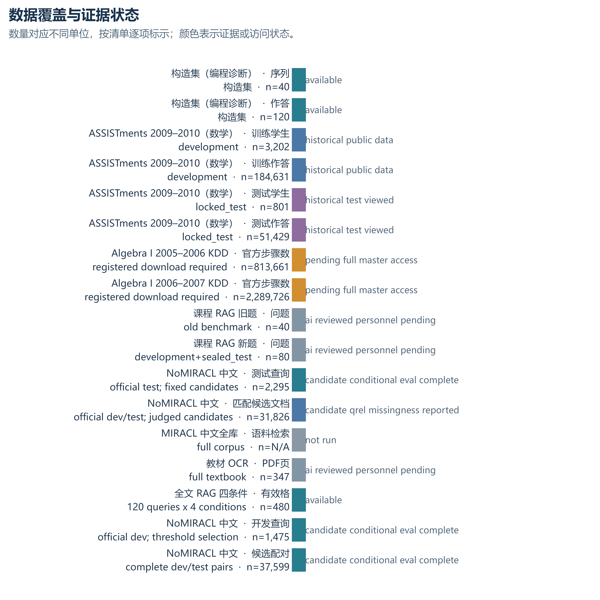

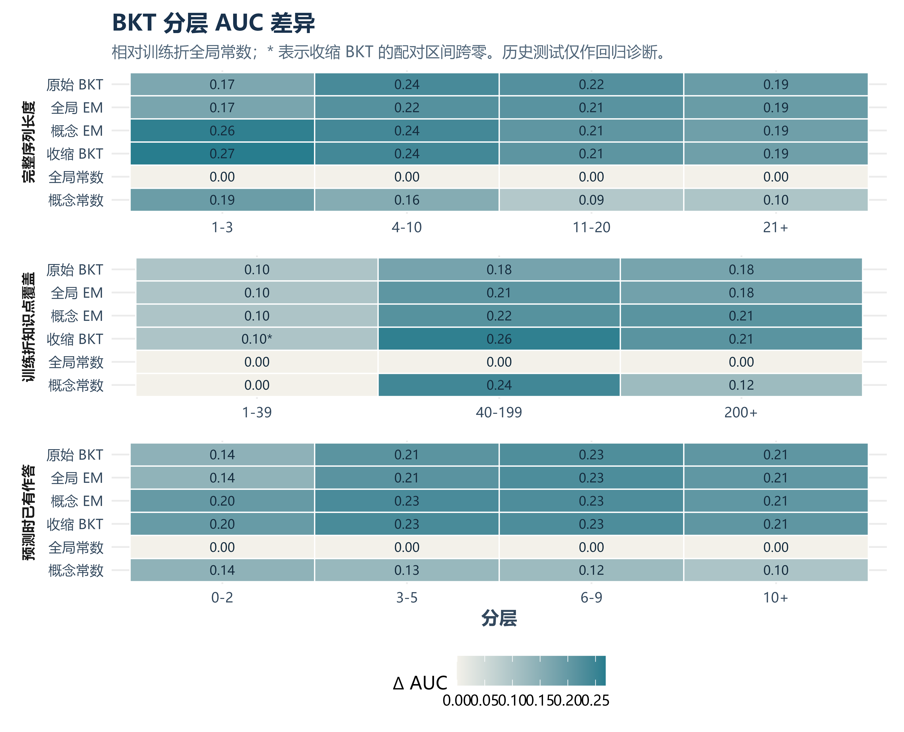

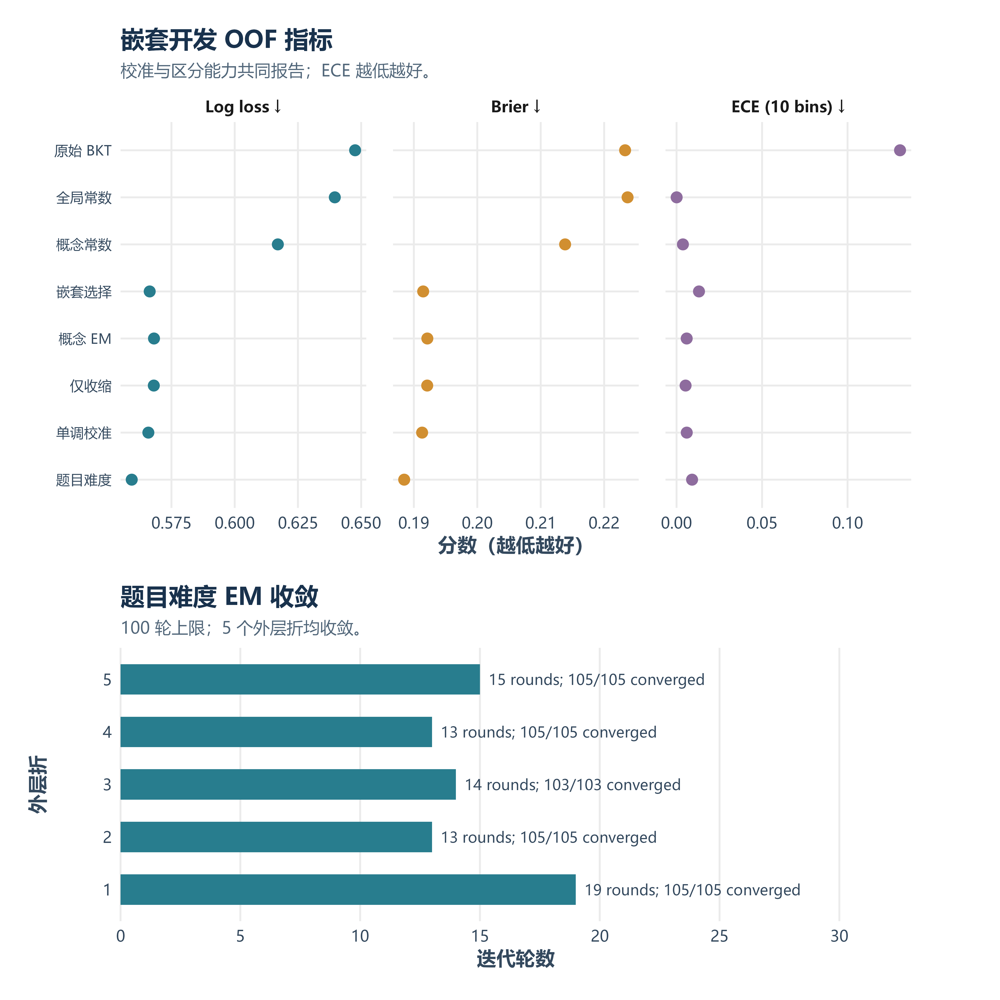

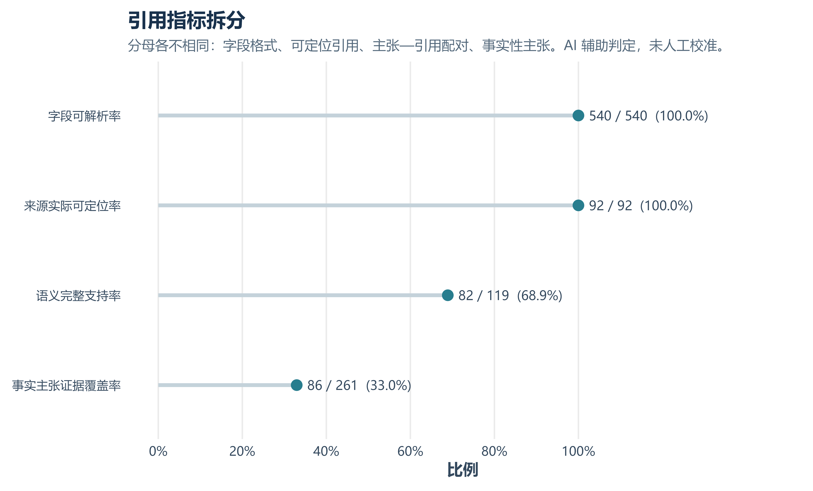

## 验收与复现检查
| 检查项 | 状态 | 结果 |
|---|---|---|
| targeted_pytest | passed | 85 local tests passed; session/graph/runtime/provider controls, pre-HTTP terminal failures, cleanup persistence, OCR recovery, partition isolation, budgets, ranked-pool metrics and AI provenance. |
| python_syntax | passed | 30 current experiment, annotation, report and delivery modules compiled in memory. |
| r_figure_generation | passed | R 4.6.1 exported 11 active SVG/PDF/600-dpi PNG charts. Historical placeholders archived; current fulltext charts retained. |
| figure_visual_qa | passed | Five current figures inspected, including decision rates from 480 cells and 240 matched constraint transitions; independent PDF line geometry and rendered glyph sizes pass. Original Cairo audit findings retained with the geometry correction. |
| report_pdf | passed_all_pages | All final pages rendered and visually reviewed. Dynamic page count and exact PDF/image hashes are recorded in render-manifest.json and verified by delivery validation. |
| annotation_import_validation | passed_ai_only | Prepared 276 citations (119 pairs), 3920 old and 9790 new candidates, 120 questions. Saved semantic rows: retrieval 13710, citations 1595, questions 120. Personnel fields remain untouched; no personnel kappa. |
| rag_formal_ablation | completed | Batch m3-fulltext-rag-20261004-v4; eligible/observed/planned 480/480/480. Phase attempts: {'preflight': 4, 'formal': 331, 'annotation': 34}. Cumulative 857/887; unresolved 0; gateway_tree_and_port_verified_closed. |
| kdd_algebra_full_master_data | pending_access | Official complete _master.txt files were not obtained; no truncated data substituted. |
| nomiracl_full_fixed_candidate_evaluation | completed | 9 local tests; 3770 queries, 37599 fully scored pairs, 150396 ranking rows; all finite. Dev-only threshold and test nDCG/FAR/FRR/AUC independently recalculated; zero external requests. |
| nomiracl_and_coverage_figure_qa | passed | Two NoMIRACL charts and updated coverage chart inspected. Every final PDF passes independent line-box collision and rendered glyph audits; source data, units and denominators verified. |
pytest 的独立临时文件根使用实验目录中的 workspace-local fixture；宿主机 OS 临时目录的枚举权限受限。定向测试通过后保留其测试专用临时目录，未覆盖用户数据。

## 研究方法依据
| 方法/数据 | 本实验中的用法与边界 | 来源 |
|---|---|---|
| pyBKT / BKT+Forget / KT-IDEM | BKT 参数估计、遗忘和题目难度模型的候选方法；本轮题目研究适配器不等于完整复现。 | [pyBKT, 2021](https://arxiv.org/html/2105.00385v2) |
| 边界参数解释 | 参数落边界作为失配/数据稀疏诊断线索，不直接视为实现缺陷。 | [Doroudi & Brunskill, EDM 2017](https://www.cs.cmu.edu/~shayand/papers/EDM2017.pdf) |
| BGE-M3 | 多语种 1024 维稠密向量；与 BM25 做独立模型索引比较。 | [BGE-M3 paper](https://arxiv.org/html/2402.03216v3), [model card](https://huggingface.co/BAAI/bge-m3) |
| RRF / reranker | 常数 60 融合两路 Top-50；BGE reranker v2-m3 重排融合候选。分数不沿用旧余弦阈值。 | [RRF, SIGIR 2009](https://plg.uwaterloo.ca/~gvcormac/cormacksigir09-rrf.pdf), [reranker card](https://huggingface.co/BAAI/bge-reranker-v2-m3) |
| NoMIRACL / MIRACL | 固定候选证据门限辅助验证不等同于全库召回；预训练数据潜在重叠作为限制。 | [NoMIRACL](https://huggingface.co/datasets/miracl/nomiracl), [MIRACL](https://github.com/project-miracl/miracl) |
| ARES 评估维度 | 用于设计引用审计标签与维度；没有人工校准，不宣称 ARES 评分。 | [ARES, NAACL 2024](https://aclanthology.org/2024.naacl-long.20/) |
| KDD Cup Algebra I | 计划中的真实数学/步骤级新验证数据；本轮完整 `_master.txt` 待官方访问。 | [KDD Cup 2010 official data](https://kdd.org/kdd-cup/view/kdd-cup-2010-student-performance-evaluation/Data) |

## 未完成项与验收边界
| 工作项 | 状态 | 完成条件 |
|---|---|---|
| 课程检索相关性/回答性 | AI检索13710条／题目120题；人员待复核 | AI探索性分组指标已计算；真实人员提交后核验标签并另行计算人员一致率 |
| Algebra I KDD 新验证 | 等待官方完整数据访问 | 登记 `_master.txt` 文件、许可、SHA-256、流失与按学生 80/20 固定分割 |
| MIRACL 中文全库召回 | 未运行 | 规模化索引/资源可用后做 corpus-wide Recall；不以 NoMIRACL 替代 |
| 结构分块与证据预算消融 | 未运行 | 在选定检索器上单独比较结构切块与 1024/2048/4096 tokenizer token 预算 |

## 证据文件与哈希
- ASSISTments 源数据 SHA-256：`162ef8d2d28bcbfea6591a282994062bd8d5eaa00636544292a0d268dca6e5da`。
- 构造集 SHA-256：`b833e457533e1e517a89d017ac42f7a27351bc44f0e6162aae82b32da130abc6`。
- 原 RAG 冻结教材索引 SHA-256：`4712bd0cec0e3a687b815d4b8c935236cc49a6c153ee8fc2068835474fab9bff`。
- 100 轮嵌套 OOF 文件 SHA-256：`84f649dbec666692d590b8fb7334c1b45ecd4d6c8a2eca6c5ababf779b2ae14b`。
- 配对区间文件 SHA-256：`dddabc5664b44602a4eae38d73ba17142ca9bd21bfed11e424ba25ee7115f0c4`。
- 引用汇总差异状态：`conflicting_legacy_summary_preserved_but_not_combined`；主源表配对数 119。
- 公开数据表、生成脚本、环境锁和图表文件 SHA-256 由 [`figure-data-manifest.json`](data/figure-data-manifest.json) 逐项登记。
- 本报告 PDF/Markdown、核心私有证据包清单、原始批次关联及全部交付文件哈希汇总在 [`delivery-manifest.json`](delivery-manifest.json)。
