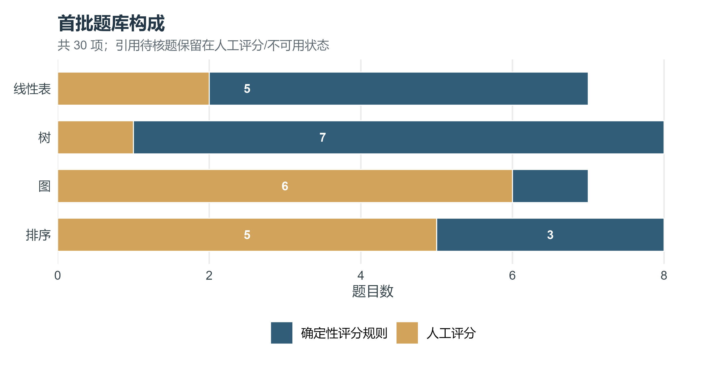
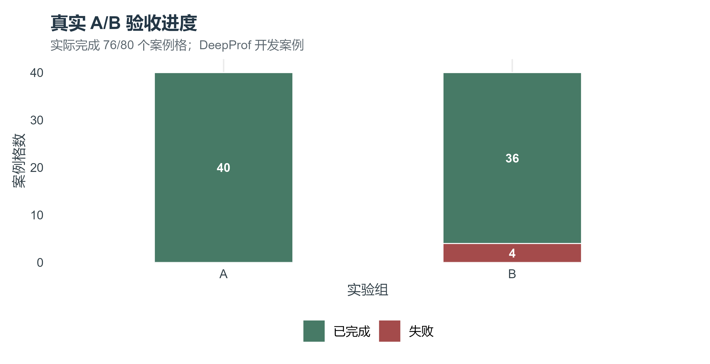
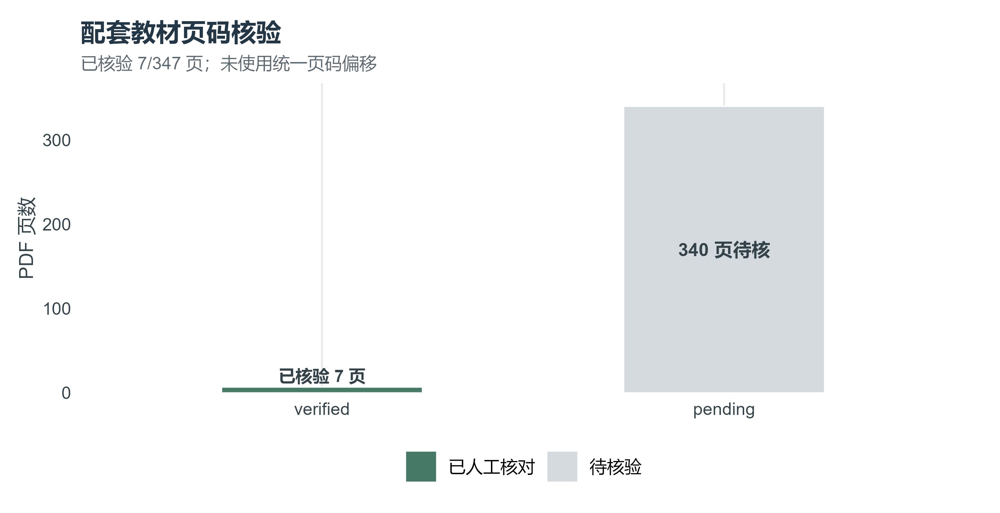
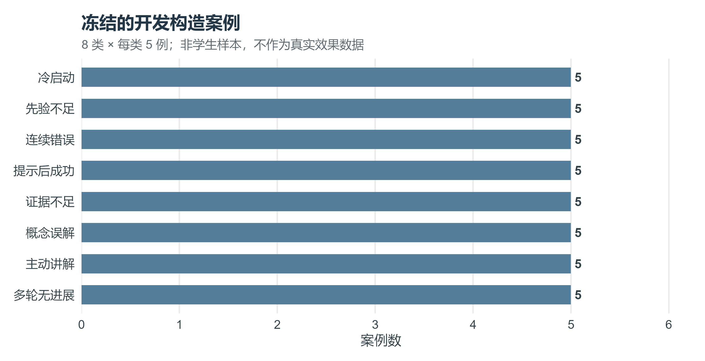
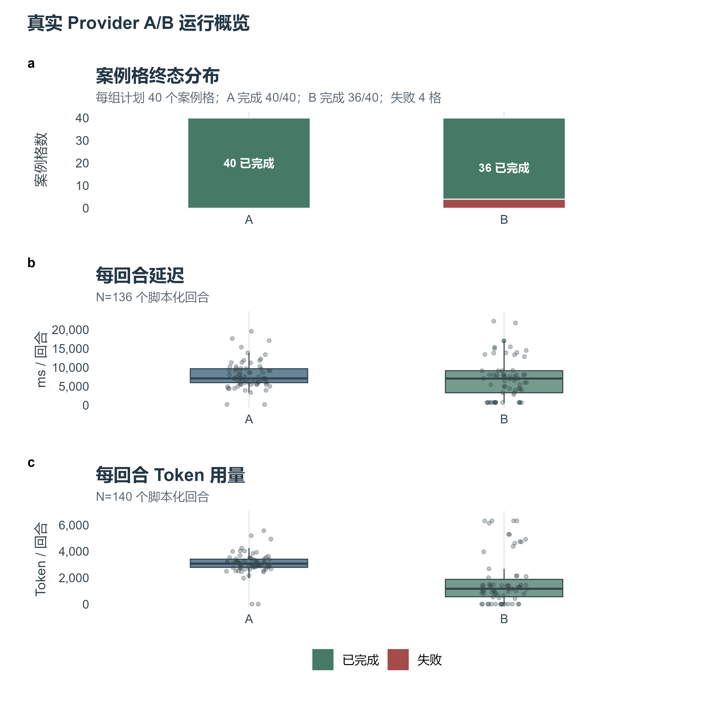
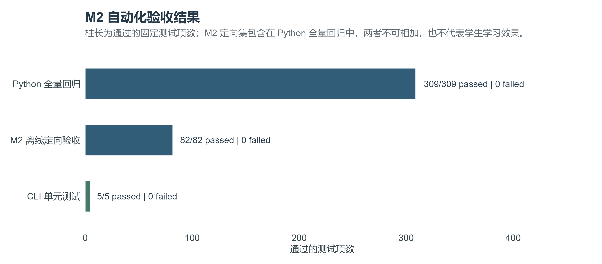
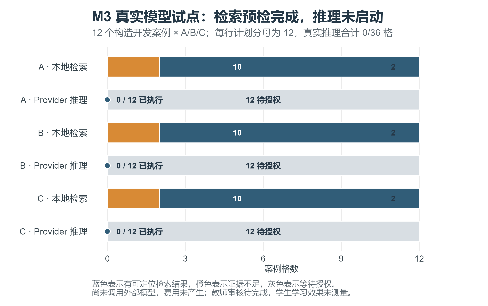

# DeepProf 验收与实验图表库

> 数据基础快照 deepprof-experiment-snapshot-v1 · 2026-09-24T02:17:34.461668+00:00；验收目录按 M2 新批次与 M3 实际运行补充 · 作图环境 R 4.6.1, ggplot2 4.0.3, patchwork 1.3.2, svglite 2.2.2, ragg 1.5.2

本 Markdown 是持续维护的图表目录与引用主表；[图表库.docx](图表库-快照-20260924-021734.docx) 保留为 2026-09-24 02:17 的历史快照，不覆盖。完整 M1–M3 叙述、统一证据清单和打包附件见[实验报告](M1-M3-实验报告.md)、[证据清单](source-data/M1-M3-evidence-manifest.json)和[实验附件 ZIP](releases/M1-M3-evidence.zip)。人工说明保存在 [图表人工注释.md](图表人工注释.md)，数据来源和限制见 [数据与来源说明.md](数据与来源说明.md)。

## 验收状态

| 项目 | 结果 | 说明 |
|---|---:|---|
| M0 题库 | 30 题 | 30 题来源已目视核对；0 题引用待核 |
| 确定性评分 | 16 / 30 | 仅启用已复核规则 |
| 教师审核 | pending | 待教师独立审核 |
| M1 A/B | 76 / 80 格 | completed_with_failures；Provider deepseek / deepseek-flash；行为核验 needs_attention |
| M1 自动行为 | 76 / 80 格通过 | needs_attention；4 格未通过；run_id=run_20260923T235151Z_ed03930c |
| 页码核验 | 7 / 347 页 | 340 页待人工核验 |
| M2 离线验收 | 82 / 82 项通过 | 最新定向集；较早 77 项保留为历史；非学习效果实验 |
| Python 全量回归 | 309 / 309 项通过 | 含 M2 定向子集；不能与 82 项相加 |
| CLI 单测 | 5 / 5 项通过 | TypeScript 类型检查另行通过，不计入单测项数 |
| M3 离线 | 400 / 400 格完成 | 120 主矩阵 + 120 回放 + 160 消融；Fake Provider |
| M3 真实模型试点 | 36 格；3 次完整、26 次截断、7 格未生成 | 29 次请求；应用终态另为 26/36 完成 |

## 图表一览

| 图号 | 内容 | N | 状态 |
|---|---|---:|---|
| F01 | 首批题库 | 30 | 材料构成 |
| F02 | A/B 真实验收 | 80 计划格 | 76 已完成 |
| F03 | 教材页码 | 347 | 7 页已核验 |
| F04 | 开发构造案例 | 40 | 非真人参与者 |
| F05 | A/B 运行概览 | 76 格 / 136 回合 | needs_attention |
| F06 | M2 冻结历史自动化验收 | Python 309 项 / M2 定向 82 项 / CLI 5 项 | 82 项包含在 309 项内；发布验证 318/7 单独记账 |
| F07 | M3 真实模型试点前置检索与推理状态 | 12 案例 × A/B/C | 历史预检；零 Provider 调用 |
| F08 | M3 真实模型试点实际结果 | 36 格 / 29 次请求 | 3 次完整生成、26 次截断、7 格未生成 |
| F09 | M3 离线矩阵、核对指标与 BKT 预测 | 120 主矩阵 + 120 回放 + 160 消融；预测 n=120 | Fake Provider；保留 AUC 0.296 的不利结果 |

## F01 F01-question-bank

题库四个模块按可用评分状态堆叠显示。

- 分子/分母为各状态题数 / 本模块题数；单位道；N=30。
- 解释：题库 30 题；16 题可使用确定性评分，14 题人工评分或未启用。
- N=30 / 总分母=30；run_id=run_20260923T235151Z_ed03930c。
- 数据：[figure-data.csv](source-data/figure-data.csv)，[experiment-snapshot.json](source-data/experiment-snapshot.json)。代码 [generate_charts.R](generate_charts.R)；环境 R 4.6.1, ggplot2 4.0.3, patchwork 1.3.2, svglite 2.2.2, ragg 1.5.2。
- 输出：[PNG](figures/F01-question-bank.png) · [SVG](figures/F01-question-bank.svg) · [PDF](figures/F01-question-bank.pdf) · [TIFF](figures/F01-question-bank.tiff)。

| 模块 | 题数 | 确定性 | 人工/未启用 | 引用待核 |
|---|---:|---:|---:|---:|
| 图 | 7 | 1 | 6 | 0 |
| 排序 | 8 | 3 | 5 | 0 |
| 树 | 8 | 7 | 1 | 0 |
| 线性表 | 7 | 5 | 2 | 0 |

## F02 F02-ab-acceptance

40 个冻结构造案例计划在 A 和 B 两组各运行一次。

- 分子/分母为每组完成格数 / 40 个计划格；单位案例运行格；计划 N=80。
- 解释：run_id=run_20260923T235151Z_ed03930c；完成 76/80 格；自动案例核验 needs_attention；未使用 Fake Provider。
- N=76 / 总分母=80；run_id=run_20260923T235151Z_ed03930c。
- 数据：[figure-data.csv](source-data/figure-data.csv)，[experiment-snapshot.json](source-data/experiment-snapshot.json)。代码 [generate_charts.R](generate_charts.R)；环境 R 4.6.1, ggplot2 4.0.3, patchwork 1.3.2, svglite 2.2.2, ragg 1.5.2。
- 输出：[PNG](figures/F02-ab-acceptance.png) · [SVG](figures/F02-ab-acceptance.svg) · [PDF](figures/F02-ab-acceptance.pdf) · [TIFF](figures/F02-ab-acceptance.tiff)。

## F03 F03-textbook-page-audit

配套教材页码核验进度。

- 分子/分母为已核页数、待核页数 / 347 页 PDF；单位 PDF 页；N=347。
- 解释：当前 7 页已人工确认，340 页待核。未使用统一页码偏移。
- N=347 / 总分母=347；run_id=run_20260923T235151Z_ed03930c。
- 数据：[figure-data.csv](source-data/figure-data.csv)，[experiment-snapshot.json](source-data/experiment-snapshot.json)。代码 [generate_charts.R](generate_charts.R)；环境 R 4.6.1, ggplot2 4.0.3, patchwork 1.3.2, svglite 2.2.2, ragg 1.5.2。
- 输出：[PNG](figures/F03-textbook-page-audit.png) · [SVG](figures/F03-textbook-page-audit.svg) · [PDF](figures/F03-textbook-page-audit.pdf) · [TIFF](figures/F03-textbook-page-audit.tiff)。

## F04 F04-constructed-case-suite

冻结的八类开发案例每类各 5 例。

- 分子/分母为每类案例数 / 40 个构造案例；单位例；N=40。
- 解释：仅用于程序分支验证，不是学生或真人参与者数据。
- N=40 / 总分母=40；run_id=run_20260923T235151Z_ed03930c。
- 数据：[figure-data.csv](source-data/figure-data.csv)，[experiment-snapshot.json](source-data/experiment-snapshot.json)。代码 [generate_charts.R](generate_charts.R)；环境 R 4.6.1, ggplot2 4.0.3, patchwork 1.3.2, svglite 2.2.2, ragg 1.5.2。
- 输出：[PNG](figures/F04-constructed-case-suite.png) · [SVG](figures/F04-constructed-case-suite.svg) · [PDF](figures/F04-constructed-case-suite.pdf) · [TIFF](figures/F04-constructed-case-suite.tiff)。

| 案例类别 | 数量 |
|---|---:|
| 主动讲解 | 5 |
| 冷启动 | 5 |
| 连续错误 | 5 |
| 提示后成功 | 5 |
| 证据不足 | 5 |
| 多轮无进展 | 5 |
| 概念误解 | 5 |
| 先验不足 | 5 |

## F05 F05-ab-runtime-overview

A/B 两组案例完成情况、脚本化回合延迟与 Token 分布。

- 完成格 N=76/80；延迟样本 A 70 回合, B 66 回合；Token 样本 A 70 回合, B 70 回合；单位分别为案例格、ms/回合和 Token/回合。
- 解释：图中点表示每个脚本化模型回合；run_id=run_20260923T235151Z_ed03930c。这是构造案例的工程运行测量，不表示学习成效。
- N=76 / 总分母=80；run_id=run_20260923T235151Z_ed03930c。
- 数据：[figure-data.csv](source-data/figure-data.csv)，[experiment-snapshot.json](source-data/experiment-snapshot.json)。代码 [generate_charts.R](generate_charts.R)；环境 R 4.6.1, ggplot2 4.0.3, patchwork 1.3.2, svglite 2.2.2, ragg 1.5.2。
- 输出：[PNG](figures/F05-ab-runtime-overview.png) · [SVG](figures/F05-ab-runtime-overview.svg) · [PDF](figures/F05-ab-runtime-overview.pdf) · [TIFF](figures/F05-ab-runtime-overview.tiff)。

- 面板 a：A/B 案例完成格；面板 b：每回合端到端延迟；面板 c：每回合 Token 总量。
- 性能源数据：[turn-performance.csv](source-data/turn-performance.csv)；不含用户提问或模型回答正文。评估明细：[acceptance-audit.json](source-data/acceptance-audit.json)。
- 分组延迟和 Token 统计：{'A': {'latency_ms': {'n': 70, 'median': 7110.0, 'p95': 15375.0}, 'token_usage': {'n': 70, 'prompt_tokens': 127755, 'completion_tokens': 88388, 'total_tokens': 216143}, 'model_calls': 68}, 'B': {'latency_ms': {'n': 66, 'median': 7062.0, 'p95': 17046.0}, 'token_usage': {'n': 70, 'prompt_tokens': 32374, 'completion_tokens': 88777, 'total_tokens': 121151}, 'model_calls': 55}}。
- 拼图使用 ggplot2 + patchwork；只表示工程运行指标，不表示学习成效。

## F06 F06-m2-validation

F06 延续记录 M2 代码验收规模与固定用例结果。图形统计固定开发测试项，不表示学生学习效果。

| 验收运行 | 通过 / 总项数 | 失败 | 解释 |
|---|---:|---:|---|
| Python 全量回归 | 309 / 309 | 0 | 当前 M2 验收记录中的 Python 测试总数 |
| M2 离线定向验收 | 82 / 82 | 0 | BKT、SQLite、教学策略、题库、OCR 与契约验收；已包含在 Python 全量回归中 |
| CLI 单测 | 5 / 5 | 0 | Node.js CLI 测试，与 Python 用例分开 |

- TypeScript 类型检查通过；这是静态检查，不计入测试项数。
- v0.6.2 发布验证另通过 Python 318 项、M2 子集 82 项和 CLI 7 项，历史图不与发布回归混用；详见[统一证据清单](source-data/M1-M3-evidence-manifest.json)。
- 柱长表示每组通过的固定测试项数，标签显示“通过/总数/失败数”。M2 定向集是 Python 全量回归的子集，两个 Python 数值不可相加；全部为确定性开发测试，不表示学生学习成效。旧快照的 77/300/3 只用于历史记录，未覆盖。
- 单测没有重复抽样或不确定区间，故不添加误差条或显著性标记。
- 源数据：[m2-validation.csv](source-data/m2-validation.csv)；M2 逐项报告：[M2-offline-acceptance.json](../M2-offline-acceptance.json)；验证摘要：[M2-offline-acceptance.md](../M2-offline-acceptance.md)。
- 作图代码：[generate_m2_charts.R](generate_m2_charts.R)；项目后端记录：[nature-figure-config.json](source-data/nature-figure-config.json)；逐项 QA：[F06-qa.json](source-data/F06-qa.json)。复现命令：`E:\Code2026\R\bin\Rscript.exe docs/experiments/generate_m2_charts.R`。输出：[PNG](figures/F06-m2-validation.png)、[SVG](figures/F06-m2-validation.svg)、[PDF](figures/F06-m2-validation.pdf) 和 [TIFF](figures/F06-m2-validation.tiff)。
- QA：PNG 已在最终尺寸目视检查，未见裁切或重叠；SVG、TIFF、PDF 均成功导出。R 语法解析和图形源码预检通过（19 PASS、2 WARN、0 FAIL；静态预检仍提示需实际解析，另行运行 R `parse()` 已通过）。PDF 通用字号扫描报告 1 pt，PDF 文本跨度读取到的实际最小字号为 8.82 pt；碰撞扫描报告 7 FAIL、1 WARN。Cairo PDF 的 trace 几何将单行文字扩成大范围边界，且中文子集字体解码异常，与目视 PNG 及独立文本跨度不符，因此保留 `needs_review`，不把自动 PDF 扫描标为通过。原始扫描见 [碰撞报告](source-data/F06-collision-audit.json)；完整 QA 记录上述差异。Windows R 启动时有四条 `C.UTF-8` locale 警告，但渲染和语法解析均成功。

## F07 F07-m3-live-pilot-preflight

本图分开呈现本地检索预检与真实模型推理进度。每组 12 个构造案例中，10 个有可定位检索结果，2 个被预检标记为证据不足；真实模型已执行 0/12 格，A/B/C 合计 0/36 格。

- 样本单位为案例运行格；每组预检分母为 12，真实推理计划分母为 36。预检仅运行本地检索，不代表生成效果。
- Provider 推理未启动，模型调用为 0，费用未产生；启动前需明确授权向 DeepSeek API 发送本地教材检索片段和试验提示。
- 案例及 Attempt 历史为开发构造数据，不是教师标注或真人数据；教师审核待完成，学生学习效果未测量。
- 聚合数据：[m3-live-pilot-preflight.csv](source-data/m3-live-pilot-preflight.csv)；机器可读状态：[m3-live-pilot-preflight.json](source-data/m3-live-pilot-preflight.json)；图表 QA：[F07-qa.json](source-data/F07-qa.json)；记录：[M3-live-pilot.md](M3-live-pilot.md)。作图代码：[generate_m3_live_pilot.R](generate_m3_live_pilot.R)。输出：[PNG](figures/F07-m3-live-pilot-preflight.png) · [SVG](figures/F07-m3-live-pilot-preflight.svg) · [PDF](figures/F07-m3-live-pilot-preflight.pdf) · [TIFF](figures/F07-m3-live-pilot-preflight.tiff)。
- 图表 QA：PNG 目视通过，SVG 含 28 个文本对象且保持可编辑；PDF 文本字号扫描和碰撞扫描因 Cairo 字体变换仍为 `needs_review`，原始结果已保存，不将自动扫描失败标成通过。

## F08 F08-m3-live-pilot-results

12 个构造案例 × A/B/C 共 36 格。堆叠段表示每组每格的 Provider 终态：`finish_reason=length`、`finish_reason=stop` 或未触发 Provider 请求。

| 组 | 终态 `length` / 12 | 终态 `stop` / 12 | 未触发请求 / 12 | Provider 请求数 | 应用回合完成 / 12 |
|---|---:|---:|---:|---:|---:|
| A | 10 | 0 | 2 | 10 | 2 |
| B | 8 | 2 | 2 | 10 | 12 |
| C | 8 | 1 | 3 | 9 | 12 |
| 合计 | 26 | 3 | 7 | 29 | 26 / 36 |

- 样本单位是运行格；每个案例组别一格、每格一轮，Provider 请求上限 36，实际请求 29。请求参数为 512 tokens、重试 0；1 次 Provider 用量报告为 513 completion tokens，异常单列。
- 26/29 次 Provider 请求以 `finish_reason=length` 结束；其中 16 个 B/C 格的应用终态仍报告完成。图形按 Provider 生成终态分类，因此应用回合完成数不等同于完整生成数。
- 该试点为构造开发案例，不是教师标注或真实学生数据；图不表示模型质量、教学效果或学习增益。
- 输入/输出合计为 29,380 / 14,563 tokens；Provider 报告缓存命中/未命中为 24,320 / 5,060。按 DeepSeek 官方价目计算，峰时估算 US$0.01914、非峰时估算 US$0.00957；DeepProf 未读取实际账户账单，估算不是账单金额。[官方价目](https://api-docs.deepseek.com/quick_start/pricing/)。
- 源数据：[逐格脱敏聚合 CSV](source-data/m3-live-pilot-live-cells.csv)、[汇总 JSON](source-data/m3-live-pilot-live.json)；作图代码：[generate_m3_live_pilot_live.R](generate_m3_live_pilot_live.R)；脱敏导出器：[export_m3_live_pilot_aggregate.py](../../scripts/export_m3_live_pilot_aggregate.py)；QA：[F08-qa.json](source-data/F08-qa.json)；运行记录：[M3-live-pilot.md](M3-live-pilot.md)。
- 输出：[PNG](figures/F08-m3-live-pilot-results.png) · [SVG](figures/F08-m3-live-pilot-results.svg) · [PDF](figures/F08-m3-live-pilot-results.pdf) · [TIFF](figures/F08-m3-live-pilot-results.tiff)。PNG 400 dpi、TIFF 600 dpi、矢量 PDF 页面 183 × 115 mm、SVG 保留文本对象。
- F08 PNG 全尺寸目视通过，无裁切或图内重叠；PDF 文字跨度为 8–15 pt，29 个文字跨度均在页面边界内。Windows R 报告 4 条 `C.UTF-8` locale 启动警告，但 R 解析和四种格式输出均成功。

## F09 F09-m3-offline-results

离线运行 `m3-offline-20260924-final6` 使用 40 个构造案例和显式 Fake Provider。主矩阵 A/B/C 各 40 格（120/120），回放 120/120，检索与证据约束消融 160/160；总计 400 格。

- 面板 A：A、B、C 主矩阵各 40 格、回放 120 格和消融 160 格的完成数 / 计划数；单位为隔离案例格。
- 面板 B：动作族匹配 196/280、回放动作一致 120/120、决策字段完整 520/520、引用字段可定位 189/189。各行分母各自定义；引用字段完整不证明语义支持。
- 面板 C：合成历史 BKT 预测 n=120；AUC 0.2964、Brier 0.3656、log loss 0.9361、ECE 0.5299。AUC 低于 0.5 参照，ECE 较高，保留为不利信号；参数仍是未拟合开发初值。
- 面板 D：无检索且约束开启时 40/40 格阻止生成；关闭约束时 26/40 格触发生成。这验证安全开关行为，不评判生成内容。
- 样本均为构造开发案例及合成 Attempt；无真人参与、教师评分或学生学习效果数据。提供图表是为说明系统执行完整性和当前指标局限。
- 源数据：[F09-m3-offline-summary.csv](source-data/F09-m3-offline-summary.csv)、[脱敏离线 JSON](releases/M1-M3-evidence.zip)、[运行摘要](m3-offline/m3-offline-20260924-final6/summary.json)、[冻结配置和工作树指纹](m3-offline/m3-offline-20260924-final6/manifest.json)。作图代码：[generate_m3_offline_results.R](generate_m3_offline_results.R)；多面板对齐适配：[patchwork_panel_alignment_adapter.R](../../scripts/patchwork_panel_alignment_adapter.R)。
- 输出：[PNG](figures/F09-m3-offline-results.png)（450 dpi）· [SVG](figures/F09-m3-offline-results.svg) · [PDF](figures/F09-m3-offline-results.pdf，183 × 142 mm）· [TIFF](figures/F09-m3-offline-results.tiff，600 dpi）。四面板对齐检查 4/4 通过；PDF 碰撞检查零失败、零警告，PDF 可见文字跨度 6–12 pt 且均在页面内。内容流扫描把 R PDF 变换后的字号读作 1 pt，已与 PyMuPDF 可见跨度交叉核对并在 QA 中保留差异。完整记录见 [F09-qa.json](source-data/F09-qa.json)。复现时需 R、ggplot2、patchwork、svglite、ragg、jsonlite 和 nature-figure 面板对齐助手；附件包内含生成脚本与环境字段。

## M1 历史性能指标

| 指标 | N | 数值 | 单位 |
|---|---:|---:|---|
| 延迟中位数 | 136 | 7109.0 | ms / 脚本化回合 |
| 延迟 P95 | 136 | 15468.0 | ms / 脚本化回合 |
| Token 用量 | 140 | 337294 | prompt + completion |
| 模型调用 | 123 | 次 |
| 估算费用 | 140 | — | Price is not configured. |

## M1 自动验收未通过格

完整 trace_id 保存在本机运行事件库与本地验收清单；下表只包含脱敏原因码和检查名。

| 案例 | 组 | 原因码 | 失败检查 |
|---|---|---|---|
| DSDEV-001 | B | empty_model_response | cell_completed, turn_terminals_ok, model_call_count_matches |
| DSDEV-016 | B | empty_model_response | cell_completed, turn_terminals_ok, model_call_count_matches |
| DSDEV-018 | B | empty_model_response | cell_completed, turn_terminals_ok, model_call_count_matches |
| DSDEV-020 | B | empty_model_response | cell_completed, turn_terminals_ok, model_call_count_matches |

自动案例行为核验 needs_attention；教师评分、语义泄露和引用支持度待人工评估；故障注入 passed（30 项）；进程恢复 passed。

## M1 独立故障与图表 QA

- 自动化回归：Python 275 项通过 / 0 项跳过；CLI 3 项通过；类型检查 passed。
- 故障注入 passed（30 项测试）；Provider 错误、超时、取消、Gateway 恢复和脱敏导出均用独立故障注入验证，不混入真实 Provider 结果。
- patchwork 面板对齐 passed；PDF 文字扫描 needs_review；PDF 碰撞扫描 needs_review。

## 课程覆盖和数据来源（M1 历史快照）

- 课程 ds.c_language.v1 共 30 个知识点；状态分布 {'covered': 13, 'uncovered': 17}。
- 未覆盖知识点：DS-LIN-03, DS-LIN-06, DS-LIN-07, DS-LIN-08, DS-TREE-03, DS-TREE-04, DS-TREE-05, DS-TREE-06, DS-GRAPH-03, DS-GRAPH-04, DS-GRAPH-05, DS-GRAPH-06, DS-SORT-03, DS-SORT-04, DS-SORT-05, DS-SORT-06, DS-SORT-07。
- 题集 SHA-256 e7982b6b5e41938cc2e5da748fdcb21ed36b04466fcaf6c3f130502eda1c36bc。
- 教材 SHA-256 bce3d6d54eafffedb63cf80a7e2e7267250573b71e622a6c9e50829142114a8b。
- 题集正文、答案、OCR 和原始模型输出保存在本机开发目录；仓库仅保存聚合数据和元数据。内部测试说明不等同于教材许可核验。
- 源说明和 FAIR 元数据见 [数据与来源说明](数据与来源说明.md)。

## M1 历史运行当时的下一步

- 复核自动验收未通过案例：DSDEV-001, DSDEV-016, DSDEV-018, DSDEV-020。失败原因：empty_model_response×4。保留原 run_id；使用 --repeat-after-fix 留存复测。
- 题库保持教师待审；独立核对题面、标准答案和评分规则后再审批。
- 继续逐页核验教材页码映射，当前尚有 340 / 347 页待核。
- 按课程覆盖表逐项评估 17 个未覆盖或待核知识点；不使用无关题目填补。
- Provider 凭据不可用和 HTTP 401 是上述 M1 记录当时的状态，不代表当前 Provider 状态；后续 DeepSeek 实际试点见 [F08 / M3-live-pilot](M3-live-pilot.md)，并记录了真实模型输出截断。
- 用能正确处理 Cairo PDF 字体变换的检查器复核 F05 文本字号与碰撞扫描；现有扫描结果已留档并由 PNG 逐面板目视。

## M1 历史运行版本和复现

- commit 71c5edc24c33fe94ac5ff5fb08715bdeaf655737；working tree dirty=True；状态摘要 SHA-256 81e55ef33feaea3630375c8549e82b2e3ad9eb10aaa7c763bd662251d74532f5。
- 工作树差异指纹 e170e95b23083443ec4033bb793b41b4246ec654023f971c7d2c7f3816714af8。
- 题库 ds-c-dev-v1；案例 ds-dev-cases-v1；策略 ds-v0.6.2-m1.1；模型 deepseek-flash。
- 验证状态 needs_attention；DOCX 视觉检查 accepted_by_user；详情 [validation.json](source-data/validation.json)。
- 使用 deepprof login 手动配置 Provider；首次配置可见输入 API Key，后续默认隐藏；deepprof doctor 确认探测后执行 deepprof acceptance --live，完成后执行 deepprof report。
