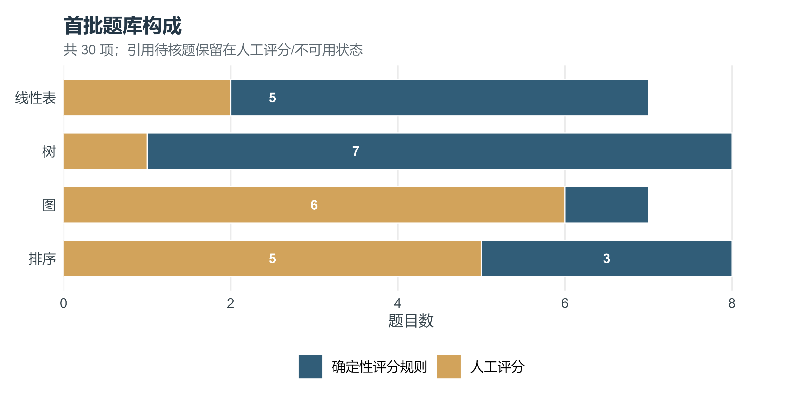
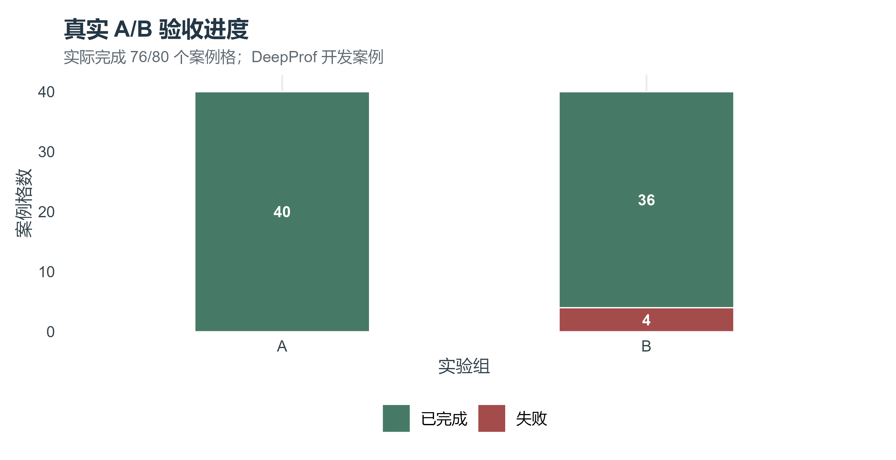
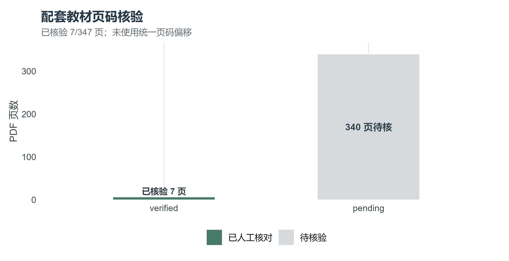
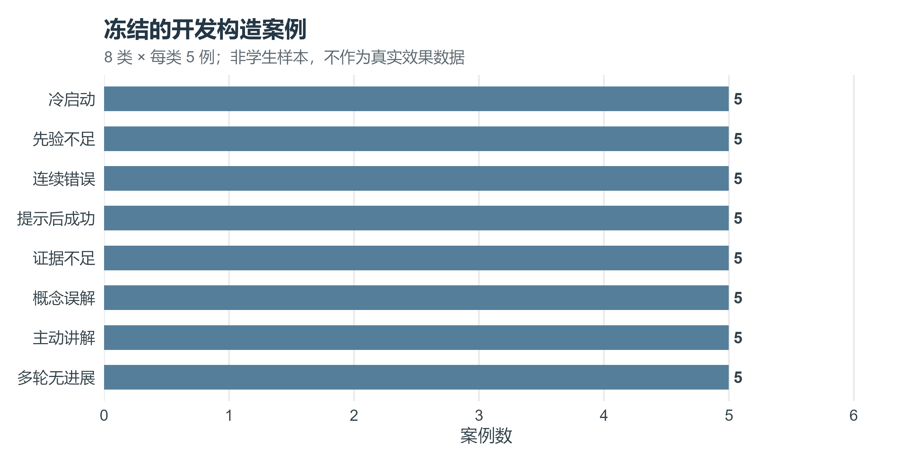
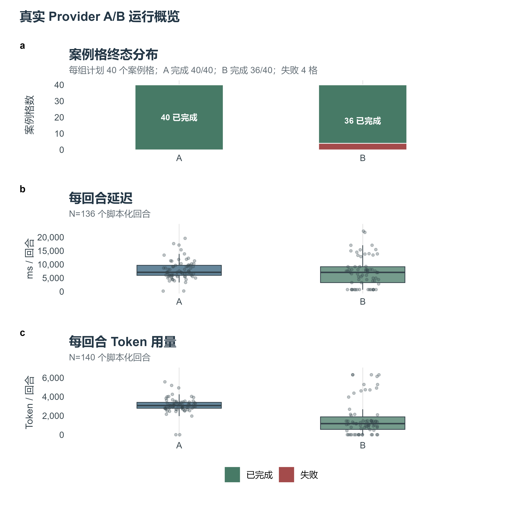

# DeepProf 验收与实验图表库

> 快照 deepprof-experiment-snapshot-v1 · 2026-09-27T06:26:05.507733+00:00 · 图表环境 R 4.6.1, ggplot2 4.0.3, patchwork 1.3.2, svglite 2.2.2, ragg 1.5.2

本文档与 [图表库.docx](图表库.docx) 使用同一份快照。人工说明保存在 [图表人工注释.md](图表人工注释.md)，重建报告不会覆盖注释。

## 验收状态

| 项目 | 结果 | 说明 |
|---|---:|---|
| M0 题库 | 30 题 | 30 题来源已目视核对；0 题引用待核 |
| 确定性评分 | 16 / 30 | 仅启用已复核规则 |
| 教师审核 | pending | 待教师独立审核 |
| M1 A/B | 76 / 80 格 | completed_with_failures；Provider deepseek / deepseek-flash；行为核验 needs_attention |
| M1 自动行为 | 76 / 80 格通过 | needs_attention；4 格未通过；run_id=run_20260923T235151Z_ed03930c |
| 页码核验 | 7 / 347 页 | 340 页待人工核验 |

## 图表一览

| 图号 | 内容 | N | 状态 |
|---|---|---:|---|
| F01 | 首批题库 | 30 | 材料构成 |
| F02 | A/B 真实验收 | 80 计划格 | 76 已完成 |
| F03 | 教材页码 | 347 | 7 页已核验 |
| F04 | 开发构造案例 | 40 | 非真人参与者 |
| F05 | A/B 运行概览 | 76 格 / 136 回合 | needs_attention |

## F01 F01-question-bank

题库四个模块按可用评分状态堆叠显示。

- 分子/分母为各状态题数 / 本模块题数；单位道；N=30。
- 解释：题库 30 题；16 题可使用确定性评分，14 题人工评分或未启用。
- N=30 / 总分母=30；run_id=run_20260923T235151Z_ed03930c。
- 数据：[figure-data.csv](source-data/figure-data.csv)，[experiment-snapshot.json](source-data/experiment-snapshot.json)。代码 [generate_charts.R](generate_charts.R)；环境 R 4.6.1, ggplot2 4.0.3, patchwork 1.3.2, svglite 2.2.2, ragg 1.5.2。
- 输出：[PNG](figures/F01-question-bank.png) · [SVG](figures/F01-question-bank.svg) · [PDF](figures/F01-question-bank.pdf) · [TIFF](figures/F01-question-bank.tiff)。

| 模块 | 题数 | 确定性 | 人工/未启用 | 引用待核 |
|---|---:|---:|---:|---:|
| 图 | 7 | 1 | 6 | 0 |
| 排序 | 8 | 3 | 5 | 0 |
| 树 | 8 | 7 | 1 | 0 |
| 线性表 | 7 | 5 | 2 | 0 |

## F02 F02-ab-acceptance

40 个冻结构造案例计划在 A 和 B 两组各运行一次。

- 分子/分母为每组完成格数 / 40 个计划格；单位案例运行格；计划 N=80。
- 解释：run_id=run_20260923T235151Z_ed03930c；完成 76/80 格；自动案例核验 needs_attention；未使用 Fake Provider。
- N=76 / 总分母=80；run_id=run_20260923T235151Z_ed03930c。
- 数据：[figure-data.csv](source-data/figure-data.csv)，[experiment-snapshot.json](source-data/experiment-snapshot.json)。代码 [generate_charts.R](generate_charts.R)；环境 R 4.6.1, ggplot2 4.0.3, patchwork 1.3.2, svglite 2.2.2, ragg 1.5.2。
- 输出：[PNG](figures/F02-ab-acceptance.png) · [SVG](figures/F02-ab-acceptance.svg) · [PDF](figures/F02-ab-acceptance.pdf) · [TIFF](figures/F02-ab-acceptance.tiff)。

## F03 F03-textbook-page-audit

配套教材页码核验进度。

- 分子/分母为已核页数、待核页数 / 347 页 PDF；单位 PDF 页；N=347。
- 解释：当前 7 页已人工确认，340 页待核。未使用统一页码偏移。
- N=347 / 总分母=347；run_id=run_20260923T235151Z_ed03930c。
- 数据：[figure-data.csv](source-data/figure-data.csv)，[experiment-snapshot.json](source-data/experiment-snapshot.json)。代码 [generate_charts.R](generate_charts.R)；环境 R 4.6.1, ggplot2 4.0.3, patchwork 1.3.2, svglite 2.2.2, ragg 1.5.2。
- 输出：[PNG](figures/F03-textbook-page-audit.png) · [SVG](figures/F03-textbook-page-audit.svg) · [PDF](figures/F03-textbook-page-audit.pdf) · [TIFF](figures/F03-textbook-page-audit.tiff)。

## F04 F04-constructed-case-suite

冻结的八类开发案例每类各 5 例。

- 分子/分母为每类案例数 / 40 个构造案例；单位例；N=40。
- 解释：仅用于程序分支验证，不是学生或真人参与者数据。
- N=40 / 总分母=40；run_id=run_20260923T235151Z_ed03930c。
- 数据：[figure-data.csv](source-data/figure-data.csv)，[experiment-snapshot.json](source-data/experiment-snapshot.json)。代码 [generate_charts.R](generate_charts.R)；环境 R 4.6.1, ggplot2 4.0.3, patchwork 1.3.2, svglite 2.2.2, ragg 1.5.2。
- 输出：[PNG](figures/F04-constructed-case-suite.png) · [SVG](figures/F04-constructed-case-suite.svg) · [PDF](figures/F04-constructed-case-suite.pdf) · [TIFF](figures/F04-constructed-case-suite.tiff)。

| 案例类别 | 数量 |
|---|---:|
| 主动讲解 | 5 |
| 冷启动 | 5 |
| 连续错误 | 5 |
| 提示后成功 | 5 |
| 证据不足 | 5 |
| 多轮无进展 | 5 |
| 概念误解 | 5 |
| 先验不足 | 5 |

## F05 F05-ab-runtime-overview

A/B 两组案例完成情况、脚本化回合延迟与 Token 分布。

- 完成格 N=76/80；延迟样本 A 70 回合, B 66 回合；Token 样本 A 70 回合, B 70 回合；单位分别为案例格、ms/回合和 Token/回合。
- 解释：图中点表示每个脚本化模型回合；run_id=run_20260923T235151Z_ed03930c。这是构造案例的工程运行测量，不表示学习成效。
- N=76 / 总分母=80；run_id=run_20260923T235151Z_ed03930c。
- 数据：[figure-data.csv](source-data/figure-data.csv)，[experiment-snapshot.json](source-data/experiment-snapshot.json)。代码 [generate_charts.R](generate_charts.R)；环境 R 4.6.1, ggplot2 4.0.3, patchwork 1.3.2, svglite 2.2.2, ragg 1.5.2。
- 输出：[PNG](figures/F05-ab-runtime-overview.png) · [SVG](figures/F05-ab-runtime-overview.svg) · [PDF](figures/F05-ab-runtime-overview.pdf) · [TIFF](figures/F05-ab-runtime-overview.tiff)。

- 面板 a：A/B 案例完成格；面板 b：每回合端到端延迟；面板 c：每回合 Token 总量。
- 性能源数据：[turn-performance.csv](source-data/turn-performance.csv)；不含用户提问或模型回答正文。评估明细：[acceptance-audit.json](source-data/acceptance-audit.json)。
- 分组延迟和 Token 统计：{'A': {'latency_ms': {'n': 70, 'median': 7110.0, 'p95': 15375.0}, 'token_usage': {'n': 70, 'prompt_tokens': 127755, 'completion_tokens': 88388, 'total_tokens': 216143}, 'model_calls': 68}, 'B': {'latency_ms': {'n': 66, 'median': 7062.0, 'p95': 17046.0}, 'token_usage': {'n': 70, 'prompt_tokens': 32374, 'completion_tokens': 88777, 'total_tokens': 121151}, 'model_calls': 55}}。
- 拼图使用 ggplot2 + patchwork；只表示工程运行指标，不表示学习成效。

## 性能指标

| 指标 | N | 数值 | 单位 |
|---|---:|---:|---|
| 延迟中位数 | 136 | 7109.0 | ms / 脚本化回合 |
| 延迟 P95 | 136 | 15468.0 | ms / 脚本化回合 |
| Token 用量 | 140 | 337294 | prompt + completion |
| 模型调用 | 123 | 次 |
| 估算费用 | 140 | — | Price is not configured. |

## M1 自动验收未通过格

完整 trace_id 保存在本机运行事件库与本地验收清单；下表只包含脱敏原因码和检查名。

| 案例 | 组 | 原因码 | 失败检查 |
|---|---|---|---|
| DSDEV-001 | B | empty_model_response | cell_completed, turn_terminals_ok, model_call_count_matches |
| DSDEV-016 | B | empty_model_response | cell_completed, turn_terminals_ok, model_call_count_matches |
| DSDEV-018 | B | empty_model_response | cell_completed, turn_terminals_ok, model_call_count_matches |
| DSDEV-020 | B | empty_model_response | cell_completed, turn_terminals_ok, model_call_count_matches |

自动案例行为核验 needs_attention；教师评分、语义泄露和引用支持度待人工评估；故障注入 passed（30 项）；进程恢复 passed。

## 独立故障与图表 QA

- 自动化回归：Python 275 项通过 / 0 项跳过；CLI 3 项通过；类型检查 passed。
- 故障注入 passed（30 项测试）；Provider 错误、超时、取消、Gateway 恢复和脱敏导出均用独立故障注入验证，不混入真实 Provider 结果。
- patchwork 面板对齐 passed；PDF 文字扫描 needs_review；PDF 碰撞扫描 needs_review。

## 课程覆盖和数据来源

- 课程 ds.c_language.v1 共 30 个知识点；状态分布 {'covered': 13, 'uncovered': 17}。
- 未覆盖知识点：DS-LIN-03, DS-LIN-06, DS-LIN-07, DS-LIN-08, DS-TREE-03, DS-TREE-04, DS-TREE-05, DS-TREE-06, DS-GRAPH-03, DS-GRAPH-04, DS-GRAPH-05, DS-GRAPH-06, DS-SORT-03, DS-SORT-04, DS-SORT-05, DS-SORT-06, DS-SORT-07。
- 题集 SHA-256 e7982b6b5e41938cc2e5da748fdcb21ed36b04466fcaf6c3f130502eda1c36bc。
- 教材 SHA-256 bce3d6d54eafffedb63cf80a7e2e7267250573b71e622a6c9e50829142114a8b。
- 题集正文、答案、OCR 和原始模型输出保存在本机开发目录；仓库仅保存聚合数据和元数据。内部测试说明不等同于教材许可核验。
- 源说明和 FAIR 元数据见 [数据与来源说明](数据与来源说明.md)。

## 下一步

- 复核自动验收未通过案例：DSDEV-001, DSDEV-016, DSDEV-018, DSDEV-020。失败原因：empty_model_response×4。保留原 run_id；使用 --repeat-after-fix 留存复测。
- 题库保持教师待审；独立核对题面、标准答案和评分规则后再审批。
- 继续逐页核验教材页码映射，当前尚有 340 / 347 页待核。
- 按课程覆盖表逐项评估 17 个未覆盖或待核知识点；不使用无关题目填补。
- 修复后复测尚未启动：Provider 当前无可用凭据/探测返回 HTTP 401；在 deepprof login 更新有效 API Key 后再运行验收。
- 用能正确处理 Cairo PDF 字体变换的检查器复核 F05 文本字号与碰撞扫描；现有扫描结果已留档并由 PNG 逐面板目视。

## 版本和复现

- commit 71c5edc24c33fe94ac5ff5fb08715bdeaf655737；working tree dirty=True；状态摘要 SHA-256 81e55ef33feaea3630375c8549e82b2e3ad9eb10aaa7c763bd662251d74532f5。
- 工作树差异指纹 e170e95b23083443ec4033bb793b41b4246ec654023f971c7d2c7f3816714af8。
- 题库 ds-c-dev-v1；案例 ds-dev-cases-v1；策略 ds-v0.6.2-m2.1；模型 deepseek-flash。
- 验证状态 needs_attention；DOCX 视觉检查 accepted_by_user；详情 [validation.json](source-data/validation.json)。
- 使用 deepprof login 手动配置 Provider；首次配置可见输入 API Key，后续默认隐藏；deepprof doctor 确认探测后执行 deepprof acceptance --live，完成后执行 deepprof report。
