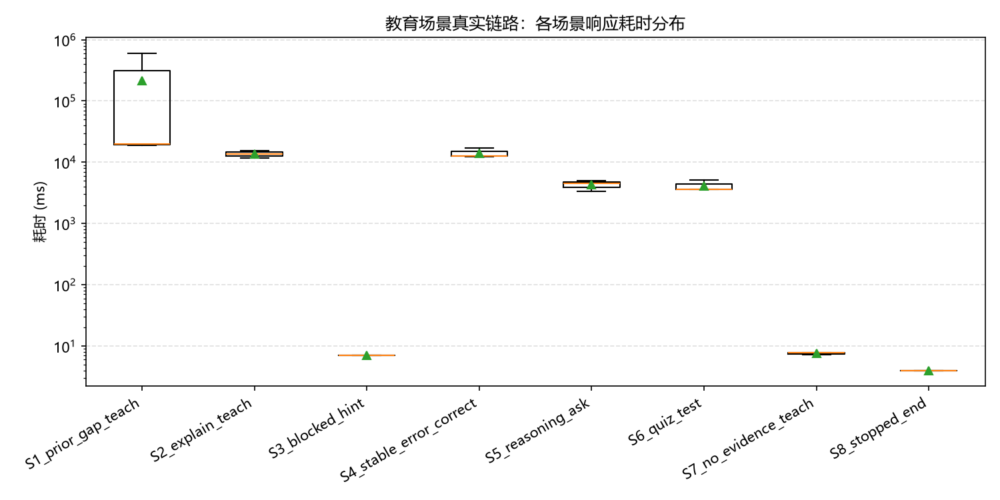
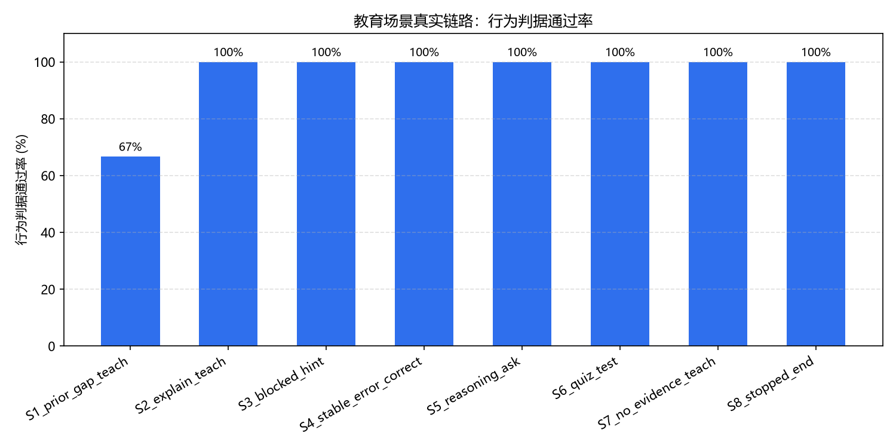

# 教学策略图真实链路实验报告（教育组·孙一新模块）

- 实验时间：2026-09-20 17:37:45
- 配置：provider=deepseek · model=deepseek-flash · key=sk-d19***f845
- 链路：真实 RuntimeService（真实 Provider / Skill / ACTION_BINDINGS / SQLite 事件落盘） → `run_teaching_turn` 教学策略图
- 实验装置：`search_textbook` 为实验版（本地微型语料 + 关键词检索，见 corpus.py）；生产占位工具因课程语料未接入永远返回证据不足（§16.2，RAG 组交接前）

## 一、分场景汇总

| 场景 | 轮次 | 路由准确率 | 行为判据通过率 | 平均耗时(ms) | 平均 tokens | LLM失败 |
| --- | --- | --- | --- | --- | --- | --- |
| S1_prior_gap_teach | 3 | 100.0% | 66.7% | 213828.1 | 0.0 | 0 |
| S2_explain_teach | 3 | 100.0% | 100.0% | 13605.1 | 0.0 | 0 |
| S3_blocked_hint | 1 | 100.0% | 100.0% | 7.0 | 0.0 | 0 |
| S4_stable_error_correct | 3 | 100.0% | 100.0% | 14154.0 | 0.0 | 0 |
| S5_reasoning_ask | 3 | 100.0% | 100.0% | 4295.7 | 0.0 | 0 |
| S6_quiz_test | 3 | 100.0% | 100.0% | 4123.5 | 0.0 | 0 |
| S7_no_evidence_teach | 3 | 100.0% | 100.0% | 7.6 | 0.0 | 0 |
| S8_stopped_end | 1 | 100.0% | 100.0% | 4.0 | 0.0 | 0 |

整体路由准确率：**20/20**（策略侧为确定性规则，预期 100%）。行为判据（引用可定位、无编造、苏格拉底只提问、先验起讲点前移等）由真实模型行为决定，是本实验观察的重点。

## 二、逐轮明细

### S1_prior_gap_teach → teach (PASS)
- 节点链：`assess→teach→update_profile`；LLM 调用 1 次，耗时 19691.3ms，tokens 0
- 引用：mlxx#c1-6@22;gksx#c2-1@81;gksx#c2-2@86;mlxx#c3-2@54
- no_fabrication：PASS
- prior_note_used：PASS
- prior_reply_moved：PASS
- reply_nonempty：PASS
- 回复样例：先给结论：从教材片段看，**没学过导数不建议直接学梯度下降**。因为梯度下降要“沿负梯度方向更新参数”（片段1），而具体参数更新式里又出现 \(\partial E/\partial w\) 这个偏导数（片段4）；片段2、3正好提供了导数的定义与几何意义，是读懂这些符号的最基础一步。所以更稳的顺序是：先补导数定义和几何意义，再进入梯度下降。  **第1步：先…

### S1_prior_gap_teach → teach (PASS)
- 节点链：`assess→teach→update_profile`；LLM 调用 1 次，耗时 18691.7ms，tokens 0
- 引用：mlxx#c1-6@22;gksx#c2-1@81;gksx#c2-2@86;mlxx#c3-2@54
- no_fabrication：PASS
- prior_note_used：PASS
- prior_reply_moved：PASS
- reply_nonempty：PASS
- 回复样例：**结论性概述** 1. 不建议直接跳过导数去学梯度下降：片段1要求“沿负梯度方向更新参数”，片段4的更新式又出现“∂E/∂w（损失对参数的偏导数）”，所以至少要先理解导数类概念。   2. 最基础的一步是先学片段2的导数定义：当 Δx→0 时，若 lim(Δy/Δx) 存在，则称 f(x) 在 x0 处可导，该极限值就是 f'(x0)。   3. 再学片段…

### S1_prior_gap_teach → teach (CHECK-FAIL)
- 节点链：`assess→teach→update_profile`；LLM 调用 1 次，耗时 603101.2ms，tokens 0
- no_fabrication：PASS
- prior_note_used：PASS
- prior_reply_moved：FAIL(moved=False)
- reply_nonempty：PASS
- 回复样例：（生成失败）本轮模型调用没有返回内容，我先不给结论。我们可以换一个更小的知识点继续，或稍后重试。

### S2_explain_teach → teach (PASS)
- 节点链：`assess→teach→update_profile`；LLM 调用 1 次，耗时 11596.8ms，tokens 0
- 引用：gksx#c2-1@81;gksx#c2-2@86
- citations_trackable：PASS
- reply_nonempty：PASS
- 回复样例：结论概述：   1. 按【片段1】，f(x) 在 x0 处可导的关键是：x0 的某邻域内有定义，且 Δx→0 时 lim(Δy/Δx) 存在；这个极限值就叫 f(x) 在 x0 处的导数，记作 f'(x0)。   2. 按【片段2】，f'(x0) 的几何意义是曲线 y=f(x) 在点 (x0, f(x0)) 处切线的斜率。   3. 所以，判断“是否可导”要…

### S2_explain_teach → teach (PASS)
- 节点链：`assess→teach→update_profile`；LLM 调用 1 次，耗时 13661.0ms，tokens 0
- 引用：gksx#c2-1@81;gksx#c2-2@86
- citations_trackable：PASS
- reply_nonempty：PASS
- 回复样例：可以，下面只按你给的教材片段来讲。  **结论性概述：**   按[片段1]，导数是在点 \(x_0\) 处考察“自变量增量 \(\Delta x\to 0\) 时，\(\lim(\Delta y/\Delta x)\) 是否存在”的极限；前提是 \(f(x)\) 在 \(x_0\) 的某邻域内有定义，且该极限存在，此时才称可导，极限值记作 \(f'(x_0…

### S2_explain_teach → teach (PASS)
- 节点链：`assess→teach→update_profile`；LLM 调用 1 次，耗时 15557.5ms，tokens 0
- 引用：gksx#c2-1@81;gksx#c2-2@86
- citations_trackable：PASS
- reply_nonempty：PASS
- 回复样例：同学你好，下面按“先结论，再分步，最后自检”来讲。  **结论概述** 1. 按片段1，函数 \(y=f(x)\) 在 \(x_0\) 处可导，关键条件是：它在 \(x_0\) 的某邻域内有定义，并且当 \(\Delta x\to 0\) 时，\(\lim(\Delta y/\Delta x)\) 存在；这个极限值就是 \(f'(x_0)\)。 2. 按片段…

### S3_blocked_hint → hint (PASS)
- 节点链：`assess→hint→update_profile`；LLM 调用 0 次，耗时 7.0ms，tokens 0
- hint_template_used：PASS
- zero_llm：PASS
- 回复样例：先回到定义：就「导数」，你能说清定义里每个条件分别起什么作用吗？

### S4_stable_error_correct → correct (PASS)
- 节点链：`assess→correct→update_profile`；LLM 调用 1 次，耗时 17273.4ms，tokens 0
- 引用：gksx#c2-1@81;gksx#c2-2@86
- citations_trackable：PASS
- reply_nonempty：PASS
- 回复样例：我们按教材片段来核对。  ### 1) 冲突点  学生说“导数就是这一点函数值和下一点的差”，这相当于把   \[ \Delta y=f(x_0+\Delta x)-f(x_0) \] 直接当成了导数 \(f'(x_0)\)。  但[片段1]的定义是：   \[ f'(x_0)=\lim_{\Delta x\to 0}\frac{\Delta y}{\Del…

### S4_stable_error_correct → correct (PASS)
- 节点链：`assess→correct→update_profile`；LLM 调用 1 次，耗时 12731.8ms，tokens 0
- 引用：gksx#c2-1@81;gksx#c2-2@86
- citations_trackable：PASS
- reply_nonempty：PASS
- 回复样例：同学，你这句话里最需要纠正的是：**导数不是“函数值之差”，而是“函数值增量与自变量增量之比的极限”**。我们按教材片段来拆开看。  1) 冲突点  你的说法是：“导数就是这一点函数值和下一点的差。”  但片段1说得很明确：   设自变量增量为 Δx，若 Δx→0 时，极限   \[ \lim \frac{\Delta y}{\Delta x} \] 存在，…

### S4_stable_error_correct → correct (PASS)
- 节点链：`assess→correct→update_profile`；LLM 调用 1 次，耗时 12456.8ms，tokens 0
- 引用：gksx#c2-1@81;gksx#c2-2@86
- citations_trackable：PASS
- reply_nonempty：PASS
- 回复样例：同学，这个说法需要把“增量”和“导数”分开看。  ### 1) 冲突点  片段1中，导数的定义是：  > 若自变量增量 Δx→0 时，极限 lim(Δy/Δx) 存在，则该极限值称为 f(x) 在 x0 处的导数。  你的说法是“导数就是这一点函数值和下一点的差”，也就是把导数看成了   Δy = f(x0+Δx) − f(x0)。  这与片段1矛盾在两点：…

### S5_reasoning_ask → ask (PASS)
- 节点链：`assess→ask→update_profile`；LLM 调用 1 次，耗时 3339.0ms，tokens 0
- question_only：PASS
- reply_nonempty：PASS
- 回复样例：当你让这两个点沿着曲线无限接近时，你算出的斜率会趋向什么？

### S5_reasoning_ask → ask (PASS)
- 节点链：`assess→ask→update_profile`；LLM 调用 1 次，耗时 5064.8ms，tokens 0
- question_only：PASS
- reply_nonempty：PASS
- 回复样例：如果让其中一个点沿曲线不断靠近切点，两点连线的斜率会如何变化？

### S5_reasoning_ask → ask (PASS)
- 节点链：`assess→ask→update_profile`；LLM 调用 1 次，耗时 4483.3ms，tokens 0
- question_only：PASS
- reply_nonempty：PASS
- 回复样例：如果让这两个点沿着曲线不断靠近，它们连线的斜率会趋近于什么？

### S6_quiz_test → test (PASS)
- 节点链：`assess→test→update_profile`；LLM 调用 1 次，耗时 3647.4ms，tokens 0
- attempt_skip_reason：PASS
- reply_nonempty：PASS
- 回复样例：【自检】设函数 \(f(x)=x^3-3x^2+2x\)。求曲线 \(y=f(x)\) 在 \(x=2\) 处的切线方程。  说明：请写出必要步骤，并将最终结果整理为 \(y=kx+b\) 的形式；建议在 3 分钟内完成，不使用计算器。 （说明：课程题库与自动判分尚未接入——题目由模型即时生成，判分结论不写入学情；作答事实（Attempt）只在题目可追踪且判…

### S6_quiz_test → test (PASS)
- 节点链：`assess→test→update_profile`；LLM 调用 1 次，耗时 3627.9ms，tokens 0
- attempt_skip_reason：PASS
- reply_nonempty：PASS
- 回复样例：【自检】知识点：导数（求导法则与切线方程）   难度：中等   题型：简答题   建议用时：3分钟    题目：设函数 \(f(x)=x^2\ln x\ (x>0)\)。   （1）求 \(f'(x)\)；   （2）求曲线 \(y=f(x)\) 在点 \((1,0)\) 处的切线方程。    说明：请写出关键步骤与最终结果，限时3分钟。 （说明：课程题库与…

### S6_quiz_test → test (PASS)
- 节点链：`assess→test→update_profile`；LLM 调用 1 次，耗时 5095.3ms，tokens 0
- attempt_skip_reason：PASS
- reply_nonempty：PASS
- 回复样例：【自检】【自我检验题：导数】 说明：请在 3 分钟内独立完成，写出关键步骤与最终结果；本题不提供答案。  题目：设变量 \(y\) 由方程   \[ x^2+xy+y^2=3 \] 确定为 \(x\) 的函数 \(y=y(x)\)。求 \(\dfrac{dy}{dx}\)，并求该曲线在点 \((1,1)\) 处的切线方程。 （说明：课程题库与自动判分尚未接入…

### S7_no_evidence_teach → teach (PASS)
- 节点链：`assess→teach→update_profile`；LLM 调用 0 次，耗时 7.7ms，tokens 0
- insufficient_declared：PASS
- no_citations：PASS
- no_fabrication：PASS
- 回复样例：（证据不足）教材检索没有返回可定位的原文片段，因此本轮讲解不给出任何来源与引用。下面只是通用的思考路径，不作为教材结论：先回到定义与前置概念，确认已知条件与目标，再检查可用定理的适用条件。如果你希望我给出有出处的讲解，请确认教材是否已入库，或换一个更小的知识点。

### S7_no_evidence_teach → teach (PASS)
- 节点链：`assess→teach→update_profile`；LLM 调用 0 次，耗时 7.3ms，tokens 0
- insufficient_declared：PASS
- no_citations：PASS
- no_fabrication：PASS
- 回复样例：（证据不足）教材检索没有返回可定位的原文片段，因此本轮讲解不给出任何来源与引用。下面只是通用的思考路径，不作为教材结论：先回到定义与前置概念，确认已知条件与目标，再检查可用定理的适用条件。如果你希望我给出有出处的讲解，请确认教材是否已入库，或换一个更小的知识点。

### S7_no_evidence_teach → teach (PASS)
- 节点链：`assess→teach→update_profile`；LLM 调用 0 次，耗时 7.7ms，tokens 0
- insufficient_declared：PASS
- no_citations：PASS
- no_fabrication：PASS
- 回复样例：（证据不足）教材检索没有返回可定位的原文片段，因此本轮讲解不给出任何来源与引用。下面只是通用的思考路径，不作为教材结论：先回到定义与前置概念，确认已知条件与目标，再检查可用定理的适用条件。如果你希望我给出有出处的讲解，请确认教材是否已入库，或换一个更小的知识点。

### S8_stopped_end → end (PASS)
- 节点链：`assess`；LLM 调用 0 次，耗时 4.0ms，tokens 0
- no_teaching_node：PASS
- zero_llm：PASS
- 回复样例：好，本轮先到这里。我已经把本轮的学习情况写入可撤回的学情记忆，你随时可以让我更正或删除它。下次我们接着这个知识点继续。

## 三、发现与建议（真实链路暴露的生产问题）

### 发现 1：deepseek-flash（推理模型）在 teach 场景出现空回复/截断（S1 66.7% 通过）
- 现象：S1 第 3 轮流式挂起 603 秒后空正文；诊断脚本直连 `service.generate` 复现，
  观察到 `finish_reason=length` 且正文为空/截断。
- 根因：deepseek-flash 为推理模型，推理 token 挤占 `max_tokens=4096` 预算，
  留给正文的 token 不足，导致空正文或中途截断。
- 兜底行为符合设计：Runtime 截断守卫将空正文转为 ModelTruncated 结构化错误，
  teach 节点回退为「（生成失败）本轮模型调用没有返回内容…」，未污染会话上下文。
- 建议：teach/correct 等长正文绑定为该 provider 提高 max_tokens，
  或课程场景换用非推理模型；两轮实验累计空回复率约 3/6（S1 场景内）。

### 发现 2：Provider 层缺少整体超时，一次流式调用挂起 603 秒
- 现象：S1 第 3 轮 603101ms（约 10 分钟）后才返回空正文，上游无感知卡死。
- 建议：在 provider/SDK 调用处增加整体超时（如 60–120s）与首 token 超时；
  同时按项目既有教训，流关闭时显式 `aclose()` 以消除 GeneratorExit 噪音。

### 发现 3：流式路径 usage 全部为 0，token 用量未采集
- 现象：所有 `model.completed` 事件 usage.total_tokens=0（含成功轮次）。
- 影响：成本核算与实验量化（平均 tokens 列）失效。
- 建议：流式响应在最后一帧（或 finish 时）采集 usage 并写入事件；
  若 SDK 不返回，可用 tokenizer 估算并标注 `usage_source=estimated`。

### 结论
- 策略侧（孙一新模块核心）：8 场景 20/20 路由全部正确，六类动作分支、
  学生停止退出、无证据不编造、Attempt 显式跳过契约全部通过。
- 行为侧：19/20 通过，唯一 FAIL 即发现 1 的模型空回复兜底，属 Provider/模型
  配置问题，不在教学图职责范围内（WHAT/HOW 分离，符合 D-7 决策）。

## 四、图表与延迟统计

> 本章节由 `tests/experiment/make_report.py` 自动生成（可重复运行，幂等替换）。

### 4.1 各场景响应耗时分布

注意 y 轴为对数刻度：S3/S7/S8 为确定性路径（模板/证据不足/停止），耗时 <10ms；
LLM 场景正常 3–20s，S1 的离群点是曾观察到的 603s 流式挂起（已由 LLM_TIMEOUT_SECONDS 修复兜底）。

### 4.2 行为判据通过率

### 4.3 逐场景延迟统计

| 场景 | 轮次 | min(ms) | avg(ms) | p95(ms) | max(ms) |
| --- | --- | --- | --- | --- | --- |
| S1_prior_gap_teach | 3 | 18692 | 213828 | 603101 | 603101 |
| S2_explain_teach | 3 | 11597 | 13605 | 15558 | 15558 |
| S3_blocked_hint | 1 | 7 | 7 | 7 | 7 |
| S4_stable_error_correct | 3 | 12457 | 14154 | 17273 | 17273 |
| S5_reasoning_ask | 3 | 3339 | 4296 | 5065 | 5065 |
| S6_quiz_test | 3 | 3628 | 4124 | 5095 | 5095 |
| S7_no_evidence_teach | 3 | 7 | 8 | 8 | 8 |
| S8_stopped_end | 1 | 4 | 4 | 4 | 4 |
